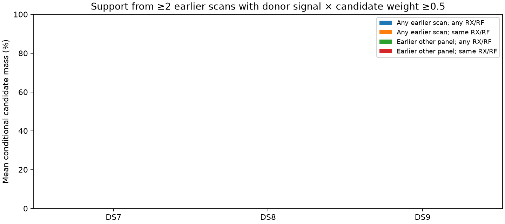

# Same-roster candidate support across earlier recordings

This census measures available donor support; it fits no correction and produces no new accuracy estimate. All 4,328 tracks and 72 distinct scans remain in denominators. Different snapshots are not joined by row number.

| Dataset | Scope | Receiver/RF restriction | Tracks | Scans with ≥2 compatible donors /24 | Mean raw supported mass | Mean strong supported mass | MAP supported tracks |
|---|---|---|---:|---:|---:|---:|---:|
| DS7 | any_earlier_scan | any_receiver_rf | 1434 | 15/24 | 0.00% | 0.00% | 0 |
| DS7 | any_earlier_scan | same_receiver_rf | 1434 | 15/24 | 0.00% | 0.00% | 0 |
| DS7 | earlier_other_panel | any_receiver_rf | 1434 | 0/24 | 0.00% | 0.00% | 0 |
| DS7 | earlier_other_panel | same_receiver_rf | 1434 | 0/24 | 0.00% | 0.00% | 0 |
| DS8 | any_earlier_scan | any_receiver_rf | 1434 | 20/24 | 0.00% | 0.00% | 0 |
| DS8 | any_earlier_scan | same_receiver_rf | 1434 | 20/24 | 0.00% | 0.00% | 0 |
| DS8 | earlier_other_panel | any_receiver_rf | 1434 | 8/24 | 0.00% | 0.00% | 0 |
| DS8 | earlier_other_panel | same_receiver_rf | 1434 | 8/24 | 0.00% | 0.00% | 0 |
| DS9 | any_earlier_scan | any_receiver_rf | 1460 | 18/24 | 0.00% | 0.00% | 0 |
| DS9 | any_earlier_scan | same_receiver_rf | 1460 | 18/24 | 0.00% | 0.00% | 0 |
| DS9 | earlier_other_panel | any_receiver_rf | 1460 | 8/24 | 0.00% | 0.00% | 0 |
| DS9 | earlier_other_panel | same_receiver_rf | 1460 | 8/24 | 0.00% | 0.00% | 0 |

Raw support means membership in at least two earlier donor scans. Strong support additionally requires signal responsibility × conditional candidate weight ≥0.5 in each of at least two donor scans. Mass is averaged across target tracks with zero support included; it is conditional candidate mass, not correctness probability. Compatible donor counts precede receiver/RF filtering and do not imply track support.

| Snapshot digest suffix | Catalogue size | Scans | Panels |
|---|---:|---:|---|
| ead4dfbcf38a | 11119 | 4 | DS7_early_8 |
| 9b247235f2e5 | 10685 | 4 | DS7_early_8 |
| 81217f5053e9 | 11119 | 7 | DS7_middle_8 |
| 2ace72cfa119 | 11130 | 1 | DS7_middle_8 |
| 126ad8bda6ac | 11130 | 16 | DS7_late_8, DS8_early_8 |
| 7d8e565676ce | 10685 | 8 | DS8_middle_8 |
| 03f517bcab56 | 11130 | 16 | DS8_late_8, DS9_early_8 |
| 820f81692ad6 | 11130 | 2 | DS9_middle_8 |
| ea470f23193d | 11130 | 6 | DS9_middle_8 |
| 1ccf4c03279a | 11130 | 8 | DS9_late_8 |

The bank exporter preserves baseline row ordering when replacing orbital elements. Same-snapshot row equality is catalogue identity under that export contract, not verified detection identity. Provider-source changes are retained in the scan rows and do not change the baseline roster key. No cross-snapshot physical identity mapping or new archive query was attempted.

Within-panel distributions share training-fitted geometry. Support there cannot serve as independent correction validation. Other-panel donors remove this shared-fit dependence but do not make this previously explored site blind. All candidate weights use the original eight-scan q020 fits.

Six prelaunch synthetic tests passed. The independent auditor builds inverted candidate-to-record sets and reconstructs every support mass, MAP support flag and denominator. Execution/input hashes pass. This audit verifies exported support, not physical identities or the radio likelihood.

[Protocol](PROTOCOL.md), [summary](summary.json), [full records and support](result.json), [tests](tests.log), [evidence hashes](evidence-sha256.json).
