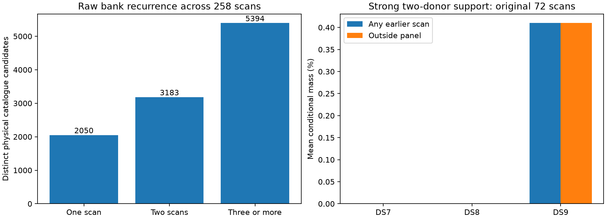

# Cross-snapshot catalogue recurrence: full frozen corpus

Raw catalogue support is not posterior agreement or verified satellite identity. Full-corpus and 72-scan results use different populations and must not be conflated.

| Dataset | Outside target chronological block | Tracks | Tracks with ≥2 earlier donor scans for a candidate | Scans with supported tracks | Supported candidate slots / all |
|---|---|---:|---:|---:|---:|
| DS7 | False | 5131 | 3356 | 61 | 9981/66975 |
| DS7 | True | 5131 | 3356 | 61 | 9981/66975 |
| DS8 | False | 3840 | 3704 | 65 | 10590/49496 |
| DS8 | True | 3840 | 3704 | 65 | 10590/49496 |
| DS9 | False | 6287 | 6237 | 105 | 49861/81494 |
| DS9 | True | 6287 | 6237 | 105 | 49861/81494 |

Full-corpus blocks are nonoverlapping chronological groups of eight within each dataset; final groups may be shorter. Donors are strictly earlier recordings, never repeated tracks in a single recording.

| Original 72-scan subset | Outside original target panel | Tracks | Mean strong-supported conditional mass | Tracks with mass >0.5 |
|---|---|---:|---:|---:|
| DS7 | False | 1434 | 0.0000% | 0 |
| DS7 | True | 1434 | 0.0000% | 0 |
| DS8 | False | 1434 | 0.0000% | 0 |
| DS8 | True | 1434 | 0.0000% | 0 |
| DS9 | False | 1460 | 0.4099% | 6 |
| DS9 | True | 1460 | 0.4099% | 6 |

Strong support requires signal responsibility × conditional candidate weight ≥0.5 in at least two earlier panel scans. The original q020 training weights are unchanged. All target tracks remain in the means, including zeros. Full-corpus raw support cannot be substituted for these weighted results.

Verified 14 exact snapshot rosters, 258 recordings and 15258 bank-eligible tracks. Independent raw TLE-line extraction matches the public parser roster and debris exclusions for every snapshot. Candidate mappings and every support count/mass were reconstructed and execution/input hashes verified. The auditor does not verify physical signal identity or independently reproduce the radio likelihood.

[Protocol](PROTOCOL.md), [summary](summary.json), [explicit rosters](rosters.json), [runtime provenance](runtime.json), [all records](result.json), [evidence](evidence-sha256.json).
