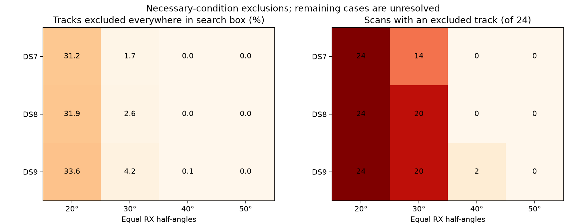

# Can position or timing changes rescue hard-cone support?

This completed diagnostic bounds the entire existing E/N ±12 km and timing ±5 s search domain. It reports tracks for which no retained candidate can satisfy every training observation's cone anywhere in that domain, under the nominal receiver axes and cached linear interpolation. It does not fit positions or demonstrate sub-km accuracy.

A scan with an excluded track cannot have a complete all-track satellite explanation within these assumptions. Nonexcluded cases remain unresolved; they are not validated feasible solutions. The bound includes all retained candidates, even those failing a horizon gate. It is not a full-catalogue impossibility claim or a calibrated beam measurement.

Main totals use nine nonoverlapping eight-scan panels: 24 distinct scans per dataset. Nested four-scan panels are independently replayed but not double-counted.

**The equal 20° hard-cone hypothesis cannot explain every track in any of the 72 scans anywhere in this domain.** At 30°, 54/72 scans are ruled out; at 40°, two DS9 scans are ruled out. At 50° the bound excludes none. These outcomes apply to the assumed pose and retained banks, not all possible physical explanations. [Next investigation](NEXT.md) identifies the two 40° exclusions and the bounded checks needed before further hard-cone fitting.

| Dataset | Half-angle | Excluded tracks / total | Excluded scans / 24 | Unsupported tracks at old fitted point |
|---|---:|---:|---:|---:|
| DS7 | 20° | 448/1434 | 24/24 | 811 |
| DS7 | 30° | 24/1434 | 14/24 | 129 |
| DS7 | 40° | 0/1434 | 0/24 | 3 |
| DS7 | 50° | 0/1434 | 0/24 | 0 |
| DS8 | 20° | 458/1434 | 24/24 | 835 |
| DS8 | 30° | 37/1434 | 20/24 | 146 |
| DS8 | 40° | 0/1434 | 0/24 | 2 |
| DS8 | 50° | 0/1434 | 0/24 | 0 |
| DS9 | 20° | 491/1460 | 24/24 | 852 |
| DS9 | 30° | 61/1460 | 20/24 | 203 |
| DS9 | 40° | 2/1460 | 2/24 | 7 |
| DS9 | 50° | 0/1460 | 0/24 | 0 |

All sixteen RX0/RX1 width pairs are retained in [summary.json](summary.json). Widths mean half-angles from each axis, distinct from the assumed 20° axis separation.

The conservative bound subtracts LOS perturbation and receiver-axis rotation from each timing segment's midpoint angles, takes the worst training observation, then the best segment. The derivation and numerical margins are fixed in [PROTOCOL.md](PROTOCOL.md). This is floating-point evaluation of an analytic bound, not formal interval arithmetic.

All eighteen processes exited zero. Every panel reproduced the earlier nominal point-support audit; candidate bounds were checked against those actual angles. Duplicate tracks across nested panels produce identical bounds. Seven synthetic tests cover domain containment, interior crossings, held isolation, and conservative monotonicity. Complete input/source and process seals were verified before aggregation.

Total child wall time 50.30 s; longest 3.90 s; peak RSS 673,552 KiB. No fits, RF collection, waveform reads, propagation, provider fetches, or production changes.

Pose, beam shape, cable mapping and satellite associations remain uncalibrated. Exclusion may indicate an inadequate bank or an incorrect physical assumption; assigning such a track to background does not restore complete satellite support.

[Tests](tests.log), [plan](plan.json), [input seal](input-seal.json), [complete evidence hashes](evidence-sha256.json).
