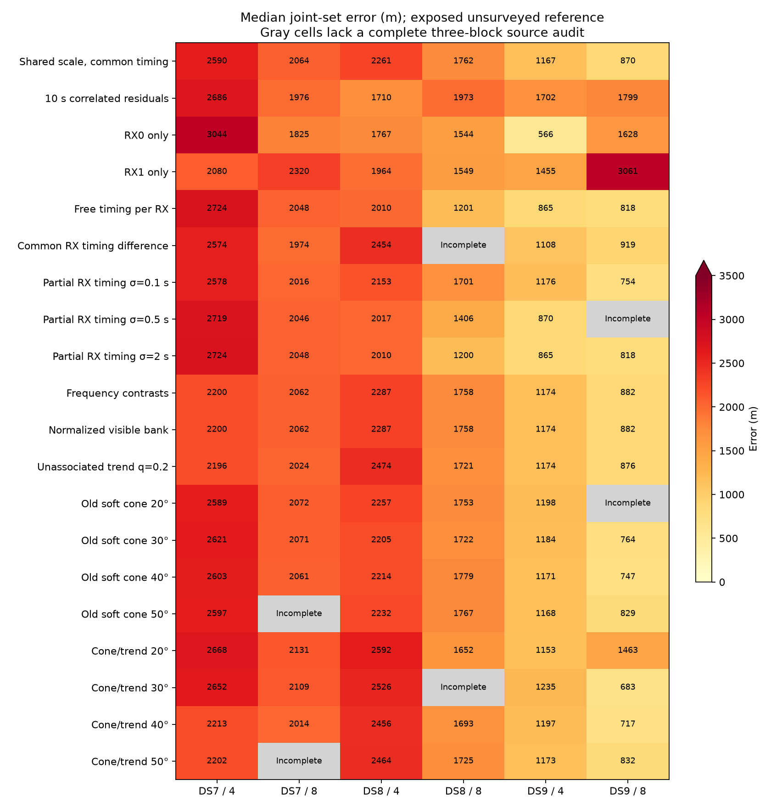

# Completed approaches on the same consecutive scan sets

This is a descriptive comparison of twenty completed model arms on the fixed early/middle/late four/eight panels. It reuses each source's training-selected fit; it does not select starts or beamwidths using reference error. Four-scan sets are nested in eight-scan sets, and all results come from the same previously explored site.

**The inherited search center is already 809.0 m from the exposed, unsurveyed reference.** This is a context check, not a radio-derived estimate or a proposed solution. Nominal sub-km counts alone therefore cannot demonstrate information gain, blind accuracy or calibrated resolution.

Each median below requires all three block results to pass their source's audit. The original shared-scale, correlated and RX-only reports audit geographic coordinates; later reports also audit timing coordinates. These are source audit statuses, not a new common numerical certification. RX-only arms use a subset of the observations.

| Approach | DS7 / 4 | DS7 / 8 | DS8 / 4 | DS8 / 8 | DS9 / 4 | DS9 / 8 | Source audits | Sub-km sets |
|---|---:|---:|---:|---:|---:|---:|---:|---:|
| [Shared scale, common timing](../2026_09_29_consecutive_panels/README.md) | 2,590 | 2,064 | 2,261 | 1,762 | 1,167 | 870 | 18/18 | 3/18 |
| [10 s correlated residuals](../2026_09_29_consecutive_correlation/README.md) | 2,686 | 1,976 | 1,710 | 1,973 | 1,702 | 1,799 | 18/18 | 4/18 |
| [RX0 only](../2026_09_29_receiver_panels/README.md) | 3,044 | 1,825 | 1,767 | 1,544 | 566 | 1,628 | 18/18 | 3/18 |
| [RX1 only](../2026_09_29_receiver_panels/README.md) | 2,080 | 2,320 | 1,964 | 1,549 | 1,455 | 3,061 | 18/18 | 5/18 |
| [Free timing per RX](../2026_09_29_split_receiver_timing/README.md) | 2,724 | 2,048 | 2,010 | 1,201 | 865 | 818 | 18/18 | 5/18 |
| [Common RX timing difference](../2026_09_29_pooled_receiver_timing/README.md) | 2,574 | 1,974 | 2,454 | Incomplete | 1,108 | 919 | 17/18 | 3/17 |
| [Partial RX timing σ=0.1 s](../2026_09_29_partial_receiver_timing/README.md) | 2,578 | 2,016 | 2,153 | 1,701 | 1,176 | 754 | 18/18 | 3/18 |
| [Partial RX timing σ=0.5 s](../2026_09_29_partial_receiver_timing/README.md) | 2,719 | 2,046 | 2,017 | 1,406 | 870 | Incomplete | 17/18 | 4/17 |
| [Partial RX timing σ=2 s](../2026_09_29_partial_receiver_timing/README.md) | 2,724 | 2,048 | 2,010 | 1,200 | 865 | 818 | 18/18 | 5/18 |
| [Frequency contrasts](../2026_09_29_frequency_contrast/README.md) | 2,200 | 2,062 | 2,287 | 1,758 | 1,174 | 882 | 18/18 | 3/18 |
| [Normalized visible bank](../2026_09_29_unassociated_trend/README.md) | 2,200 | 2,062 | 2,287 | 1,758 | 1,174 | 882 | 18/18 | 3/18 |
| [Unassociated trend q=0.2](../2026_09_29_unassociated_trend/README.md) | 2,196 | 2,024 | 2,474 | 1,721 | 1,174 | 876 | 18/18 | 3/18 |
| [Old soft cone 20°](../2026_09_29_rx_cone_position/README.md) | 2,589 | 2,072 | 2,257 | 1,753 | 1,198 | Incomplete | 17/18 | 2/17 |
| [Old soft cone 30°](../2026_09_29_rx_cone_position/README.md) | 2,621 | 2,071 | 2,205 | 1,722 | 1,184 | 764 | 18/18 | 4/18 |
| [Old soft cone 40°](../2026_09_29_rx_cone_position/README.md) | 2,603 | 2,061 | 2,214 | 1,779 | 1,171 | 747 | 18/18 | 3/18 |
| [Old soft cone 50°](../2026_09_29_rx_cone_position/README.md) | 2,597 | Incomplete | 2,232 | 1,767 | 1,168 | 829 | 17/18 | 3/17 |
| [Cone/trend 20°](../2026_09_29_cone_trend/README.md) | 2,668 | 2,131 | 2,592 | 1,652 | 1,153 | 1,463 | 18/18 | 2/18 |
| [Cone/trend 30°](../2026_09_29_cone_trend/README.md) | 2,652 | 2,109 | 2,526 | Incomplete | 1,235 | 683 | 17/18 | 4/17 |
| [Cone/trend 40°](../2026_09_29_cone_trend/README.md) | 2,213 | 2,014 | 2,456 | 1,693 | 1,197 | 717 | 18/18 | 3/18 |
| [Cone/trend 50°](../2026_09_29_cone_trend/README.md) | 2,202 | Incomplete | 2,464 | 1,725 | 1,173 | 832 | 17/18 | 3/17 |

All errors are metres. Failed or unaudited results remain in the machine-readable comparison; they are not silently dropped from a median.

## Descriptive ranking, not a model-selection experiment

Among both-RX arms with all eighteen source audits passing, order by the largest of the three dataset eight-scan medians. This post-hoc display emphasizes performance across datasets; it is not a preregistered selection rule. Worst-panel errors and counts beating the inherited origin expose failures hidden by medians.

| Order | Approach | Worst dataset eight-scan median (m) | Worst panel (m) | Better than inherited origin |
|---:|---|---:|---:|---:|
| 1 | 10 s correlated residuals | 1,976 | 3,514 | 3/18 |
| 2 | Cone/trend 40° | 2,014 | 3,723 | 3/18 |
| 3 | Partial RX timing σ=0.1 s | 2,016 | 3,798 | 2/18 |
| 4 | Unassociated trend q=0.2 | 2,024 | 3,681 | 2/18 |
| 5 | Partial RX timing σ=2 s | 2,048 | 3,706 | 1/18 |
| 6 | Free timing per RX | 2,048 | 3,879 | 1/18 |
| 7 | Old soft cone 40° | 2,061 | 3,418 | 3/18 |
| 8 | Normalized visible bank | 2,062 | 3,461 | 2/18 |
| 9 | Frequency contrasts | 2,062 | 3,461 | 2/18 |
| 10 | Shared scale, common timing | 2,064 | 3,468 | 2/18 |
| 11 | Old soft cone 30° | 2,071 | 3,396 | 3/18 |
| 12 | Cone/trend 20° | 2,131 | 4,266 | 0/18 |

Do not rank held log scores across these different density constructions. Within-model matched held comparisons remain in the source reports. Predictive gains have repeatedly occurred without geographic gains. The full-dataset fits and earlier single-scan studies use different sample counts and are summarized separately in [the earlier approach overview](../2026_09_29_approach_summary/README.md).

All selected positions were checked against the same reference with independent distance arithmetic, and session membership was matched to the original eighteen panels. Source summaries and selected-fit artifacts were checked against their evidence inventories. [Complete comparison](model-comparison.json) retains every panel, source path and audit status. No new geographic fits were run.
