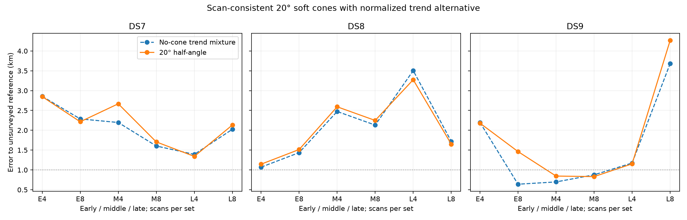
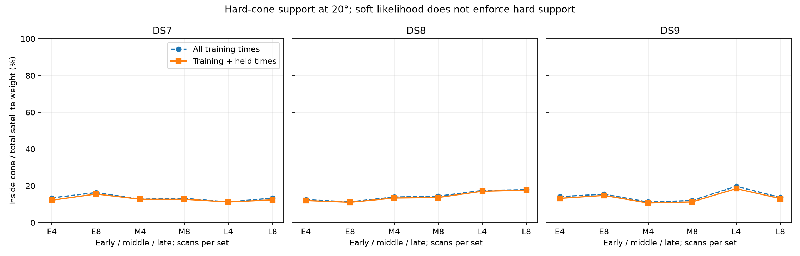

# 20° cone/trend batch

**Completed arm: 18/18 selected audits pass.** This arm alone does not complete the four-width experiment or establish calibrated sub-km accuracy.

71/72 optimizer starts qualify. Among audited panels, position improves in 8/18, held prediction in 1/18, and 2 nominal errors are below 1 km. Selection uses training score only. Counts across nested four/eight sets are dependent.

At the nominal fitted points, nominal axes beat swapped axes on held frequency in 18/18 panels and co-pointed axes in 10/18. These controls are not refitted, so this does not validate orientation or travel direction. Their comparison must not be confused with the separate no-cone baseline comparison above.

Each receiver keeps the same axis and width throughout the scan set. Cone compatibility uses the worst training angle with a 2° sigmoid edge and no floor; rejected satellite prior mass goes to the normalized unassociated trend. This is a soft compatibility model, not a hard cone or a calibrated beam. The held density keeps training weights fixed.

## Median joint-set error

Metres; all three block audits are required for each median.

| Dataset | Scans | No-cone mixture | Cone/trend |
|---|---:|---:|---:|
| DS7 | 4 | 2,196.1 | 2,667.8 |
| DS7 | 8 | 2,023.6 | 2,131.5 |
| DS8 | 4 | 2,473.8 | 2,592.3 |
| DS8 | 8 | 1,721.1 | 1,651.5 |
| DS9 | 4 | 1,173.9 | 1,153.1 |
| DS9 | 8 | 876.1 | 1,462.5 |

## Every planned panel

Held change is cone minus no-cone on identical observations. Unvalidated estimates remain visible, but are excluded from scientific aggregates.

| Panel | No-cone m | Cone m | Held change nats | Audit |
|---|---:|---:|---:|---|
| DS7_early_4 | 2855.797 | 2848.815 | -7.602 | Pass |
| DS7_early_8 | 2286.000 | 2214.442 | -17.739 | Pass |
| DS7_middle_4 | 2196.053 | 2667.822 | +13.907 | Pass |
| DS7_middle_8 | 1603.573 | 1706.271 | -38.086 | Pass |
| DS7_late_4 | 1391.623 | 1341.297 | -38.905 | Pass |
| DS7_late_8 | 2023.561 | 2131.485 | -53.136 | Pass |
| DS8_early_4 | 1069.519 | 1144.877 | -10.188 | Pass |
| DS8_early_8 | 1435.665 | 1514.206 | -12.162 | Pass |
| DS8_middle_4 | 2473.754 | 2592.301 | -42.283 | Pass |
| DS8_middle_8 | 2130.848 | 2247.900 | -97.162 | Pass |
| DS8_late_4 | 3504.674 | 3274.540 | -20.232 | Pass |
| DS8_late_8 | 1721.066 | 1651.501 | -25.249 | Pass |
| DS9_early_4 | 2196.073 | 2178.761 | -18.422 | Pass |
| DS9_early_8 | 639.499 | 1462.526 | -12.744 | Pass |
| DS9_middle_4 | 697.083 | 845.032 | -17.003 | Pass |
| DS9_middle_8 | 876.132 | 831.376 | -58.356 | Pass |
| DS9_late_4 | 1173.946 | 1153.093 | -38.066 | Pass |
| DS9_late_8 | 3680.856 | 4265.657 | -121.788 | Pass |

## Geometry and conditional receiver controls

Signal weight is the sum of satellite responsibilities. Inside fractions divide training/all-observation hard-cone signal mass by that signal weight. They diagnose geometric compatibility of retained hypotheses, not verified satellite identities. Controls score swapped/co-pointed axes at the nominal fitted point without refitting; positive held differences favor nominal axes.

| Panel | Signal weight / tracks | Training inside % | Train+held inside % | Nominal−swapped held | Nominal−co-pointed held |
|---|---:|---:|---:|---:|---:|
| DS7_early_4 | 200.004 / 239 | 13.49 | 12.22 | +48.407 | +19.800 |
| DS7_early_8 | 421.761 / 486 | 16.37 | 15.58 | +82.479 | +21.939 |
| DS7_middle_4 | 207.702 / 231 | 12.75 | 12.75 | +0.535 | -4.036 |
| DS7_middle_8 | 411.940 / 464 | 13.22 | 12.73 | +35.274 | +4.533 |
| DS7_late_4 | 218.732 / 247 | 11.29 | 11.29 | +7.328 | -3.512 |
| DS7_late_8 | 429.956 / 484 | 13.35 | 12.42 | +38.119 | -7.124 |
| DS8_early_4 | 228.793 / 255 | 12.50 | 12.06 | +34.651 | -0.979 |
| DS8_early_8 | 430.986 / 485 | 11.35 | 11.12 | +30.343 | -8.562 |
| DS8_middle_4 | 194.794 / 234 | 13.91 | 13.40 | +17.747 | -4.003 |
| DS8_middle_8 | 377.298 / 464 | 14.40 | 13.68 | +63.429 | +12.247 |
| DS8_late_4 | 185.412 / 246 | 17.54 | 17.11 | +22.180 | -3.538 |
| DS8_late_8 | 386.053 / 485 | 17.97 | 17.71 | +43.444 | -10.621 |
| DS9_early_4 | 211.818 / 248 | 14.16 | 13.22 | +64.240 | +22.490 |
| DS9_early_8 | 416.091 / 491 | 15.49 | 14.81 | +99.736 | +30.059 |
| DS9_middle_4 | 197.147 / 241 | 11.24 | 10.74 | +13.727 | +1.179 |
| DS9_middle_8 | 399.970 / 485 | 12.07 | 11.32 | +36.585 | +7.341 |
| DS9_late_4 | 173.449 / 236 | 19.78 | 18.54 | +45.456 | +14.915 |
| DS9_late_8 | 335.204 / 484 | 13.72 | 13.09 | +59.920 | +11.366 |

## Initialization and nested prediction

The fourth start uses the old no-cone training-selected solution. Generic-only best results below expose any extra-start effect; they are not alternate selections after audit failures.

| Panel | Generic-only m | Four-start m | Extra-start training gain |
|---|---:|---:|---:|
| DS7_early_4 | 2848.815 | 2848.815 | 0.000000 |
| DS7_early_8 | 2214.442 | 2214.442 | 0.000000 |
| DS7_middle_4 | 2667.823 | 2667.822 | 0.000000 |
| DS7_middle_8 | 1706.271 | 1706.271 | 0.000000 |
| DS7_late_4 | 1341.297 | 1341.297 | 0.000000 |
| DS7_late_8 | 2131.485 | 2131.485 | 0.000000 |
| DS8_early_4 | 1144.877 | 1144.877 | 0.000000 |
| DS8_early_8 | 1514.206 | 1514.206 | 0.000000 |
| DS8_middle_4 | 2592.301 | 2592.301 | 0.000000 |
| DS8_middle_8 | 2247.900 | 2247.900 | 0.000000 |
| DS8_late_4 | 3274.540 | 3274.540 | 0.000000 |
| DS8_late_8 | 1651.502 | 1651.501 | 0.000000 |
| DS9_early_4 | 2178.761 | 2178.761 | 0.000000 |
| DS9_early_8 | 1462.526 | 1462.526 | 0.000000 |
| DS9_middle_4 | 845.032 | 845.032 | 0.000000 |
| DS9_middle_8 | 1678.797 | 831.376 | 210.474741 |
| DS9_late_4 | 1153.093 | 1153.093 | 0.000000 |
| DS9_late_8 | 4265.657 | 4265.657 | 0.000000 |

Eight-minus-four held prediction on matched first-four observations:

| Dataset | Block | Held change nats |
|---|---|---:|
| DS7 | early | -44.409 |
| DS7 | middle | -13.014 |
| DS7 | late | -11.351 |
| DS8 | early | -69.308 |
| DS8 | middle | -15.844 |
| DS8 | late | +3.892 |
| DS9 | early | -18.736 |
| DS9 | middle | -36.133 |
| DS9 | late | -38.523 |

## Failures and verification

- DS8_middle_8_c20 / northwest: unqualified (ABNORMAL: ). No completed run was retried.

90 child processes, 90 exit zero. Total child wall time 948.18 s; maximum 28.74 s; peak RSS 668,296 KiB.

Complete frozen hashes and per-child evidence were verified; selections were reconstructed from every start. All selected fits check every coordinate at two finite-difference steps and replay the no-cone implementation against the old trend model. Independent distance formulas agree within 0.0001 m. Numerical convergence does not establish identifiability.

Assumed world pose, provisional receiver mapping, retained-bank conditioning, uncalibrated priors and exposed unsurveyed reference remain limitations. No paired identity, reception/non-reception likelihood or travel-direction validation is claimed. No new RF data were collected.

[Full results](summary-c20.json), [protocol](PROTOCOL.md), [tests](tests.log), [frozen plan](plan.json).
