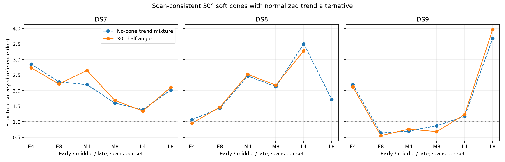
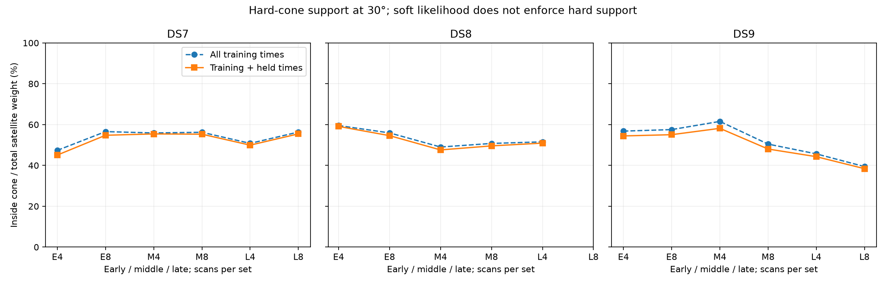

# 30° cone/trend batch

**Completed arm: 17/18 selected audits pass.** This arm alone does not complete the four-width experiment or establish calibrated sub-km accuracy.

69/72 optimizer starts qualify. Among audited panels, position improves in 8/17, held prediction in 8/17, and 4 nominal errors are below 1 km. Selection uses training score only. Counts across nested four/eight sets are dependent.

At the nominal fitted points, nominal axes beat swapped axes on held frequency in 16/17 panels and co-pointed axes in 8/17. These controls are not refitted, so this does not validate orientation or travel direction. Their comparison must not be confused with the separate no-cone baseline comparison above.

Each receiver keeps the same axis and width throughout the scan set. Cone compatibility uses the worst training angle with a 2° sigmoid edge and no floor; rejected satellite prior mass goes to the normalized unassociated trend. This is a soft compatibility model, not a hard cone or a calibrated beam. The held density keeps training weights fixed.

## Median joint-set error

Metres; all three block audits are required for each median.

| Dataset | Scans | No-cone mixture | Cone/trend |
|---|---:|---:|---:|
| DS7 | 4 | 2,196.1 | 2,651.7 |
| DS7 | 8 | 2,023.6 | 2,109.4 |
| DS8 | 4 | 2,473.8 | 2,526.4 |
| DS8 | 8 | 1,721.1 | Incomplete |
| DS9 | 4 | 1,173.9 | 1,235.5 |
| DS9 | 8 | 876.1 | 683.1 |

## Every planned panel

Held change is cone minus no-cone on identical observations. Unvalidated estimates remain visible, but are excluded from scientific aggregates.

| Panel | No-cone m | Cone m | Held change nats | Audit |
|---|---:|---:|---:|---|
| DS7_early_4 | 2855.797 | 2738.575 | +0.965 | Pass |
| DS7_early_8 | 2286.000 | 2215.160 | +2.539 | Pass |
| DS7_middle_4 | 2196.053 | 2651.711 | +32.669 | Pass |
| DS7_middle_8 | 1603.573 | 1688.963 | -10.070 | Pass |
| DS7_late_4 | 1391.623 | 1346.308 | -12.998 | Pass |
| DS7_late_8 | 2023.561 | 2109.359 | -6.018 | Pass |
| DS8_early_4 | 1069.519 | 950.275 | +2.751 | Pass |
| DS8_early_8 | 1435.665 | 1470.893 | +0.254 | Pass |
| DS8_middle_4 | 2473.754 | 2526.401 | -7.688 | Pass |
| DS8_middle_8 | 2130.848 | 2178.291 | -23.848 | Pass |
| DS8_late_4 | 3504.674 | 3282.394 | -5.289 | Pass |
| DS8_late_8 | 1721.066 | 1613.248 | +3.133 | FAIL — unvalidated |
| DS9_early_4 | 2196.073 | 2121.069 | +1.537 | Pass |
| DS9_early_8 | 639.499 | 555.238 | +0.075 | Pass |
| DS9_middle_4 | 697.083 | 763.299 | +3.226 | Pass |
| DS9_middle_8 | 876.132 | 683.064 | -21.869 | Pass |
| DS9_late_4 | 1173.946 | 1235.467 | -8.923 | Pass |
| DS9_late_8 | 3680.856 | 3959.912 | -61.210 | Pass |

## Geometry and conditional receiver controls

Signal weight is the sum of satellite responsibilities. Inside fractions divide training/all-observation hard-cone signal mass by that signal weight. They diagnose geometric compatibility of retained hypotheses, not verified satellite identities. Controls score swapped/co-pointed axes at the nominal fitted point without refitting; positive held differences favor nominal axes.

| Panel | Signal weight / tracks | Training inside % | Train+held inside % | Nominal−swapped held | Nominal−co-pointed held |
|---|---:|---:|---:|---:|---:|
| DS7_early_4 | 212.325 / 239 | 47.39 | 45.08 | +19.229 | +2.233 |
| DS7_early_8 | 445.115 / 486 | 56.57 | 54.77 | +26.595 | -0.251 |
| DS7_middle_4 | 215.561 / 231 | 55.89 | 55.43 | -4.545 | -3.423 |
| DS7_middle_8 | 428.373 / 464 | 56.23 | 55.29 | +11.734 | -3.754 |
| DS7_late_4 | 232.380 / 247 | 50.80 | 49.92 | +10.525 | -1.373 |
| DS7_late_8 | 453.226 / 484 | 56.34 | 55.45 | +22.336 | -6.346 |
| DS8_early_4 | 239.856 / 255 | 59.53 | 59.11 | +15.459 | +0.610 |
| DS8_early_8 | 450.773 / 485 | 55.92 | 54.58 | +9.547 | -4.011 |
| DS8_middle_4 | 211.057 / 234 | 49.01 | 47.59 | +16.571 | -1.739 |
| DS8_middle_8 | 413.378 / 464 | 50.76 | 49.56 | +44.880 | +5.611 |
| DS8_late_4 | 203.162 / 246 | 51.54 | 50.93 | +5.006 | -7.393 |
| DS8_late_8 | 416.828 / 485 | 52.50 | 51.73 | +9.444 | -4.223 |
| DS9_early_4 | 227.219 / 248 | 56.80 | 54.44 | +35.001 | +9.065 |
| DS9_early_8 | 447.989 / 491 | 57.55 | 55.05 | +40.667 | +1.966 |
| DS9_middle_4 | 205.509 / 241 | 61.55 | 58.16 | +11.782 | +1.201 |
| DS9_middle_8 | 427.283 / 485 | 50.45 | 48.04 | +26.307 | +2.569 |
| DS9_late_4 | 195.463 / 236 | 45.66 | 44.28 | +25.980 | +5.390 |
| DS9_late_8 | 386.127 / 484 | 39.44 | 38.41 | +21.404 | -6.992 |

## Initialization and nested prediction

The fourth start uses the old no-cone training-selected solution. Generic-only best results below expose any extra-start effect; they are not alternate selections after audit failures.

| Panel | Generic-only m | Four-start m | Extra-start training gain |
|---|---:|---:|---:|
| DS7_early_4 | 2738.575 | 2738.575 | 0.000000 |
| DS7_early_8 | 2215.160 | 2215.160 | 0.000000 |
| DS7_middle_4 | 2651.711 | 2651.711 | 0.000000 |
| DS7_middle_8 | 1688.963 | 1688.963 | 0.000000 |
| DS7_late_4 | 1346.308 | 1346.308 | 0.000000 |
| DS7_late_8 | 2109.358 | 2109.359 | 0.000000 |
| DS8_early_4 | 950.275 | 950.275 | 0.000000 |
| DS8_early_8 | 1470.893 | 1470.893 | 0.000000 |
| DS8_middle_4 | 2526.401 | 2526.401 | 0.000000 |
| DS8_middle_8 | 2178.291 | 2178.291 | 0.000000 |
| DS8_late_4 | 3282.390 | 3282.394 | 0.000000 |
| DS8_late_8 | 1613.248 | 1613.248 | 0.000000 |
| DS9_early_4 | 2121.069 | 2121.069 | 0.000000 |
| DS9_early_8 | 555.238 | 555.238 | 0.000000 |
| DS9_middle_4 | 763.299 | 763.299 | 0.000000 |
| DS9_middle_8 | 683.064 | 683.064 | 0.000000 |
| DS9_late_4 | 1235.467 | 1235.467 | 0.000000 |
| DS9_late_8 | 3589.455 | 3959.912 | 8.529749 |

Eight-minus-four held prediction on matched first-four observations:

| Dataset | Block | Held change nats |
|---|---|---:|
| DS7 | early | -48.463 |
| DS7 | middle | -17.034 |
| DS7 | late | -10.020 |
| DS8 | early | -71.627 |
| DS8 | middle | -16.305 |
| DS8 | late | Unvalidated |
| DS9 | early | -71.708 |
| DS9 | middle | -32.279 |
| DS9 | late | -28.621 |

## Failures and verification

- DS8_late_8_c30: selected audit failed or unavailable; detailed stencils are retained in the complete results.
- DS8_late_8_c30 / northwest: unqualified (CONVERGENCE: RELATIVE REDUCTION OF F <= FACTR*EPSMCH). No completed run was retried.
- DS8_late_8_c30 / no_cone: unqualified (CONVERGENCE: RELATIVE REDUCTION OF F <= FACTR*EPSMCH). No completed run was retried.
- DS9_late_8_c30 / southeast: unqualified (ABNORMAL: ). No completed run was retried.

90 child processes, 90 exit zero. Total child wall time 970.61 s; maximum 33.08 s; peak RSS 668,804 KiB.

Complete frozen hashes and per-child evidence were verified; selections were reconstructed from every start. All selected fits check every coordinate at two finite-difference steps and replay the no-cone implementation against the old trend model. Independent distance formulas agree within 0.0001 m. Numerical convergence does not establish identifiability.

Assumed world pose, provisional receiver mapping, retained-bank conditioning, uncalibrated priors and exposed unsurveyed reference remain limitations. No paired identity, reception/non-reception likelihood or travel-direction validation is claimed. No new RF data were collected.

[Full results](summary-c30.json), [protocol](PROTOCOL.md), [tests](tests.log), [frozen plan](plan.json).
