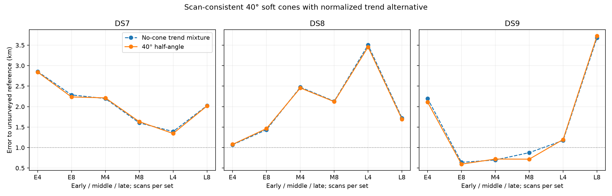
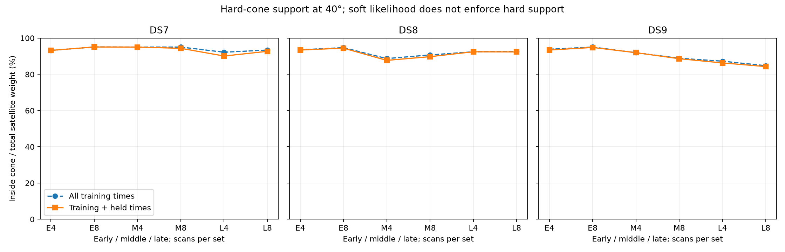

# 40° cone/trend batch

**Completed arm: 18/18 selected audits pass.** This arm alone does not complete the four-width experiment or establish calibrated sub-km accuracy.

69/72 optimizer starts qualify. Among audited panels, position improves in 11/18, held prediction in 10/18, and 3 nominal errors are below 1 km. Selection uses training score only. Counts across nested four/eight sets are dependent.

At the nominal fitted points, nominal axes beat swapped axes on held frequency in 13/18 panels and co-pointed axes in 8/18. These controls are not refitted, so this does not validate orientation or travel direction. Their comparison must not be confused with the separate no-cone baseline comparison above.

Each receiver keeps the same axis and width throughout the scan set. Cone compatibility uses the worst training angle with a 2° sigmoid edge and no floor; rejected satellite prior mass goes to the normalized unassociated trend. This is a soft compatibility model, not a hard cone or a calibrated beam. The held density keeps training weights fixed.

## Median joint-set error

Metres; all three block audits are required for each median.

| Dataset | Scans | No-cone mixture | Cone/trend |
|---|---:|---:|---:|
| DS7 | 4 | 2,196.1 | 2,213.3 |
| DS7 | 8 | 2,023.6 | 2,014.5 |
| DS8 | 4 | 2,473.8 | 2,456.3 |
| DS8 | 8 | 1,721.1 | 1,692.8 |
| DS9 | 4 | 1,173.9 | 1,196.6 |
| DS9 | 8 | 876.1 | 717.1 |

## Every planned panel

Held change is cone minus no-cone on identical observations. Unvalidated estimates remain visible, but are excluded from scientific aggregates.

| Panel | No-cone m | Cone m | Held change nats | Audit |
|---|---:|---:|---:|---|
| DS7_early_4 | 2855.797 | 2843.220 | -1.631 | Pass |
| DS7_early_8 | 2286.000 | 2236.599 | +0.420 | Pass |
| DS7_middle_4 | 2196.053 | 2213.325 | -3.985 | Pass |
| DS7_middle_8 | 1603.573 | 1633.261 | -1.359 | Pass |
| DS7_late_4 | 1391.623 | 1343.227 | -5.589 | Pass |
| DS7_late_8 | 2023.561 | 2014.492 | +2.044 | Pass |
| DS8_early_4 | 1069.519 | 1077.924 | +0.576 | Pass |
| DS8_early_8 | 1435.665 | 1464.496 | +2.993 | Pass |
| DS8_middle_4 | 2473.754 | 2456.255 | +2.311 | Pass |
| DS8_middle_8 | 2130.848 | 2121.455 | -5.075 | Pass |
| DS8_late_4 | 3504.674 | 3454.477 | +2.240 | Pass |
| DS8_late_8 | 1721.066 | 1692.836 | +7.615 | Pass |
| DS9_early_4 | 2196.073 | 2108.805 | +1.147 | Pass |
| DS9_early_8 | 639.499 | 596.158 | +11.673 | Pass |
| DS9_middle_4 | 697.083 | 719.841 | +3.569 | Pass |
| DS9_middle_8 | 876.132 | 717.144 | -9.499 | Pass |
| DS9_late_4 | 1173.946 | 1196.627 | -3.045 | Pass |
| DS9_late_8 | 3680.856 | 3723.331 | -2.476 | Pass |

## Geometry and conditional receiver controls

Signal weight is the sum of satellite responsibilities. Inside fractions divide training/all-observation hard-cone signal mass by that signal weight. They diagnose geometric compatibility of retained hypotheses, not verified satellite identities. Controls score swapped/co-pointed axes at the nominal fitted point without refitting; positive held differences favor nominal axes.

| Panel | Signal weight / tracks | Training inside % | Train+held inside % | Nominal−swapped held | Nominal−co-pointed held |
|---|---:|---:|---:|---:|---:|
| DS7_early_4 | 215.807 / 239 | 93.19 | 93.19 | -0.061 | -2.307 |
| DS7_early_8 | 453.060 / 486 | 95.09 | 95.09 | -1.770 | +0.120 |
| DS7_middle_4 | 220.802 / 231 | 95.02 | 95.02 | -6.182 | -2.283 |
| DS7_middle_8 | 435.176 / 464 | 95.04 | 94.35 | +2.031 | -2.935 |
| DS7_late_4 | 237.749 / 247 | 92.19 | 90.09 | +2.874 | -2.961 |
| DS7_late_8 | 461.544 / 484 | 93.39 | 92.69 | +3.893 | -1.243 |
| DS8_early_4 | 244.167 / 255 | 93.52 | 93.41 | +3.547 | +1.885 |
| DS8_early_8 | 460.720 / 485 | 94.72 | 94.44 | +0.624 | -0.592 |
| DS8_middle_4 | 216.305 / 234 | 88.68 | 87.70 | +4.256 | +1.665 |
| DS8_middle_8 | 429.558 / 464 | 90.69 | 89.74 | +8.432 | +2.919 |
| DS8_late_4 | 210.159 / 246 | 92.44 | 92.43 | +0.468 | +1.755 |
| DS8_late_8 | 429.121 / 485 | 92.59 | 92.37 | -0.396 | +2.057 |
| DS9_early_4 | 234.297 / 248 | 93.83 | 93.41 | +5.625 | +0.059 |
| DS9_early_8 | 458.660 / 491 | 95.04 | 94.82 | +8.932 | -0.034 |
| DS9_middle_4 | 210.892 / 241 | 91.94 | 91.94 | +2.904 | -0.565 |
| DS9_middle_8 | 440.994 / 485 | 88.85 | 88.62 | +4.613 | -1.818 |
| DS9_late_4 | 209.220 / 236 | 87.25 | 86.29 | +7.844 | +0.922 |
| DS9_late_8 | 414.794 / 484 | 84.76 | 84.27 | -6.125 | -11.187 |

## Initialization and nested prediction

The fourth start uses the old no-cone training-selected solution. Generic-only best results below expose any extra-start effect; they are not alternate selections after audit failures.

| Panel | Generic-only m | Four-start m | Extra-start training gain |
|---|---:|---:|---:|
| DS7_early_4 | 2843.220 | 2843.220 | 0.000000 |
| DS7_early_8 | 2236.599 | 2236.599 | 0.000000 |
| DS7_middle_4 | 2213.325 | 2213.325 | 0.000000 |
| DS7_middle_8 | 1633.260 | 1633.261 | 0.000000 |
| DS7_late_4 | 1343.227 | 1343.227 | 0.000000 |
| DS7_late_8 | 2014.492 | 2014.492 | 0.000000 |
| DS8_early_4 | 1077.924 | 1077.924 | 0.000000 |
| DS8_early_8 | 1464.496 | 1464.496 | 0.000000 |
| DS8_middle_4 | 2456.255 | 2456.255 | 0.000000 |
| DS8_middle_8 | 2121.455 | 2121.455 | 0.000000 |
| DS8_late_4 | 3454.477 | 3454.477 | 0.000000 |
| DS8_late_8 | 1692.836 | 1692.836 | 0.000000 |
| DS9_early_4 | 2108.805 | 2108.805 | 0.000000 |
| DS9_early_8 | 596.158 | 596.158 | 0.000000 |
| DS9_middle_4 | 719.841 | 719.841 | 0.000000 |
| DS9_middle_8 | 282.604 | 717.144 | 121.532600 |
| DS9_late_4 | 1196.627 | 1196.627 | 0.000000 |
| DS9_late_8 | 3723.331 | 3723.331 | 0.000000 |

Eight-minus-four held prediction on matched first-four observations:

| Dataset | Block | Held change nats |
|---|---|---:|
| DS7 | early | -48.146 |
| DS7 | middle | +24.644 |
| DS7 | late | -4.658 |
| DS8 | early | -70.270 |
| DS8 | middle | -15.760 |
| DS8 | late | +3.999 |
| DS9 | early | -69.561 |
| DS9 | middle | -31.197 |
| DS9 | late | -9.437 |

## Failures and verification

- DS7_early_8_c40 / northwest: unqualified (ABNORMAL: ). No completed run was retried.
- DS9_early_4_c40 / origin: unqualified (ABNORMAL: ). No completed run was retried.
- DS9_late_8_c40 / no_cone: unqualified (ABNORMAL: ). No completed run was retried.

90 child processes, 90 exit zero. Total child wall time 1063.08 s; maximum 32.27 s; peak RSS 664,748 KiB.

Complete frozen hashes and per-child evidence were verified; selections were reconstructed from every start. All selected fits check every coordinate at two finite-difference steps and replay the no-cone implementation against the old trend model. Independent distance formulas agree within 0.0001 m. Numerical convergence does not establish identifiability.

Assumed world pose, provisional receiver mapping, retained-bank conditioning, uncalibrated priors and exposed unsurveyed reference remain limitations. No paired identity, reception/non-reception likelihood or travel-direction validation is claimed. No new RF data were collected.

[Full results](summary-c40.json), [protocol](PROTOCOL.md), [tests](tests.log), [frozen plan](plan.json).
