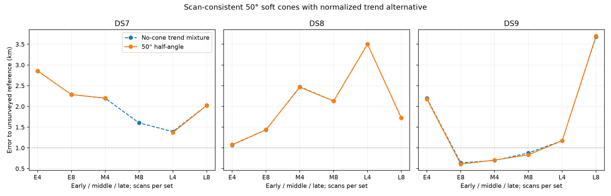
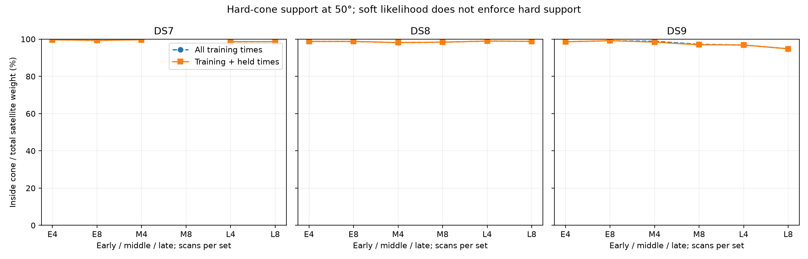

# 50° cone/trend batch

**Completed arm: 17/18 selected audits pass.** This arm alone does not complete the four-width experiment or establish calibrated sub-km accuracy.

72/72 optimizer starts qualify. Among audited panels, position improves in 10/17, held prediction in 14/17, and 3 nominal errors are below 1 km. Selection uses training score only. Counts across nested four/eight sets are dependent.

At the nominal fitted points, nominal axes beat swapped axes on held frequency in 13/17 panels and co-pointed axes in 12/17. These controls are not refitted, so this does not validate orientation or travel direction. Their comparison must not be confused with the separate no-cone baseline comparison above.

Each receiver keeps the same axis and width throughout the scan set. Cone compatibility uses the worst training angle with a 2° sigmoid edge and no floor; rejected satellite prior mass goes to the normalized unassociated trend. This is a soft compatibility model, not a hard cone or a calibrated beam. The held density keeps training weights fixed.

## Median joint-set error

Metres; all three block audits are required for each median.

| Dataset | Scans | No-cone mixture | Cone/trend |
|---|---:|---:|---:|
| DS7 | 4 | 2,196.1 | 2,202.3 |
| DS7 | 8 | 2,023.6 | Incomplete |
| DS8 | 4 | 2,473.8 | 2,463.7 |
| DS8 | 8 | 1,721.1 | 1,724.9 |
| DS9 | 4 | 1,173.9 | 1,173.1 |
| DS9 | 8 | 876.1 | 831.5 |

## Every planned panel

Held change is cone minus no-cone on identical observations. Unvalidated estimates remain visible, but are excluded from scientific aggregates.

| Panel | No-cone m | Cone m | Held change nats | Audit |
|---|---:|---:|---:|---|
| DS7_early_4 | 2855.797 | 2860.515 | +1.123 | Pass |
| DS7_early_8 | 2286.000 | 2284.963 | +2.620 | Pass |
| DS7_middle_4 | 2196.053 | 2202.318 | -1.795 | Pass |
| DS7_middle_8 | 1603.573 | 1611.208 | -1.035 | FAIL — unvalidated |
| DS7_late_4 | 1391.623 | 1367.873 | -0.938 | Pass |
| DS7_late_8 | 2023.561 | 2022.299 | +3.083 | Pass |
| DS8_early_4 | 1069.519 | 1077.454 | +0.799 | Pass |
| DS8_early_8 | 1435.665 | 1439.454 | +0.470 | Pass |
| DS8_middle_4 | 2473.754 | 2463.725 | +1.694 | Pass |
| DS8_middle_8 | 2130.848 | 2128.010 | +0.899 | Pass |
| DS8_late_4 | 3504.674 | 3500.225 | +2.572 | Pass |
| DS8_late_8 | 1721.066 | 1724.933 | +4.072 | Pass |
| DS9_early_4 | 2196.073 | 2178.048 | +2.169 | Pass |
| DS9_early_8 | 639.499 | 608.283 | +7.809 | Pass |
| DS9_middle_4 | 697.083 | 706.428 | +3.423 | Pass |
| DS9_middle_8 | 876.132 | 831.531 | +0.869 | Pass |
| DS9_late_4 | 1173.946 | 1173.058 | -0.934 | Pass |
| DS9_late_8 | 3680.856 | 3698.115 | +5.896 | Pass |

## Geometry and conditional receiver controls

Signal weight is the sum of satellite responsibilities. Inside fractions divide training/all-observation hard-cone signal mass by that signal weight. They diagnose geometric compatibility of retained hypotheses, not verified satellite identities. Controls score swapped/co-pointed axes at the nominal fitted point without refitting; positive held differences favor nominal axes.

| Panel | Signal weight / tracks | Training inside % | Train+held inside % | Nominal−swapped held | Nominal−co-pointed held |
|---|---:|---:|---:|---:|---:|
| DS7_early_4 | 218.334 / 239 | 99.66 | 99.66 | +2.033 | +1.710 |
| DS7_early_8 | 457.832 / 486 | 99.33 | 99.33 | +4.611 | +2.949 |
| DS7_middle_4 | 222.231 / 231 | 99.72 | 99.66 | -0.160 | +1.282 |
| DS7_middle_8 | 438.387 / 464 | 99.53 | 99.53 | -0.827 | +0.953 |
| DS7_late_4 | 238.780 / 247 | 98.63 | 98.63 | -0.497 | -0.193 |
| DS7_late_8 | 464.423 / 484 | 98.70 | 98.70 | +1.513 | +0.390 |
| DS8_early_4 | 245.840 / 255 | 98.78 | 98.78 | +1.633 | +1.772 |
| DS8_early_8 | 464.797 / 485 | 98.79 | 98.78 | -2.013 | +2.431 |
| DS8_middle_4 | 219.328 / 234 | 98.13 | 98.13 | +1.844 | +0.327 |
| DS8_middle_8 | 436.519 / 464 | 98.37 | 98.37 | +0.726 | -0.699 |
| DS8_late_4 | 213.424 / 246 | 98.99 | 98.99 | +0.497 | +0.972 |
| DS8_late_8 | 434.891 / 485 | 98.85 | 98.82 | +1.464 | +1.814 |
| DS9_early_4 | 236.194 / 248 | 98.60 | 98.60 | +1.036 | +0.886 |
| DS9_early_8 | 462.765 / 491 | 99.19 | 99.19 | +2.399 | +1.781 |
| DS9_middle_4 | 212.735 / 241 | 98.86 | 98.39 | +0.045 | +0.515 |
| DS9_middle_8 | 446.964 / 485 | 97.19 | 96.97 | -1.718 | -2.264 |
| DS9_late_4 | 216.036 / 236 | 96.87 | 96.87 | +0.000 | -1.433 |
| DS9_late_8 | 431.216 / 484 | 94.80 | 94.80 | +6.818 | -0.465 |

## Initialization and nested prediction

The fourth start uses the old no-cone training-selected solution. Generic-only best results below expose any extra-start effect; they are not alternate selections after audit failures.

| Panel | Generic-only m | Four-start m | Extra-start training gain |
|---|---:|---:|---:|
| DS7_early_4 | 2860.515 | 2860.515 | 0.000000 |
| DS7_early_8 | 2284.963 | 2284.963 | 0.000000 |
| DS7_middle_4 | 2202.318 | 2202.318 | 0.000000 |
| DS7_middle_8 | 1611.208 | 1611.208 | 0.000000 |
| DS7_late_4 | 1367.873 | 1367.873 | 0.000000 |
| DS7_late_8 | 2022.300 | 2022.299 | 0.000000 |
| DS8_early_4 | 1077.454 | 1077.454 | 0.000000 |
| DS8_early_8 | 1439.454 | 1439.454 | 0.000000 |
| DS8_middle_4 | 2463.725 | 2463.725 | 0.000000 |
| DS8_middle_8 | 2128.011 | 2128.010 | 0.000000 |
| DS8_late_4 | 3500.225 | 3500.225 | 0.000000 |
| DS8_late_8 | 1724.934 | 1724.933 | 0.000000 |
| DS9_early_4 | 2178.048 | 2178.048 | 0.000000 |
| DS9_early_8 | 608.284 | 608.283 | 0.000000 |
| DS9_middle_4 | 706.428 | 706.428 | 0.000000 |
| DS9_middle_8 | 831.531 | 831.531 | 0.000000 |
| DS9_late_4 | 1173.058 | 1173.058 | 0.000000 |
| DS9_late_8 | 3698.115 | 3698.115 | 0.000000 |

Eight-minus-four held prediction on matched first-four observations:

| Dataset | Block | Held change nats |
|---|---|---:|
| DS7 | early | -46.344 |
| DS7 | middle | Unvalidated |
| DS7 | late | -7.966 |
| DS8 | early | -66.757 |
| DS8 | middle | -14.452 |
| DS8 | late | +3.642 |
| DS9 | early | -73.736 |
| DS9 | middle | -35.912 |
| DS9 | late | -2.030 |

## Failures and verification

- DS7_middle_8_c50: selected audit failed or unavailable; detailed stencils are retained in the complete results.

90 child processes, 90 exit zero. Total child wall time 895.50 s; maximum 26.23 s; peak RSS 667,776 KiB.

Complete frozen hashes and per-child evidence were verified; selections were reconstructed from every start. All selected fits check every coordinate at two finite-difference steps and replay the no-cone implementation against the old trend model. Independent distance formulas agree within 0.0001 m. Numerical convergence does not establish identifiability.

Assumed world pose, provisional receiver mapping, retained-bank conditioning, uncalibrated priors and exposed unsurveyed reference remain limitations. No paired identity, reception/non-reception likelihood or travel-direction validation is claimed. No new RF data were collected.

[Full results](summary-c50.json), [protocol](PROTOCOL.md), [tests](tests.log), [frozen plan](plan.json).
