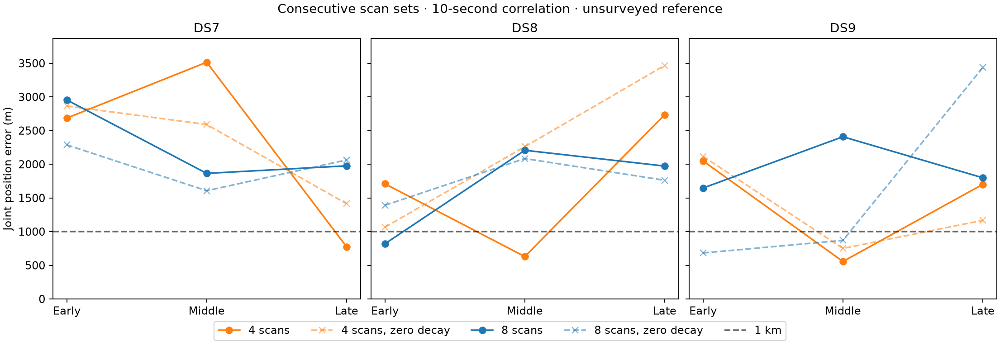

# Temporal correlation on the same consecutive scan sets

The fixed 10-second correlation model **does not provide a consistent
short-window geographic improvement**. It improves nine of the 18 panel
errors and worsens nine. All 18 held-observation scores improve, demonstrating
again that improved residual prediction does not establish improved location.
All six dataset/size median errors remain above 1 km with correlation.

| Dataset | Four-scan median: zero / 10 s (m) | Eight-scan median: zero / 10 s (m) | Four-scan sub-km count: zero / 10 s | Eight-scan sub-km count: zero / 10 s |
|---|---:|---:|---:|---:|
| DS7 | 2,590 / 2,686 | 2,064 / 1,976 | 0/3 / 1/3 | 0/3 / 0/3 |
| DS8 | 2,261 / 1,710 | 1,762 / 1,973 | 0/3 / 1/3 | 0/3 / 1/3 |
| DS9 | 1,167 / 1,702 | 870 / 1,799 | 1/3 / 1/3 | 2/3 / 0/3 |

These are medians across three **jointly fitted consecutive sets**, not
single-scan medians. Four correlated fits are below 1 km, versus three
zero-decay fits, but the locations of those successes change. Do not choose
a different model per panel using these exposed reference errors.

## Every paired result

Each comparison uses identical recordings, observations, held masks, generic
starts and optimizer settings. Negative error change is favorable; positive
held change is favorable. Raw held gains use different observation counts
between panels; compare their signs and paired values, not panel rankings.

| Panel | Zero-decay error (m) | 10-second error (m) | Error change (m) | Held change (nats) |
|---|---:|---:|---:|---:|
| DS7 early 4 | 2,864.858 | 2,685.516 | -179.342 | +2,702.794 |
| DS7 early 8 | 2,287.191 | 2,954.790 | +667.599 | +5,053.613 |
| DS7 middle 4 | 2,590.063 | 3,514.491 | +924.427 | +3,395.439 |
| DS7 middle 8 | 1,606.608 | 1,864.355 | +257.747 | +7,367.250 |
| DS7 late 4 | 1,414.224 | **775.491** | -638.733 | +2,616.690 |
| DS7 late 8 | 2,063.706 | 1,976.333 | -87.373 | +5,568.412 |
| DS8 early 4 | 1,065.224 | 1,709.573 | +644.349 | +3,293.725 |
| DS8 early 8 | 1,390.877 | **819.173** | -571.705 | +6,189.173 |
| DS8 middle 4 | 2,260.918 | **629.471** | -1,631.447 | +3,246.511 |
| DS8 middle 8 | 2,084.608 | 2,207.405 | +122.797 | +6,159.298 |
| DS8 late 4 | 3,467.535 | 2,734.790 | -732.745 | +4,155.724 |
| DS8 late 8 | 1,762.028 | 1,973.100 | +211.072 | +7,420.543 |
| DS9 early 4 | 2,117.272 | 2,048.797 | -68.475 | +2,760.746 |
| DS9 early 8 | **682.990** | 1,646.960 | +963.971 | +6,313.260 |
| DS9 middle 4 | **750.643** | **556.117** | -194.526 | +4,022.362 |
| DS9 middle 8 | **869.695** | 2,408.479 | +1,538.784 | +8,558.323 |
| DS9 late 4 | 1,167.327 | 1,701.820 | +534.493 | +4,060.923 |
| DS9 late 8 | 3,435.817 | 1,798.965 | -1,636.852 | +8,741.226 |

The late DS9 eight-scan regression becomes smaller, but remains above 1 km;
the two previously sub-km DS9 eight-scan fits both become worse than 1 km.
Thus the result does not support replacing the zero-decay model generally.

The nested eight-minus-four held comparison remains negative in all nine
blocks when evaluated on the same first-four held observations. Changes are
DS7 early/middle/late -7.852/-23.797/-0.002 nats; DS8
-6.625/-7.946/-9.027; DS9 -9.630/-27.321/-18.236. The DS7 late difference
is effectively negligible at this reporting scale. Correlation does not remove
the observed disagreement under a shared position, and these scores do not
identify its physical cause.

## Fixed ablation and evidence

[PROTOCOL.md](PROTOCOL.md) freezes the existing model with scale matrix
100² * (0.8 exp(-abs(dt)/10) + 0.2 I), Student-t4, unchanged candidate mixtures,
offset profiling, visibility and whole-visit partition. The original control
uses a diagonal scale matrix with shared track scale. The sole scientific
plan change is decay_s 0 to 10. No hyperparameter search or geography-based
model-selection rule is introduced.

Preparation verifies 775 previous evidence/protocol bindings, including the
[original panel report](../2026_09_29_consecutive_panels/README.md).
The complete plan is identical apart from decay. It retains 18 panels,
72 distinct recordings and 108 memberships; paired four-scan sets remain
nested in their eight-scan blocks. Membership, all starts and track eligibility
are unchanged. [validation.json](validation.json) verifies plan identity and
byte-identical scientific runner and launcher.

All 72 scientific processes exit zero: 54 fits and 18 selected-fit audits.
There is a qualified selected fit for every panel; **48/54 starts qualify**.
Six starts return ABNORMAL optimizer termination despite small gradients and
remain unqualified: DS7 early4/southeast, DS7 late4/origin, DS7 late8/northwest,
DS8 middle4/origin and northwest, DS9 early8/northwest. They were not retried,
reclassified or used for selection. Highest training score among qualified
starts determines selection; held scores and geography do not.

The scorer verifies 1,157 execution/input bindings; exact manifest slices,
nesting and track/held identities; training replay and row sums within 1e-7;
and independent geographic arithmetic within 0.0001 m. All 72 position-gradient
checks pass, maximum discrepancy 2.927e-6 versus tolerance 0.002. All report
scripts pass Ruff lint and formatting. The unchanged scientific helpers'
six tests previously passed in the [DS7 test record](../2026_09_28_ds7_full_shared/tests.log);
no fresh run of those unchanged tests is claimed.

Execution used one scientific worker, BLAS1/nice19, a 12 GiB address-space
ceiling, 300-second process limits and >=14 GiB available memory before launch.
Summed job wall time is 437.02 seconds, maximum process 16.72 seconds, peak RSS
670,340 KiB. No scientific input worker overlapped execution. No timeouts,
process failures, RF collection, waveform reads, propagation, provider fetch,
component changes or golden-fixture changes occurred.

[plan.json](plan.json) and stage directories retain membership, starts,
commands, seals, results and receipts. [scores.json](scores.json) retains all
alternatives, medians, paired changes and nested comparisons;
[resource-summary.json](resource-summary.json) accounts for every process;
[evidence-sha256.json](evidence-sha256.json) binds the report and dependencies.
Execution order: prepare.py, launch.py source, launch.py transfer, score_plot.py.
Transfer here means selection and auditing, not cross-dataset position transfer.

The exposed reference is unsurveyed and nested sets are dependent. These
results do not establish surveyed accuracy, calibrated confidence, independent
emitter identity or unseen-site validation. Complete-dataset zero-decay results
remain 527/736/229 m for DS7/DS8/DS9; this experiment changes no prior result.
Reliable short-window sub-km localization remains unresolved. Prioritize
training-only diagnostics of the disagreement between consecutive trajectories
before adding or tuning another nuisance term. Preserve all 18 panels as the
comparison set rather than retaining only the successful ones.
