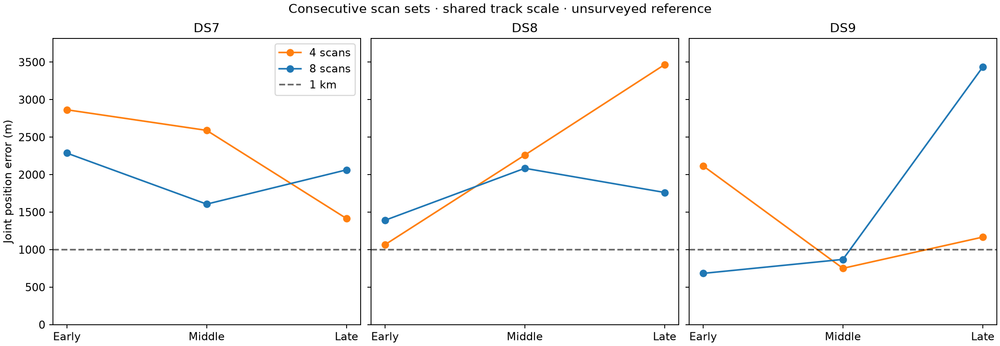

# Consecutive four- and eight-scan evaluations

All 18 predeclared panels were evaluated with the shared-track-scale model.
Eight scans improve the median joint-panel error in every dataset, but **short
consecutive windows do not reliably achieve sub-kilometre accuracy**. Only
three of 18 selected panel fits are below 1 km, all in DS9. Complete-dataset
results of 527 m (DS7), 736 m (DS8) and 229 m (DS9) do not transfer uniformly
to these smaller observation budgets.

| Dataset | Four-scan median error (m) | Four-scan sets below 1 km | Eight-scan median error (m) | Eight-scan sets below 1 km |
|---|---:|---:|---:|---:|
| DS7 | 2,590.063 | 0/3 | 2,063.706 | 0/3 |
| DS8 | 2,260.918 | 0/3 | 1,762.028 | 0/3 |
| DS9 | 1,167.327 | 1/3 | 869.695 | 2/3 |

These are medians across **three jointly fitted sets**, not medians of
independent single-scan estimates. All 18 selected fits qualify. No failed
panel is omitted from these denominators.

## Every selected panel

Ordinals are one-based positions in each frozen manifest sorted by capture
start and session ID. Eight-scan blocks begin at the first, middle and last
possible positions specified in the protocol; four-scan blocks are their
first halves. The blocks were fixed before fitting, without outcome selection.

| Dataset / block | Four-scan ordinals | Error (m) | Eight-scan ordinals | Error (m) | Four / eight start-span (min) |
|---|---|---:|---|---:|---:|
| DS7 early | 1–4 | 2,864.858 | 1–8 | 2,287.191 | 21.21 / 49.52 |
| DS7 middle | 41–44 | 2,590.063 | 41–48 | 1,606.608 | 21.18 / 49.46 |
| DS7 late | 81–84 | 1,414.224 | 81–88 | 2,063.706 | 21.21 / 49.52 |
| DS8 early | 1–4 | 1,065.224 | 1–8 | 1,390.877 | 21.23 / 56.60 |
| DS8 middle | 29–32 | 2,260.918 | 29–36 | 2,084.608 | 28.32 / 56.57 |
| DS8 late | 58–61 | 3,467.535 | 58–65 | 1,762.028 | 21.21 / 49.44 |
| DS9 early | 1–4 | 2,117.272 | 1–8 | **682.990** | 21.20 / 49.47 |
| DS9 middle | 49–52 | **750.643** | 49–56 | **869.695** | 21.19 / 49.45 |
| DS9 late | 98–101 | 1,167.327 | 98–105 | 3,435.817 | 21.21 / 63.58 |

Eight improves geography in five of nine paired blocks and worsens four.
The largest regression is late DS9: 1,167 to 3,436 m. The corresponding
middle DS9 pair remains sub-km but also worsens. Each eight-scan panel has
464–491 eligible tracks; four-scan panels have 231–255. Consecutive admitted
recordings do not mean uninterrupted RF observation. Start-span excludes the
last recording's duration and is not active dwell. Sample-rate mix, observation
counts, time coverage and trajectories change together, so this does not
isolate any one of those factors.

## Matched predictive comparison

Held scores below compare eight minus four **only on the same first-four
recordings' held observations**, with each model's training-fitted parameters.
The additional four recordings are not included in the score difference.

| Dataset / block | Matched held observations | Held change (nats) |
|---|---:|---:|
| DS7 early | 4,200 | -54.774 |
| DS7 middle | 4,845 | -18.942 |
| DS7 late | 4,510 | -13.619 |
| DS8 early | 4,526 | -65.382 |
| DS8 middle | 4,040 | -11.207 |
| DS8 late | 4,373 | -5.305 |
| DS9 early | 4,246 | -67.633 |
| DS9 middle | 4,812 | -34.236 |
| DS9 late | 3,940 | -2.615 |

All nine matched predictive comparisons regress despite five geographic
improvements. Adding scans imposes a shared position across more trajectories;
these results demonstrate disagreement under the current model, without
identifying its physical cause. They do not justify assigning it to receiver
tilt, oscillator drift, ephemeris error or emitter association without further
evidence.

## Design, qualification and verification

[PROTOCOL.md](PROTOCOL.md) fixes 18 panels, containing 72 distinct recordings
and 108 memberships because the four-scan sets overlap their paired eight.
All inputs come from the complete, hash-verified
[checkpoint 09](../2026_09_28_full_manifest_inputs/checkpoints/09-full-ready/README.md).
[plan.json](plan.json) records exact sessions, manifest ordinals, sample rates,
capture starts, pose hashes, tracks, train/held counts and eligibility exclusions.
There are no recording substitutions or outcome-based exclusions.

The scientific runner and launcher are byte-identical to complete DS7/DS8/DS9.
The shared-track-scale Student-t4 likelihood uses decay zero and 100 Hz scale,
unchanged candidate mixtures and partition, one shared position and one timing
per scan. Every panel starts at E/N (0,0), (3,-3), (-3,3) km with zero timings.
No fitted complete-dataset coordinate initializes a panel. Selection uses the
greatest training score among successful interior starts with gradient
infinity norm <=0.01; geography and held score do not select starts.

All 72 scientific processes exit zero: 54 source fits and 18 selected-fit audits.
**51 of 54 starts qualify**, with at least two qualified starts for every panel.
Three DS7 starts report optimizer ABNORMAL termination despite small gradients:
early four/origin, early eight/southeast and late four/origin. They remain
unqualified, are retained in scores.json, and are excluded from selection.
There are no retries, timeouts or relaxed gates.

The scorer verifies 684 execution/input bindings, exact manifest slices,
disjoint eight-scan blocks and nested four-scan membership. All training-score
replays and row sums agree within 1e-7. All 72 E/N finite-difference checks
(four per selected fit) pass, with maximum discrepancy 2.160e-5 against
tolerance 0.002. Track identities and train/held counts match audited inputs;
matched first-four held counts are identical. Independent spherical-distance
checks agree within 0.0001 m.

All report scripts pass Ruff lint and formatting. [validation.json](validation.json)
records membership checks and unchanged execution files. The six unchanged
scientific-helper tests previously passed in the
[DS7 test log](../2026_09_28_ds7_full_shared/tests.log); no fresh run is claimed.
One scientific worker ran at a time, after complete DS9 modeling and with no
input worker overlap. BLAS1/nice19, 12 GiB address-space cap, 300-second process
cap and 14 GiB minimum available memory were retained. Summed job wall time
420.36 s; longest process 14.32 s; peak RSS 670,532 KiB. Archive publication
overlapped execution. No new RF collection, waveform read, propagation,
provider fetch, component change or golden-fixture change occurred.

## Evidence and interpretation

[scores.json](scores.json) retains every start, qualification, selected error,
paired held delta and aggregate. [resource-summary.json](resource-summary.json)
contains every process receipt. [evidence-sha256.json](evidence-sha256.json)
binds the report and dependencies, excluding itself. To reproduce the run
order: prepare.py; launch.py source; launch.py transfer; score_plot.py.
The transfer phase here selects and audits each panel, without cross-dataset
position transfer.

The older DS7 baseline used the same eight-scan ordinal blocks and reported
2,541.480 / 1,562.550 / 1,322.090 m for early/middle/late (rounded source values).
See [historical panels](../2026_09_27_ds7_full88/group-panels-v1.md). Shared scale
improves the early block but worsens middle and late; this historical comparison
does not isolate the likelihood because optimizer setup also differs.

The reference remains exposed and unsurveyed. Nested panel fits are dependent;
three windows per dataset are not a confidence interval, a blind benchmark or
new-site validation. Complete-dataset sub-km nominal errors remain valid, but
**reliable short-window sub-km localization is still unresolved**. Next prioritize
training-only diagnostics of the late-DS9 regression and common-position
residual disagreement, retaining these fixed panels for subsequent comparisons.
