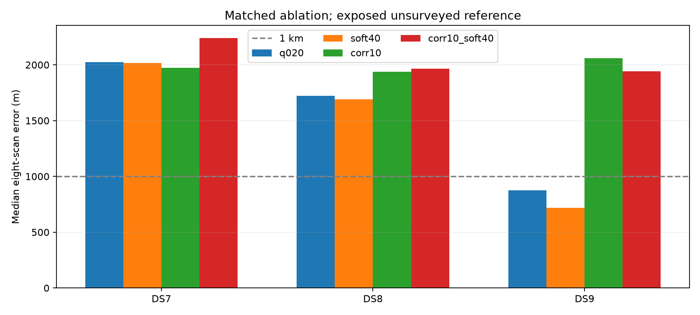
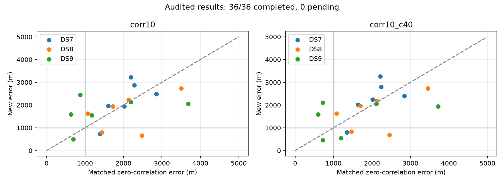

# Correlated contrasts and receiver cones: completed ablation

**Both frozen arms are complete; all 36 selected numerical audits pass. Neither
arm establishes reliable sub-km localization across DS7/DS8/DS9.** Correlation
plus soft40 reaches a 544.7 m four-scan median on DS9, but every eight-scan
median remains above 1.9 km. Its DS7 and DS8 four-scan medians also exceed 1 km.
No units remain pending.

Adding correlation improves held prediction on all 18 panels in each arm,
relative to its matched zero-correlation control. Location improves on only
9/18 in each comparison. Adding soft40 to the correlated model improves location
on 9/18 and held prediction on 10/18. Predictive gains do not establish geographic
gains; these are dependent, explored panels at one exposed unsurveyed site.

## Matched median joint-set error

Metres over three early/middle/late panels; every cell has all three selected
audits passing. All four models use the same normalized q=0.20 trend mixture,
observations and shared location with one timing offset per scan.

| Model | DS7 four | DS7 eight | DS8 four | DS8 eight | DS9 four | DS9 eight |
|---|---:|---:|---:|---:|---:|---:|
| No correlation, no cone | 2,196.1 | 2,023.6 | 2,473.8 | 1,721.1 | 1,173.9 | 876.1 |
| No correlation, soft40 | 2,213.3 | 2,014.5 | 2,456.3 | 1,692.8 | 1,196.6 | 717.1 |
| Correlation, no cone | 2,487.6 | 1,971.8 | 1,626.0 | 1,936.5 | 1,551.2 | 2,059.2 |
| Correlation, soft40 | 2,391.6 | 2,241.1 | 1,629.5 | 1,964.6 | **544.7** | 1,942.5 |

The [full ablation](ABLATION.md) retains every panel and all four matched
comparisons. No start, cone width or covariance setting was selected using
reference error. The no-correlation controls are the previously published
q020 and soft40 fits, not reruns.

The late DS9 eight-scan error decreases from 3,680.9 to 2,059.2 m without a
cone, and from 3,723.3 to 1,942.5 m with soft40. This does not compensate for
other DS9 degradations. Nominal sub-km panel counts increase from three in
each control to four without a cone and five with soft40. Worst selected
errors are 3,218.6 and 3,258.5 m respectively.

The five nominal sub-km combined-model panels are DS7 late four (798.4 m),
DS8 early eight (837.4 m), DS8 middle four (689.7 m), DS9 middle four
(465.0 m), and DS9 late four (544.7 m). These are separate fitted sets,
not a claim that individual scans attain those errors.

## Model and validation

The new likelihood uses the existing ten-second temporal kernel with a
0.2 nugget in normalized anchored frequency contrasts. Both satellite and
background branches use this correlated noise; the background also retains
its marginalized 2000 Hz/s slope scale. Noise scale is 100 Hz and degrees
of freedom four. Constant frequency is eliminated without fitting held data.

Soft40 uses fixed nominal RX0 west/RX1 east axes, ±10 degrees from zenith,
40-degree half-angles and a two-degree sigmoid edge. It shares geometry
throughout each set but does not enforce hard visibility. Rejected satellite
prior mass transfers to the unassociated trend. Pose, receiver mapping and
satellite identities remain uncalibrated; held frequency density is not a
reception/non-reception model.

Ten prelaunch tests cover independent rational matrix calculations, all-anchor
invariance, zero-decay replay, covariance validity, derivatives, held isolation,
normalized conditional prediction, background-only behavior and fresh-process
imports. All 36 selected fits pass the position/timing two-step derivative
audit and zero-decay score/gradient/prediction/weight replay. The summarizer
reconstructs qualification and training selection and checks identical
observation identities and counts.

140/144 optimizer starts qualify: 71/72 without cones and 69/72 with soft40.
All 180 child processes exit zero. Four starts have an abnormal optimizer
termination and remain unqualified: DS7 middle four origin without cones;
DS8 early four east_south, DS8 early eight no_cone, and DS9 middle four origin
with soft40. No completed fit was retried or substituted after selection.

Total child wall time is 1,452.06 seconds across bounded dataset batches;
longest child 25.44 seconds and peak RSS 702,748 KiB. One numerical worker
used the frozen 180-second/4-GiB caps. No new RF, raw IQ, propagation, provider
fetch, archive read or production change occurred.

[No-cone start diagnostics](STARTS-corr10.md) and
[soft40 start diagnostics](STARTS-corr10_c40.md) retain alternative solutions.
DS7 middle four has qualified fits about 1.08 km apart with a 0.684-nat gap
without cones, and about 1.10 km apart with a 1.137-nat gap with soft40.
These are optimizer diagnostics, not calibrated confidence intervals. Agreement
of four starts does not prove global uniqueness. The inherited origin is
already 809 m from the exposed unsurveyed reference.

## Next direction and complete evidence

Do not expand the cone grid based on these geographic results. The
[next proposed evidence gate](NEXT.md) tests cross-receiver frequency coherence
before asserting a shared satellite identity or fitting a stitched trajectory.
It has not been executed here. The broader sub-km objective remains open.

[All 36 results](all-complete/README.md), [machine-readable results](all-complete/summary.json),
[four-cell ablation](ablation.json), [protocol](PROTOCOL.md), [ten tests](tests.log),
[frozen plan](plan.json), [input seal](input-seal.json), [complete hashes](evidence-sha256.json).

Immutable earlier checkpoints retain [7 completed units](checkpoint-1/README.md),
[12 completed units](checkpoint-2/README.md), and the
[first complete arm](corr10-complete/README.md). Their pending labels describe
those historical checkpoints, not the final state. During initial report
development, the reader was corrected to accept the older inventory's flat JSON
shape; no scientific results or frozen execution sources changed.
