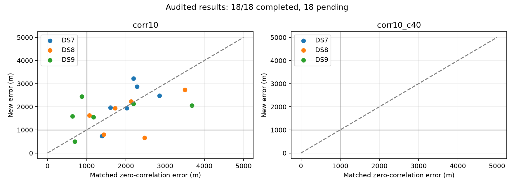

# Correlated contrasts and unassociated trends: first arm complete

**Correlation alone is not promoted as a reliable sub-km solution.** All 18
panels in the corr10 arm are complete and pass selected-fit numerical audit.
Held prediction improves on 18/18, while location error improves on 9/18 and
worsens on 9/18. Four panels have nominal error below 1 km, versus three for
the matched zero-correlation model. Every dataset/size median remains above
1 km. These are exposed-reference results at one unsurveyed site.

The second frozen arm, **corr10_c40 (correlation plus soft 40-degree cones),
has 18 pending panels**. It has not been run or implicitly credited with these
results. The plan and execution sources for both arms were frozen together.

## Matched median joint-set error

Metres over early/middle/late panels. Each reported median has three passing
audits. The control is the normalized q=0.20 unassociated-trend model.

| Dataset | Four scans, control | Four scans, correlated | Eight scans, control | Eight scans, correlated |
|---|---:|---:|---:|---:|
| DS7 | 2,196.1 | 2,487.6 | 2,023.6 | 1,971.8 |
| DS8 | 2,473.8 | 1,626.0 | 1,721.1 | 1,936.5 |
| DS9 | 1,173.9 | 1,551.2 | 876.1 | 2,059.2 |

The late DS9 eight-scan result improves from 3,680.9 m to 2,059.2 m, but this
does not compensate for the degradation in other DS9 panels. The four nominal
sub-km cases are DS7 late four (739.6 m), DS8 early eight (801.7 m), DS8 middle
four (661.9 m), and DS9 middle four (497.1 m). No start or model setting was
selected using these errors. The largest selected error is 3,218.6 m.

The right plot is empty because the cone-combination arm is pending. Points
below the diagonal improve nominal location error. Better held frequency
density alone does not validate a geographic estimate; temporal correlation
can explain neighbouring held observations without correcting position bias.

## What changed and how it was checked

This model applies the existing ten-second correlation kernel, with 0.2 nugget,
to normalized anchored frequency contrasts in both the satellite and background
branches. The background additionally retains its marginalized 2000 Hz/s slope
scale. Noise scale is 100 Hz, degrees of freedom four, and q=0.20. Constant
frequency is eliminated without fitting held observations. One location is
shared across each set, with one timing offset per scan. No cone is used in
this completed arm.

Ten prelaunch tests cover independent rational matrix calculations, all-anchor
invariance, zero-decay replay, covariance validity, derivatives, held isolation,
normalized conditional prediction, background-only behavior and fresh-process
imports. All 18 selected fits replay the old implementation when correlation
is disabled; every position and timing parameter passes the two-step numerical
audit. 71/72 starts qualify, all 90 child processes exit zero. No completed fit
was retried or replaced after selection. Every unqualified start remains visible.

Total child wall time is 606.61 seconds; longest child 20.73 seconds and peak
RSS 702,284 KiB. Runs used one numerical worker in three bounded dataset batches,
with a 180-second/4-GiB cap per child. No new RF, raw IQ, orbit propagation,
provider fetch, archive read or production change occurred.

The [start diagnostics](STARTS-corr10.md) retain alternatives. In DS7 middle
four, qualified fits approximately 1.08 km apart differ by only 0.684 nats of
training score. These are not calibrated confidence intervals, and agreement
of four starts would not prove global uniqueness. The inherited origin is
already 809 m from the exposed reference; no blind accuracy claim follows.

## Remaining work

Complete the already-frozen corr10_c40 arm on all 18 panels, retaining every
failure and comparing it with the published zero-correlation soft40 fits.
The current arm supplies evidence against treating predictive improvements
as proof of sub-km localization; it does not determine the pending arm's result.
The broader DS7/DS8/DS9 objective remains open.

[Complete first-arm table and pending units](corr10-complete/README.md),
[machine-readable results](corr10-complete/summary.json), [protocol](PROTOCOL.md),
[ten tests](tests.log), [frozen plan](plan.json), [input seal](input-seal.json),
[evidence hashes](evidence-sha256.json).

Earlier immutable checkpoints retain [7 completed units](checkpoint-1/README.md)
and [12 completed units](checkpoint-2/README.md). During report development,
the reader was corrected to accept the older evidence inventory's flat JSON
shape; no model results or frozen sources changed. Checkpoints bind terminal
processes only and explicitly mark unfinished units pending.
