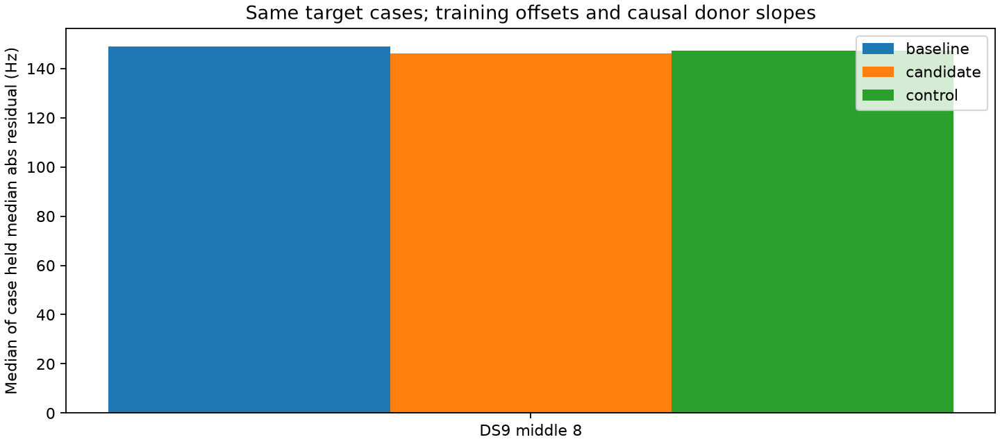

# Exact-RX/RF residual transfer has insufficient matched coverage

**No residual correction is promoted.** The frozen test has only **two matched
cases**, both from one recording and the same catalogue candidate, 66439, in
DS9 middle-eight. One improves and one worsens relative to both the unchanged
prediction and the receiver/RF control. There are no matched late-DS9 cases.
This is insufficient evidence of useful transfer, not proof that every possible
satellite correction fails.

All 34 fixed-point exports completed and replayed the original q020 training
scores, per-track training/held scores, signal responsibilities and candidate
weights. There were no new geographic or timing fits. Residuals are conditional
on training-selected candidate hypotheses, not independently verified identities.

| Matched population | Cases | Baseline held median absolute residual | Candidate-slope correction | Receiver/RF control |
|---|---:|---:|---:|---:|
| DS9 middle-eight | 2 | 148.800 Hz | 146.062 Hz | 147.195 Hz |
| All other panels | 0 | Unavailable | Unavailable | Unavailable |

These are medians of per-case median absolute held residuals after the same
training-derived constant offset. They are not normalized mixture scores,
independent trials or geographic errors. The small 2.737 Hz median paired gain
does not justify promotion from one candidate/recording. Both cases belong to
`scan-fw-2ddf30684e758a6a`; complete track IDs and predictions are in summary.json.

The two donor groups are DS7_donor_00 and DS9_donor_14. Candidate slopes are
**+3.983 / -5.690 Hz/s** for the first case and **+0.094 / -2.599 Hz/s** for
the second. Thus the two available donor estimates do not even share a sign
in either case. These canonical exported units are not physical clock
calibrations, and donor location error or element revisions may contribute.

## Why the earlier support count falls

The previous support census admitted any receiver/RF. This experiment's frozen
rule requires identical receiver and exact RF in at least two earlier donor
groups, each also containing other-candidate tracks for the control. It also
requires a strong target hypothesis and at least five training observations
spanning five seconds.

A **posthoc coverage-only audit** attributes the reduction below. No thresholds
were changed, no relaxed cases were scored, and no fits were rerun.

| Target panel | Eligible conditional cases | Two groups, any RX/RF | Two groups, same RX | Two groups, same RX and exact RF | Final matched cases |
|---|---:|---:|---:|---:|---:|
| DS8 late-eight | 429 | 3 | 2 | 0 | 0 |
| DS9 middle-eight | 446 | 48 | 31 | 2 | 2 |
| DS9 late-eight | 429 | 58 | 48 | 0 | 0 |

All other panels have zero two-group support after the target/shape gates.
The other-candidate control requirement causes no further loss after exact
RX/RF matching in this execution. Exact RF matching is the main coverage limit
for DS9; the previous 117 supported target MAP tracks cannot be described as
117 matched transfer tests.

## Method and verification

Training residuals use unchanged cached predictions at the 25 donor-only and
nine target eight-scan fitted points. A candidate case must have training signal
responsibility times conditional weight at least 0.5. A linear residual slope
is fitted only on training observations. The target constant offset is its own
training residual mean; its held observations never set an offset or slope.

Only donor groups ending before the target recording begins are available.
Within the same RX/exact RF, each donor group supplies a median same-candidate
slope and a separate median other-candidate slope. Two matched groups are
required; a median of group medians produces each forecast. No slope clipping
or reference-informed parameter choice occurs.

Of 10,930 donor tracks, 9,968 supply eligible conditional residual cases; of
4,328 target tracks, 3,983 do. All exclusions and reasons remain in the exports.
All 4,328 targets remain in coverage denominators. No unqualified or unsupported
track is represented as a successful correction.

Three prelaunch tests passed, covering exact linear recovery and held isolation,
short training spans, strict group chronology and matched receiver/RF controls.
The independent auditor reconstructs training slopes by least squares, checks
score replays and coverage, rebuilds matched group membership and medians,
recomputes forecasts, and verifies source/input/process hashes. It does not
independently implement the radio likelihood or verify satellite identities.

All **34 processes exited zero**, summed wall time **131.42 s**, longest
**6.02 s**, peak RSS **755,384 KiB**. Sequential BLAS1/nice19 execution used
90 s child limits and a 4 GiB address-space cap. There were no retries, RF,
raw IQ, propagation, archive/provider accesses or production changes.

## Decision toward sub-km evaluation

Do not launch geographic fits using this exact-match slope rule: it supplies
no correction to the failing late-DS9 panel and almost no matched evidence
elsewhere. Before a broader transfer model, distinguish legitimate RF-dependent
residuals from bookkeeping differences in recorded RF, and test any new
cross-RF hypothesis with explicit controls. Do not merely loosen matching until
a favorable result appears. [Next investigation](NEXT.md).

[Frozen results](RESULTS.md), [summary](summary.json), [coverage attribution](attrition.json),
[protocol](PROTOCOL.md), [tests](tests.log), [complete evidence hashes](evidence-sha256.json).
