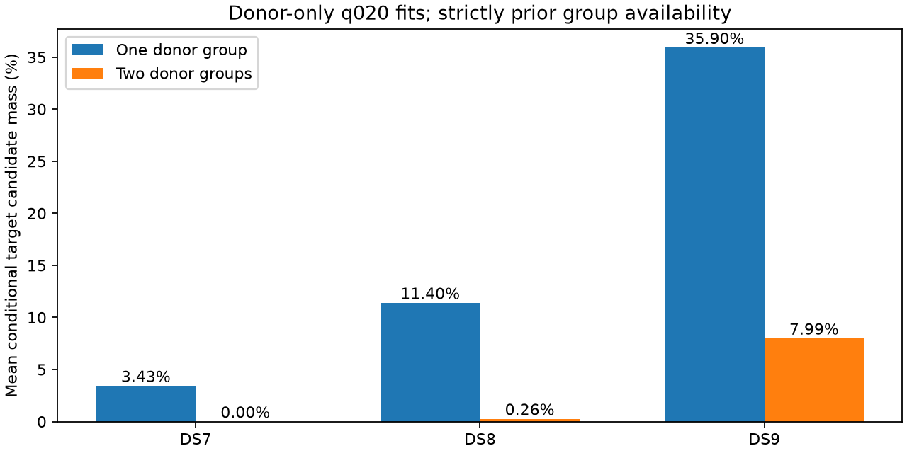

# Independent donor fits yield useful support mainly on DS9

**All 25 donor groups produce an audited fit.** They contain the 186 scans
outside the 72 target scans, with 10,930 bank-eligible donor tracks. Of 75
generic starts, 74 qualify. Training-weighted support remains substantially
narrower than raw candidate recurrence: two independent donor groups support
the target conditional MAP for **0 DS7, 4 DS8 and 117 DS9 tracks**.

This admits a bounded residual-consistency diagnostic mainly on DS9; it does
not justify a general satellite correction for DS7/DS8/DS9. No correction or
new target geographic fit was performed. Reliable short-set sub-km accuracy
remains unproven.

| Target dataset | Tracks | Mean one-group supported mass | Mean two-group supported mass | Target signal × two-group mass | Tracks with two-group mass >0.5 |
|---|---:|---:|---:|---:|---:|
| DS7 | 1,434 | 3.433% | 0% | 0% | 0 |
| DS8 | 1,434 | 11.401% | 0.264% | 0.263% | 4 |
| DS9 | 1,460 | 35.902% | 7.986% | 7.405% | 117 |

Every target track remains in the means, including unsupported tracks. Strong
donor membership requires signal responsibility times conditional candidate
weight at least 0.5 in a track. Support from two distinct fitted donor groups
is required for the two-group columns. Multiple tracks or scans sharing one
fitted group do not supply two independent group estimates. These are
descriptive model masses, not calibrated identity probabilities.

## Independence and chronology

The earlier full-dataset shared-scale fits use a different likelihood and
include the targets. Reusing them as independent donor calibration would be
incorrect. This study instead uses the same q=0.20 normalized frequency-contrast
and unassociated-trend likelihood as the target panels, with the original
observations, candidate banks, masks and scales.

All 72 target recordings are excluded before donor groups are formed. The
remaining chronological runs are split at target gaps, dataset boundaries and
eight recordings. Short final groups of four, five and one scan remain intact.
Three generic starts fit shared location and one timing per donor recording.
Selection uses only training score among fully audited starts.

A donor group becomes usable only after its last observation timestamp.
Using an earlier member's start time would improperly allow later observations
in that group's fit to influence an earlier target. This whole-group cutoff is
reconstructed by the result auditor. Targets use their unchanged original
eight-scan training distributions. The nested four-scan panels are not counted
again in the coverage table.

Catalogue numbers come from the independently audited
[cross-snapshot mapping](../2026_09_29_catalogue_recurrence/README.md). Candidate
number equality does not prove which satellite generated a track, and element
revisions do not establish persistent orbit errors.

## Verification and retained failure

All 25 bounded child processes exited zero. **DS8_donor_13 / southeast**
returned an abnormal optimizer termination and remains unqualified; it was not
retried. Its origin and northwest starts qualify, and northwest is the
training-selected result. All 25 selected endpoints pass the frozen derivative
and boundary audits. [All group results](RESULTS.md) preserve the three starts
and their qualifications per group.

Three prelaunch tests cover exclusion gaps, dataset/block boundaries and
whole-group causal availability. The five existing optimizer/selection tests
also passed before inputs and execution sources were frozen. The auditor
rechecks source/input/process hashes, all 186/72 disjoint memberships, group
availability, start qualifications, training selection, score sums, track
coverage and normalized weights. It then reconstructs candidate support.
This is an arithmetic/provenance audit, not an independent RF likelihood or
satellite identity verification.

Total child wall time is **570.09 s**, longest child **29.76 s**, peak RSS
**673,724 KiB**. Execution was sequential, BLAS1/nice19, with 90 s timeout,
4 GiB address-space cap and at least 5 GiB available memory per child. There
were no retries, new RF, raw IQ, propagation, archive/provider reads or
production changes. The frozen execution source retains one cosmetic Ruff
E501 line-length warning; numerical tests and audit gates were not changed.

The 186-scan historical calibration budget is additional to target four/eight
scan budgets. Donor held scores are retained only as diagnostics and did not
choose groups or starts. No reference error was used or scored here. The site
and previous outcomes are exposed, so this is not blind validation.

## Decision

Do not fit a global satellite correction as if every target had independently
supported repeat observations. First inspect whether candidate-specific residual
structure agrees across the supported donor groups and predicts target training
data beyond receiver/RF controls. The 117 DS9 tracks make that a bounded,
testable question; the empty DS7 two-group population needs another mechanism.
[Next investigation](NEXT.md).

[Frozen protocol](PROTOCOL.md), [full results](RESULTS.md), [summary](summary.json),
[group tests](tests.log), [optimizer tests](optimizer-tests.log),
[complete evidence hashes](evidence-sha256.json).
