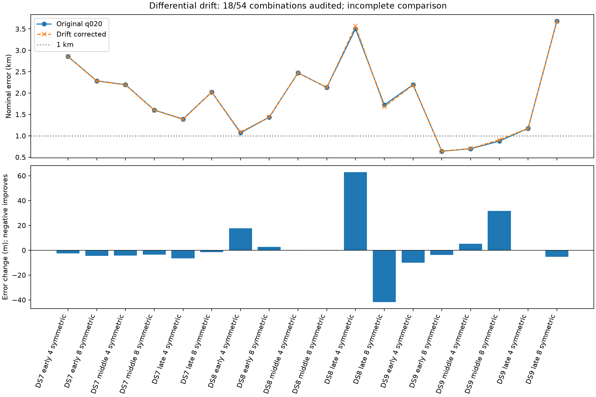

# Differential receiver drift: first geographic arm complete

**Equal splitting of relative drift does not provide reliable sub-km accuracy.**
All eighteen symmetric-arm fits pass their numerical audits. Location error
improves on 11/18 panels, worsens on six, and is unchanged on one. Held prediction
improves on eight, worsens on nine, and ties on one. Three panels remain below
1 km, exactly the baseline count. Neither nominal sub-km counts nor these exposed
single-site comparisons establish calibrated resolution or blind accuracy.

This is **18/54 completed arm/panel combinations**. The RX0-anchor and RX1-anchor
arms are frozen but not executed yet. No allocation has been selected as a winner.

| Model | DS7 four-scan median m | DS7 eight-scan median m | DS8 four-scan median m | DS8 eight-scan median m | DS9 four-scan median m | DS9 eight-scan median m |
|---|---:|---:|---:|---:|---:|---:|
| Original q020 | 2,196 | 2,024 | 2,474 | 1,721 | 1,174 | 876 |
| Symmetric drift correction | 2,192 | 2,022 | 2,474 | 1,679 | 1,174 | 908 |
| RX0 anchor | Pending | Pending | Pending | Pending | Pending | Pending |
| RX1 anchor | Pending | Pending | Pending | Pending | Pending | Pending |

Each median uses all three early/middle/late panels. Four/eight panels overlap.
The largest improvement is 41.93 m on DS8 late eight; the largest worsening is
62.92 m on DS8 late four. Late DS9 eight remains 3,675.61 m versus 3,680.86 m.
DS9 late four has no qualified corrections and reproduces its original estimate.
The limited correction covers 310/4,328 bank-eligible tracks across 26/72 scans;
all other tracks remain in the objective unchanged.

[Every panel and status](checkpoint-18/README.md),
[all starts, held changes and medians](checkpoint-18/summary.json).

Eight prelaunch tests pass. All 72 optimizer starts qualify and all eighteen
training-selected fits pass replay and finite-difference audits. Every selected
fit also reproduces the published fixed-position correction scores and receipts.
All ninety child processes exit zero; summed child wall time 553.44 seconds,
maximum 11.83 seconds, peak RSS 742,032 KiB. No retries or failed-audit substitution.
The run used three sequential six-panel batches with fixed resource caps.

The model fits shared location and one timing per scan, preserving original
candidate banks, masks, trend mixture and scale parameters. Correction allocation
does not identify common receiver drift. Pair selection is training-based but
does not verify satellite identity; shared donors and plug-in corrections do
not supply calibrated joint confidence. No cone or reception-order information
was added here. The reference is exposed and unsurveyed.

Remaining execution: the two receiver-anchor arms on the same eighteen panels,
in six-panel batches with all starts and failures retained. The stronger earlier
fixed-position score for correcting RX0 is a hypothesis to test, not evidence
of geographic improvement. Preserve the published scientific sources and completed
outputs; later reports may extend this directory with new results.

[Frozen protocol](PROTOCOL.md), [plan](plan.json), [tests](tests.log),
[input seal](input-seal.json), [complete evidence inventory](evidence-sha256.json).
Earlier [six-panel](checkpoint-6/README.md) and [twelve-panel](checkpoint-12/README.md)
checkpoints retain their historical pending statuses.
