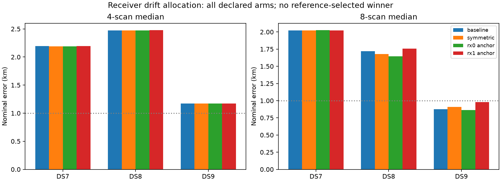

# Differential receiver drift: all geographic allocations complete

**All 54 declared arm/panel combinations are complete and audited. None delivers
reliable sub-km accuracy across DS7, DS8 and DS9.** Every allocation retains the
baseline's three sub-km panels. Correcting RX0 while holding RX1 fixed improves
held prediction on 14/18 panels but geographic error on only 9/18.

| Model | DS7 / 4 median m | DS7 / 8 median m | DS8 / 4 median m | DS8 / 8 median m | DS9 / 4 median m | DS9 / 8 median m |
|---|---:|---:|---:|---:|---:|---:|
| Original q020 | 2,196 | 2,024 | 2,474 | 1,721 | 1,174 | 876 |
| Symmetric drift split | 2,192 | 2,022 | 2,474 | 1,679 | 1,174 | 908 |
| RX0 fixed; correct RX1 | 2,190 | 2,025 | 2,471 | 1,644 | 1,174 | 863 |
| RX1 fixed; correct RX0 | 2,194 | 2,021 | 2,477 | 1,758 | 1,174 | 978 |

Each median uses all three early/middle/late panels. Four/eight panels overlap.
These previously explored single-site errors use an exposed unsurveyed reference;
they are not blind accuracy or calibrated resolution. No allocation is selected
using reference-coordinate error.

| Allocation | Lower error / 18 | Better held prediction / 18 | Sub-km / 18 | Worst panel m |
|---|---:|---:|---:|---:|
| Symmetric | 11 | 8 | 3 | 3,676 |
| RX0 fixed | 10 | 3 | 3 | 3,658 |
| RX1 fixed | 9 | 14 | 3 | 3,688 |

Each arm has one unchanged panel, DS9 late four, with no qualified corrections.
Counts are descriptive, not independent trials. Symmetric correction reaches
310/4,328 bank-eligible tracks across 26/72 scans; single-receiver anchors change
half those tracks. All remaining tracks stay in the objective unchanged.

[Complete ablation](ABLATION.md), [every panel and audit status](all-complete/README.md),
[all starts and results](all-complete/summary.json), [machine-readable comparison](ablation.json).

## Verification and retained failures

Eight prelaunch tests pass. All 54 training-selected fits pass replay and
finite-difference audits; every selected fit also reproduces its published
fixed-position correction scores and receipts. Of 216 optimizer starts, 212
qualify. Four report ABNORMAL termination and remain rejected despite small
final gradients: DS7 early four/RX0-anchor west_north; DS7 early eight/RX0-anchor
origin; DS7 late four/RX1-anchor west_north; DS8 late eight/RX0-anchor origin.
No failed start was retried, and no selected audit was substituted.

All 270 child processes exit zero. Summed child wall time is 1,590.38 seconds,
maximum 14.31 seconds, and peak RSS 742,660 KiB. Execution used nine separately
inspected six-panel batches, one sequential worker, and fixed resource caps.
Frozen sources and inputs verify. No new RF, raw IQ, propagation, provider
fetches, production modifications or golden-fixture changes.

## Interpretation and next direction

The model preserves original banks, masks, noise scales and the q020 trend
mixture, fitting shared location and one timing per scan. Relative receiver
drift leaves common drift unidentifiable. Pairing does not verify a shared
satellite, and shared donors plus plug-in corrections do not provide calibrated
joint uncertainty. No beam or reception-order information was added here.

Do not expand drift bounds or select an anchor using roof error. The next
[proposed evidence check](NEXT.md) is whether training-selected RX pairs
support shared satellite assignments within their pinned candidate banks.
An uncertain shared-trajectory alternative could add a physical constraint
that drift correction alone does not supply. It has not been executed here.

[Frozen protocol](PROTOCOL.md), [plan](plan.json), [tests](tests.log),
[input seal](input-seal.json), [complete evidence inventory](evidence-sha256.json).
Earlier checkpoints retain their historical pending statuses; use the
all-complete report for the completed comparison.
