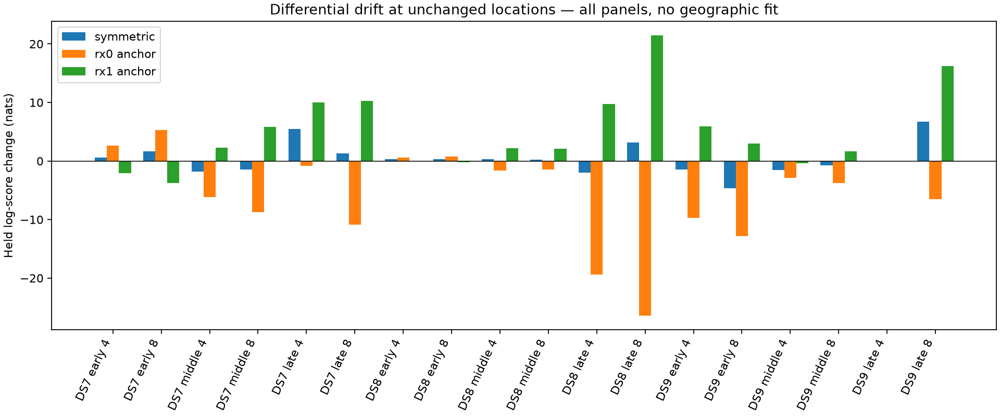

# Drift allocation at unchanged fitted locations

All eighteen fixed-position panels completed. The unchanged control reproduces
published training scores, gradients, every held track score and conditional
signal-candidate weights within 1e-7. Six tests pass in the execution interpreter.
All eighteen children exit zero. There is no new geographic fit or error.

| Assumption | Better held score / 18 | Tied | Worse | Median change, nats |
|---|---:|---:|---:|---:|
| Split relative drift equally | 10 | 1 | 7 | +0.284 |
| Hold RX0 fixed; correct RX1 | 4 | 1 | 13 | −3.336 |
| Hold RX1 fixed; correct RX0 | 12 | 1 | 5 | +2.258 |

The asymmetry merits a geographic sensitivity test of all three assumptions.
It does not identify which hardware clock drifts, establish common-mode
calibration, or validate shared satellite identities. Training-selected pairs
and calibration estimates are reused across targets, and nested panels are
dependent. These conditional scores do not integrate calibration uncertainty.

| Panel | Symmetric Δnats | RX0 fixed Δnats | RX1 fixed Δnats |
|---|---:|---:|---:|
| DS7 early 4 | +0.557 | +2.658 | −2.067 |
| DS7 early 8 | +1.646 | +5.339 | −3.772 |
| DS7 middle 4 | −1.811 | −6.160 | +2.294 |
| DS7 middle 8 | −1.463 | −8.738 | +5.836 |
| DS7 late 4 | +5.437 | −0.837 | +10.014 |
| DS7 late 8 | +1.262 | −10.852 | +10.268 |
| DS8 early 4 | +0.323 | +0.623 | −0.038 |
| DS8 early 8 | +0.313 | +0.743 | −0.184 |
| DS8 middle 4 | +0.295 | −1.590 | +2.221 |
| DS8 middle 8 | +0.274 | −1.495 | +2.083 |
| DS8 late 4 | −1.954 | −19.424 | +9.730 |
| DS8 late 8 | +3.145 | −26.432 | +21.464 |
| DS9 early 4 | −1.490 | −9.674 | +5.919 |
| DS9 early 8 | −4.616 | −12.812 | +2.964 |
| DS9 middle 4 | −1.559 | −2.881 | −0.422 |
| DS9 middle 8 | −0.784 | −3.791 | +1.645 |
| DS9 late 4 | 0.000 | 0.000 | 0.000 |
| DS9 late 8 | +6.694 | −6.480 | +16.242 |

All allocations use the same q020 training-selected positions, timings, tracks,
candidate banks and masks. Neither cone weights nor model scales change.
DS9 late four has no qualified corrections, so every score is unchanged.
Across the nine nonoverlapping eight-scan panels, symmetric correction reaches
136/1,434 DS7, 74/1,434 DS8 and 100/1,460 DS9 bank-eligible tracks. A single
receiver anchor changes half those counts. Coverage spans 10, 8 and 8 scans
respectively. No missing calibration removes a track.

The reporter verifies frozen hashes, result identities, exact score sums,
all correction receipts and unchanged training/held scores on every uncorrected
track. Total child wall time 55.95 seconds; maximum 4.21 seconds; peak RSS
741,148 KiB. Sources and input bindings verify. No retries, RF collection,
raw-waveform reads, propagation, provider fetches or production modifications.

[Frozen protocol](FIXED-PROTOCOL.md), [plan](fixed-plan.json),
[tests](fixed-tests.log), [audited summary](fixed-summary.json),
[per-panel evidence](fixed-runs/), [complete evidence inventory](evidence-sha256.json).
