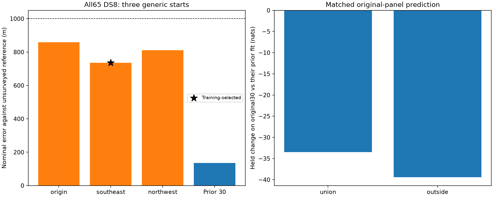

# Shared-scale localization on complete DS8

The training-selected complete-DS8 fit has **736.097 m nominal error** against
the exposed unsurveyed reference. All three generic starts qualify and give
**736–859 m**. The sub-kilometre threshold survives inclusion of all 65 manifest
recordings, but the result is substantially worse than the prior 30-record fit
and loses predictive score on both matched original panels.

This extends the [combined30 result](../2026_09_28_combined30/README.md) using
the unchanged shared-track-scale likelihood and the same evaluation design as
[complete DS7](../2026_09_28_ds7_full_shared/README.md). It does not establish
complete-dataset performance for DS9, which still has 45 recordings pending
input preparation at [checkpoint 08](../2026_09_28_full_manifest_inputs/checkpoints/08-pool-ds8-ready/README.md).

## Results

| Fit/start | Nominal error (m) | Training gap from selected full65 fit (nats) | Gradient infinity norm | Qualified |
|---|---:|---:|---:|---|
| Full65, origin | 859.466 | -235.885 | 0.002435 | Yes |
| Full65, southeast — selected | **736.097** | 0 | 0.000535 | Yes |
| Full65, northwest | 810.963 | -265.803 | 0.001116 | Yes |
| Prior 30-record fit | 135.092 | Different observations; no direct score comparison | — | Yes |

The selected full-dataset error is **601.005 m larger** than the earlier
30-record result. The inherited origin is already 809.029 m from the reference;
the selected estimate is only about 72.9 m closer. Two other qualified starts
are farther from the reference than that inherited origin. Thus this is
evidence for a nominal threshold on complete membership, not a large geographic
improvement, calibrated resolution or proof that more data improves accuracy.
Selection used training score only, not reference distance or held score.

| Original panel, matched to its prior combined30 fit | Tracks | Held observations | Training change (nats) | Held change (nats) | Positive held records /15 |
|---|---:|---:|---:|---:|---:|
| Union 15 | 904 | 17,117 | -13.061 | -33.489 | 6 |
| Outside 15 | 871 | 14,775 | -54.372 | -39.418 | 7 |

Both matched panels lose held score, totaling **-72.907 nats** over the original
30 recordings. Their track identities and held counts match the prior fit
exactly. The additional 35 recordings contribute 2,065 eligible tracks, 55,733
training observations and 37,031 held observations. Their absolute scores are
archived; they have no previous shared-scale geographic baseline, so no change
statistic is claimed for them.

## Fixed scientific design

All **65 DS8 recordings** remain included: 3,840 eligible tracks, 104,216
training observations and 68,923 held observations. Six track-level eligibility
exclusions remain explicit in the input ledger. Preparation requires complete
readiness, exact ordered manifest membership, matching input hashes and the
unchanged request config. There is no recording substitution or outcome filter.

[PROTOCOL.md](PROTOCOL.md) freezes the same multivariate Student-t4 shared track
scale model at 100 Hz, diagonal scale matrix (decay 0), weak offset prior,
candidate banks, visibility, catalogue normalization and whole-visit partition.
The [runner](run.py) and [launcher](launch.py) are byte-for-byte copies of the
complete-DS7 experiment, as checked in [validation.json](validation.json).
Only dataset membership, count accounting and report comparisons change.

Three generic E/N starts are (0,0), (3,-3) and (-3,3) km; all 65 timing offsets
start at zero. No prior fitted position or timing vector initializes or replaces
a run. L-BFGS-B uses maxiter 140/maxfun 200, ftol 1e-14, gtol 1e-8, maxls 30,
bounds +/-12 km and +/-5 seconds. Qualification requires optimizer success,
interior parameters and gradient infinity norm <= 0.01. The greatest training
score among qualified starts determines selection. There are no retries,
relaxed gates or earlier-fit fallback.

## Verification and resources

All four scientific processes exit zero: three source fits and one selected-
point held/numerical audit. All three fits qualify. Training replays and row
sums agree within 1e-7. Four E/N gradient comparisons at 1 m and 0.5 m pass;
maximum discrepancy is **2.940e-5**, against tolerance 0.002. All track/observation
counts and recording identities reconcile. Independent spherical-distance
checks agree within 0.0001 m. The scorer verifies 300 execution/input bindings.

All four report scripts pass Ruff lint and formatting checks. The unchanged
scientific helpers' six tests previously passed in the
[DS7 test record](../2026_09_28_ds7_full_shared/tests.log); this report does not
claim a fresh run of those unchanged tests. The full-DS8 execution supplies the
dataset-specific replay, numerical-gradient, identity and count checks above.
Runtime and reader provenance are retained in the
[input environment archive](../2026_09_28_full_manifest_inputs/environment.json).

One modeling worker ran at a time with BLAS1/nice19, a 12 GiB address-space cap,
300-second process cap and at least 14 GiB available memory before each job.
No scientific input worker overlapped modeling; publication of sealed input
archives did overlap. Maximum job time is 87.25 seconds, summed job time
271.46 seconds, and maximum RSS 4,335,612 KiB. There are no process failures,
optimizer failures, timeouts or retries in this modeling experiment. The older
DS9 input timeout is preserved in its separate input report, not attributed to
these four successful model processes.

## Evidence, limits and decision

[plan.json](plan.json) freezes all inputs, generic starts and audited counts.
Each stage preserves its command, input/source hashes, exit status, result,
terminal log and resources. [scores.json](scores.json) contains every alternative,
selection, nominal error, matched predictive comparison and gradient check.
[resource-summary.json](resource-summary.json) preserves measured resources;
[evidence-sha256.json](evidence-sha256.json) binds the report and dependencies,
excluding itself. Run order is `prepare.py`, `launch.py source`,
`launch.py transfer`, then `score_plot.py`. Here `transfer` selects and audits
the DS8 fit; it does not fit another dataset.

The reference is the same exposed, unsurveyed operator coordinate used by prior
experiments, and the inherited origin is already sub-kilometre. This is complete
DS8 membership, not blind or surveyed validation, a new-site result, proof of
emitter identity or a calibrated confidence radius. Multiple locally qualified
starts do not certify a global optimum. No waveform reads, RF collection,
provider fetch, new propagation, component changes or golden-fixture changes
occur in this modeling stage.

Retain shared track scale as a nominal sub-kilometre approach on complete DS7
(526.902 m) and complete DS8 (736.097 m), with the geographic and held-prediction
regressions above explicit. Continue full DS9 preparation and the same independent
complete-dataset evaluation before claiming the objective across all three
datasets. The overall DS7/DS8/DS9 goal remains open.
