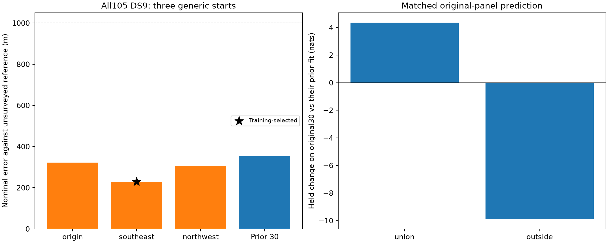

# Shared-scale localization on complete DS9

The training-selected fit achieves **229.248 m nominal horizontal error** using
all 105 DS9 recordings. All three generic starts qualify, with errors of
229–322 m. This completes the same full-membership shared-scale evaluation
that reached 526.902 m on DS7 and 736.097 m on DS8. These are joint position
errors against an exposed unsurveyed reference, not single-scan accuracy or
calibrated resolution.

| Start | Error (m) | Training gap from selected (nats) | Gradient infinity norm | Qualified |
|---|---:|---:|---:|---|
| Origin | 322.420 | -506.815 | 0.001071 | Yes |
| Southeast, selected | **229.248** | 0 | 0.000975 | Yes |
| Northwest | 306.045 | -860.291 | 0.000740 | Yes |
| Prior 30-record fit | 352.435 | Different observations | — | Yes |

The selected error is 123.187 m smaller than the prior 30-record fit and
579.781 m smaller than the inherited origin's 809.029 m error. Membership
changes between 30 and 105; this is not a controlled likelihood ablation.
Selection uses training likelihood only. Reference distance and held score
do not select starts. Different qualified local solutions remain, so this
does not certify a global optimum.

| Original panel, matched against its prior combined30 fit | Tracks | Held observations | Training change (nats) | Held change (nats) | Positive held records /15 |
|---|---:|---:|---:|---:|---:|
| Union 15 | 905 | 16,706 | +11.856 | +4.356 | 9 |
| Outside 15 | 917 | 17,510 | -16.056 | -9.890 | 7 |

The net matched held change is **-5.533 nats**. Geographic improvement therefore
does not establish an overall predictive improvement. The additional 75
recordings contain 4,465 eligible tracks, 124,822 training observations and
83,911 held observations. Absolute scores are retained in scores.json;
there is no earlier shared-scale geographic baseline for these recordings.

## Frozen model and complete inputs

All **105 manifest recordings** are retained, with 6,287 eligible tracks,
175,352 training observations and 118,127 held observations. Eight track
eligibility exclusions remain explicit. The audited
[complete input checkpoint](../2026_09_28_full_manifest_inputs/checkpoints/09-full-ready/README.md)
verifies ordered membership, artifact hashes, DS9 mint-time GLRT bindings
and the separately validated DS9-F028 recovery. Its original timeout remains
preserved; it is not a failure of this model run.

[PROTOCOL.md](PROTOCOL.md) freezes shared track scale with decay zero,
Student-t4 at 100 Hz, weak offset prior, catalogue normalization, visibility,
causal candidate banks and whole-visit train/held partition. Three generic
E/N starts are (0,0), (3,-3), (-3,3) km, with all 105 timings initially zero.
No earlier fitted position or timing initializes or replaces a fit.
The numerical runner and launcher are byte-identical to complete DS7/DS8.

L-BFGS-B retains maxiter 140/maxfun 200, ftol 1e-14, gtol 1e-8, maxls 30,
position bounds +/-12 km and timing bounds +/-5 s. Qualification requires
optimizer success, interior parameters and gradient infinity norm <=0.01.
There is no automatic retry, relaxed qualification or earlier-fit fallback.

## Verification and resources

All four scientific processes exit zero: three fits and one selected-point
held/numerical audit. Training replays and row sums agree within 1e-7; four
position-gradient checks at 1 m and 0.5 m have maximum discrepancy
**9.585e-6**, below 0.002. Track identities, observation counts and manifest
membership reconcile. Independent spherical-distance checks agree within
0.0001 m. The scorer verifies 460 execution/input bindings.

All four report scripts pass Ruff lint and formatting. The unchanged
scientific helpers' six tests previously passed in the
[DS7 test record](../2026_09_28_ds7_full_shared/tests.log); no fresh run of those
unchanged tests is claimed. [validation.json](validation.json) checks byte
identity of the scientific runner and launcher. Runtime provenance is in the
[input environment archive](../2026_09_28_full_manifest_inputs/environment.json).

One scientific worker ran at a time, BLAS1/nice19, with a 12 GiB address-space
cap, 300-second process cap and at least 14 GiB available memory before each
launch. An initial low-memory observation delayed launch until headroom
recovered; no model process failed that gate. No input worker overlapped
modeling; archive publication did overlap. Fit wall times were 184.61,
219.01 and 181.76 seconds; held audit 42.05 seconds. Total 627.43 seconds,
maximum RSS 7,293,836 KiB. No optimizer failure, timeout or retry occurred.

## Evidence and next evaluation

[plan.json](plan.json) freezes inputs and starts. Stage directories retain
commands, source/input hashes, results, exit statuses, terminal logs and
resource measurements. [scores.json](scores.json) records all starts and
matched held comparisons. [resource-summary.json](resource-summary.json)
and [evidence-sha256.json](evidence-sha256.json) retain the audit trail.
Execution order is prepare.py, launch.py source, launch.py transfer,
score_plot.py. Here transfer performs selection and held auditing, not a
cross-dataset position transfer.

Complete DS7, DS8 and DS9 now each have a nominal sub-kilometre shared-scale
joint result. The reference is the same previously exposed, unsurveyed
operator coordinate; no blind/new-site validation, independent emitter
identity, calibrated confidence radius or surveyed accuracy is established.
No RF collection, waveform read, provider fetch, new propagation, component
change or golden-fixture change occurs in this experiment.

The requested [consecutive four/eight-scan experiment](../2026_09_29_consecutive_panels/PROTOCOL.md)
tests whether this behavior survives smaller observation budgets. Its
predeclared blocks must be evaluated separately; the complete-dataset result
cannot substitute for their results or for single-scan medians.
