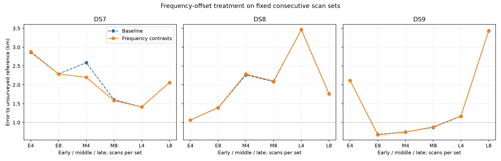
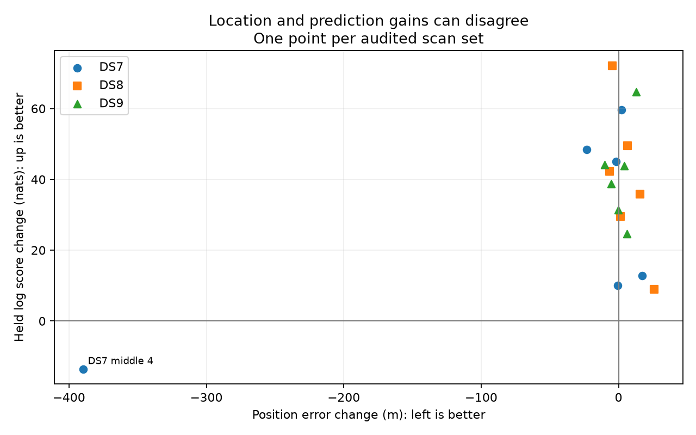

# Frequency-contrast location control

**18/18 selected panels pass the numerical audit; 3 audited sets are below 1 km.** This is not evidence of reliable sub-km resolution across DS7/DS8/DS9.

The model removes each track's constant frequency offset using a normalized Student-t4 density on frequency differences. It changes the likelihood dimension and predictive treatment of the offset, and removes the weak absolute-offset penalty. No cone, separate RX timing, or background branch is added.

Eight independent synthetic tests passed before freezing. 53/54 starts qualify. Among audited panels, position error improves in 9/18 and held prediction improves in 17/18. These dependent, single-site comparisons are descriptive; reference coordinates are unsurveyed and previously exposed.

## Median joint-set error

Metres across early/middle/late. Incomplete means at least one planned block failed qualification or audit; do not silently omit it.

| Dataset | Scans | Baseline | Frequency contrasts |
|---|---:|---:|---:|
| DS7 | 4 | 2,590.1 | 2,200.3 |
| DS7 | 8 | 2,063.7 | 2,061.9 |
| DS8 | 4 | 2,260.9 | 2,287.0 |
| DS8 | 8 | 1,762.0 | 1,757.6 |
| DS9 | 4 | 1,167.3 | 1,173.5 |
| DS9 | 8 | 869.7 | 882.5 |

## Every planned panel

Held change is contrast minus baseline, in nats over the identical held observations. Positive favors contrasts. Training scores are not compared across these different-dimensional models.

| Panel | Baseline m | Contrast m | Held change nats | Audit |
|---|---:|---:|---:|---|
| DS7_early_4 | 2864.858 | 2881.926 | +12.751 | Pass |
| DS7_early_8 | 2287.191 | 2289.516 | +59.631 | Pass |
| DS7_middle_4 | 2590.063 | 2200.318 | -13.535 | Pass |
| DS7_middle_8 | 1606.608 | 1583.280 | +48.500 | Pass |
| DS7_late_4 | 1414.224 | 1413.520 | +9.990 | Pass |
| DS7_late_8 | 2063.706 | 2061.863 | +45.027 | Pass |
| DS8_early_4 | 1065.224 | 1066.687 | +29.539 | Pass |
| DS8_early_8 | 1390.877 | 1397.496 | +49.581 | Pass |
| DS8_middle_4 | 2260.918 | 2286.976 | +8.970 | Pass |
| DS8_middle_8 | 2084.608 | 2100.105 | +35.902 | Pass |
| DS8_late_4 | 3467.535 | 3461.033 | +42.302 | Pass |
| DS8_late_8 | 1762.028 | 1757.611 | +72.045 | Pass |
| DS9_early_4 | 2117.272 | 2116.956 | +31.355 | Pass |
| DS9_early_8 | 682.990 | 672.930 | +44.157 | Pass |
| DS9_middle_4 | 750.643 | 745.328 | +38.729 | Pass |
| DS9_middle_8 | 869.695 | 882.477 | +64.710 | Pass |
| DS9_late_4 | 1167.327 | 1173.533 | +24.574 | Pass |
| DS9_late_8 | 3435.817 | 3439.973 | +43.887 | Pass |

## Matched first-four held predictions

Eight-scan minus four-scan fit, scoring only the common first four scans.

| Dataset | Block | Held change nats |
|---|---|---:|
| DS7 | early | -51.315 |
| DS7 | middle | +22.052 |
| DS7 | late | -11.622 |
| DS8 | early | -65.439 |
| DS8 | middle | -12.022 |
| DS8 | late | -6.298 |
| DS9 | early | -71.792 |
| DS9 | middle | -35.141 |
| DS9 | late | -10.141 |

## Audit and reproduction

72 child processes, 72 exit zero; total job wall time 386.93 s, maximum 11.01 s, peak RSS 665,196 KiB. Process success is separate from scientific qualification.

All source/input and child evidence hashes were verified; selections were reconstructed from each start. Every selected fit checks both step sizes on all position/timing coordinates, with explicit timing-node crossing checks. Both geographic distance formulas agree within 0.0001 m. The summary retains all starts and failed checks.

The original retained candidate bank and horizon gate remain. Candidate weights do not establish satellite identities; no normalized full-catalogue detection/clutter model is claimed. A future unassociated-track branch must resolve omitted catalogue mass explicitly. No new RF data were collected.

[Protocol](PROTOCOL.md), [tests](tests.log), [frozen plan](plan.json), [complete results](summary.json), [source/input seal](input-seal.json).

## Next modeling step

The [explicit unassociated-trend proposal](FOLLOWUP.md) describes how to reduce the geographic force of tracks poorly explained by satellite candidates. It requires a compatible normalized contrast density and an explicit retained-bank interpretation before mixture probabilities can be meaningful. This report does not implement that branch or establish receiver-cone consistency.

## Unqualified starts

- DS9_early_4 / origin: ABNORMAL: 

These starts remain excluded under the frozen success requirement, even if their final gradient is small. No completed start was rerun.
