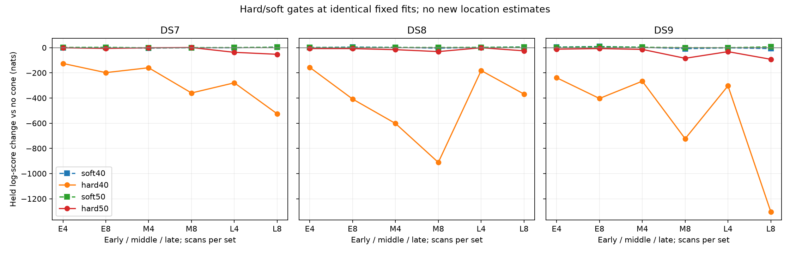

# Hard versus soft cones at unchanged fitted locations

**Neither hard gate is promoted.** Hard40 worsens held prediction in all 18 panels;
hard50 worsens it in 17/18. Most hard40 loss occurs even on tracks with an in-cone
candidate. [Decision, loss decomposition and next model](DECISION.md).

All eighteen fixed-position panels completed and replay the published no-cone q=0.20 model. This experiment changes only training-cone weights and their transfer to the unassociated trend. Location, per-scan timing, candidate banks and held observations remain identical. It produces no new geographic accuracy estimate.

| Arm | Better held prediction vs no cone | Median change (nats) | Range (nats) | Unsupported tracks / 4,328 | Scans with unsupported tracks / 72 |
|---|---:|---:|---:|---:|---:|
| soft40 | 10/18 | +0.626 | -8.631 to +8.935 | 12 | 11 |
| hard40 | 0/18 | -331.773 | -1304.146 to -125.727 | 12 | 11 |
| soft50 | 15/18 | +1.376 | -1.855 to +6.332 | 0 | 0 |
| hard50 | 1/18 | -13.164 | -92.688 to +0.672 | 0 | 0 |

Unsupported means no retained training-horizon-visible candidate stays inside the width throughout training. Counts use only nine nonoverlapping eight-scan sets. The soft arm may retain outside-cone signal weight; the hard arm assigns unsupported tracks entirely to background. Background is not a complete satellite explanation.

| Half-angle | Hard beats soft held score | Median hard-minus-soft (nats) |
|---|---:|---:|
| 40° | 0/18 | -330.712 |
| 50° | 2/18 | -15.969 |

## Every panel

| Panel | soft40 − baseline | hard40 − baseline | soft50 − baseline | hard50 − baseline |
|---|---:|---:|---:|---:|
| DS7_early_4 | -1.052 | -125.727 | +1.322 | -1.139 |
| DS7_early_8 | +0.376 | -198.540 | +2.685 | -6.401 |
| DS7_middle_4 | -4.344 | -159.817 | -1.855 | -1.319 |
| DS7_middle_8 | -0.430 | -360.151 | +0.057 | +0.672 |
| DS7_late_4 | -1.278 | -279.480 | +0.390 | -37.313 |
| DS7_late_8 | +4.287 | -525.522 | +3.479 | -53.009 |
| DS8_early_4 | +0.875 | -156.932 | +0.950 | -7.659 |
| DS8_early_8 | +4.210 | -408.526 | +0.616 | -7.806 |
| DS8_middle_4 | +2.335 | -602.359 | +1.431 | -16.151 |
| DS8_middle_8 | -4.819 | -911.536 | +0.954 | -31.481 |
| DS8_late_4 | +2.008 | -181.945 | +2.372 | -1.069 |
| DS8_late_8 | +5.222 | -368.964 | +3.883 | -25.403 |
| DS9_early_4 | +4.318 | -239.118 | +2.692 | -12.206 |
| DS9_early_8 | +8.935 | -403.664 | +6.332 | -7.412 |
| DS9_middle_4 | +2.831 | -266.512 | +2.917 | -14.123 |
| DS9_middle_8 | -8.631 | -723.489 | -0.087 | -84.714 |
| DS9_late_4 | -1.693 | -303.396 | -0.692 | -31.935 |
| DS9_late_8 | -7.868 | -1304.146 | +6.198 | -92.688 |

## Geometry and limitations

| Arm | Training-inside / satellite weight | Training-and-held-inside / satellite weight |
|---|---:|---:|
| soft40 | 92.24% | 91.80% |
| hard40 | 100.00% | 99.48% |
| soft50 | 98.32% | 98.29% |
| hard50 | 100.00% | 99.97% |

Hard gates enforce training consistency for signal hypotheses; held geometry remains diagnostic. The normalized conditional frequency score does not model observing opportunities or non-detections and does not enforce hard visibility at held times. No receiver orientation or travel direction is calibrated. Counts across nested panels are dependent, and the retained banks are not the full catalogue.

The complete results retain reassociation counts among tracks with signal responsibility >0.5 in the scored arm and no-cone baseline, with explicit denominators, and the two previously excluded RX0 tracks. Posterior concentration is not verified identity. Any subsequent hard-gate position fit requires separate tests and a bounded search for a discontinuous objective.

All 18 child processes exit zero; summed wall time 46.20 s, maximum 3.50 s, peak RSS 668,900 KiB. Frozen execution/input hashes, baseline replays, observation identities, probability sums, exact hard zeros and support masses were verified. No new fits, RF, raw IQ, propagation, provider fetches or archive reads.

The [original execution](../2026_09_29_hard_cone_scoring/README.md) failed before loading data and produced no scores. This corrected entry point uses an identical scientific plan; all original artifacts are preserved.

[Protocol](PROTOCOL.md), [ten passing prelaunch tests](tests-v2.log), [complete results](summary.json), [evidence hashes](evidence-sha256.json).
