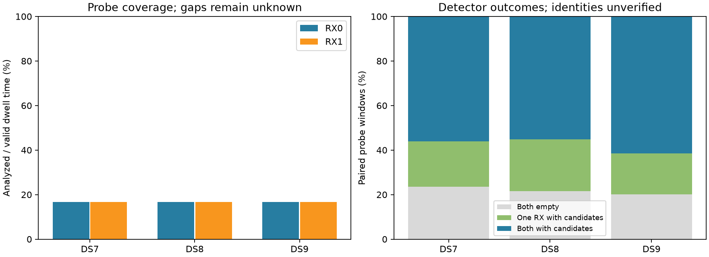

# Complete DS7/DS8/DS9 receiver opportunity audit

**All 258 recordings pass the opportunity audit.** There are 571,484 paired probe
windows, with no missing receiver views, inconsistent pair timing/tuning, duplicate
probe keys, uncovered visits, or probes outside their valid visit intervals.
Every recorded valid visit is 120 ms and each RX has one 20 ms analyzed probe:
**16.7% extraction coverage of valid dwell time in every recording**.

This establishes observation support for subsequent modeling. It is not a new
geographic fit, satellite identification or demonstrated sub-km improvement.

| Dataset | Scans | Target / donor scans | Valid visits / paired windows | Both RXs empty | One RX with candidates | Both RXs with candidates |
|---|---:|---:|---:|---:|---:|---:|
| DS7 | 88 | 24 / 64 | 194,934 | 45,898 | 39,785 | 109,251 |
| DS8 | 65 | 24 / 41 | 143,988 | 31,078 | 33,497 | 79,413 |
| DS9 | 105 | 24 / 81 | 232,562 | 46,897 | 42,690 | 142,975 |

Empty means zero extracted candidates passing the persisted fractional-margin gate,
not verified satellite absence. Both RXs having candidates does not establish that
they observed the same satellite. All 72 original target scans and 186 disjoint
donor scans are retained; no geographic error or detector outcome selects membership.

| Dataset | RX0 empty probes / all probes | RX1 empty probes / all probes | RX0 analyzed coverage | RX1 analyzed coverage |
|---|---:|---:|---:|---:|
| DS7 | 51,125 / 194,934 | 80,456 / 194,934 | 16.7% | 16.7% |
| DS8 | 34,372 / 143,988 | 61,281 / 143,988 | 16.7% | 16.7% |
| DS9 | 53,629 / 232,562 | 82,855 / 232,562 | 16.7% | 16.7% |

## Meaning of dwell and coverage

Dwell duration here comes from each public capture receipt's valid start/end device
sample counters and sample rate. It is the **actual recorded valid visit interval**,
not a configured active-dwell maximum, inactive-dwell setting, or elapsed wall time
including retuning. No 240 or 360 ms valid interval occurs in these 258 manifests.
That does not establish what all requested firmware settings were or why a requested
longer dwell might not occur; such a configuration/decision audit is separate.

The unexamined 100 ms in each 120 ms visit remains unknown to this extraction.
This fraction is not recording duty cycle, signal occupancy or probability of
detection. Receipt continuity and source qualification do not turn unexamined
samples into detector observations. Aggregate coverage uses seconds, avoiding
extra weighting of higher-rate recordings. Per-record and dataset/role/RX/dwell
breakdowns remain in [summary.json](summary.json).

## Method and verification

The [protocol](PROTOCOL.md) was frozen before execution. The three verified
[pilot exports](../2026_09_29_opportunity_coverage/README.md) are reused; the remaining
255 records are loaded through public TrackingInput and read-only adaptive capture
inspection, without raw IQ reads. Capture digests must match immutable dataset
manifests. Every batch verifies the installed loader bytes against the preserved
pilot source. Each compressed record contains exact RF, visit sample intervals,
probe intervals, candidate counts, qualification and analysis-manifest digest.

Three frozen interval-accounting tests pass before export. Eight bounded batches
exit zero, with 597.22 s total launcher wall time and peak child RSS 259,988 KiB.
No failed records, retries or substitutions occurred. One process ran at a time,
with BLAS1/nice19, a 180 s batch timeout and 4 GiB address-space limit.

The final audit replays the frozen pilot auditor for every record and checks saved
summaries exactly. A separate disjoint-interval calculation independently confirms
covered/valid sample totals for every RX in every recording. All 258 inputs and
their timing authorities are qualified. Source/input hashes verify after execution;
all scripts pass Ruff. The figure was visually inspected.

No RF collection, orbit propagation, provider query, production modification or
geographic fit was performed. The saved report includes all compressed metadata
exports, summaries, launch/exit/resource receipts and complete evidence hashes.

## Model implication and next experiment

A visibility likelihood may score these probe windows, with an explicit detector
model, while leaving the gaps unknown. Earlier presence, paired-state and causal
geometry experiments already retained empty windows; this audit does not reveal
a missing-window bug in those studies or overturn their negative results.

[The next comparison](NEXT.md) tests a distinct hypothesis: whether training-only
receiver/RF extraction coverage helps calibrate the unassociated-track prior better
than a donor-fitted constant prior. Complete joins, held-data isolation and predictive
transfer must be demonstrated before a new geographic fit. No such prior model has
been fitted in this report. Reliable sub-km accuracy for DS7/DS8/DS9 remains open.

[Selection and batches](plan.json), [full summary](summary.json), [audit code](summarize.py),
[tests](tests.log), [input seal](input-seal.json), [completion receipt](exit.json),
[complete evidence inventory](evidence-sha256.json).
