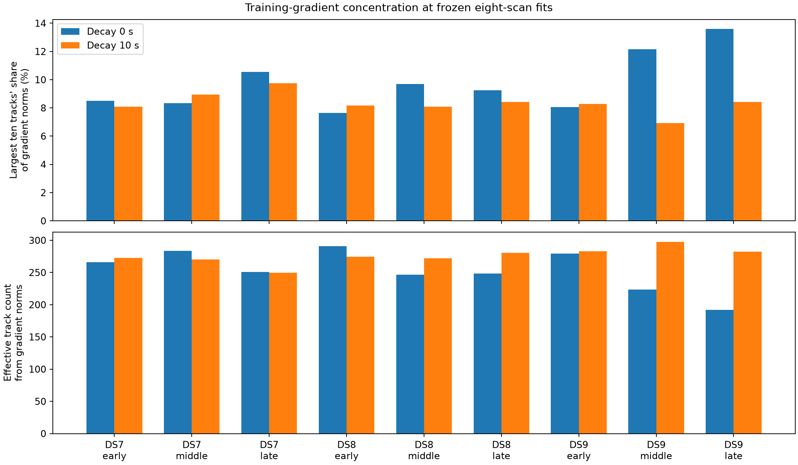

# Training-only audit of consecutive-panel disagreement

The local training gradients are **distributed across hundreds of tracks**,
not dominated by a few large individual contributions. Across all nine
eight-scan panels and both likelihoods, the largest track contributes less
than 1.9% of the summed position-gradient norms; the largest ten contribute
6.9–13.6%. This weakens a simple few-outlier explanation for the short-window
results, without establishing the effect of deleting and refitting any track.

No model was fitted or changed here. This diagnostic decomposes the existing
selected points from [zero-decay panels](../2026_09_29_consecutive_panels/README.md)
and [10-second panels](../2026_09_29_consecutive_correlation/README.md), using
training data only. It introduces no new geographic performance claim.

## Concentration across all panels

Largest-ten share divides the sum of the ten largest track gradient norms by
the sum of all track norms. Effective track count is (sum norm)^2/sum(norm^2),
a concentration statistic rather than independent observations or effective
geographic degrees of freedom.

| Eight-scan panel | Eligible tracks | Largest-ten share: zero / 10 s | Effective tracks: zero / 10 s |
|---|---:|---:|---:|
| DS7 early | 486 | 8.50% / 8.08% | 266.1 / 272.8 |
| DS7 middle | 464 | 8.33% / 8.95% | 283.3 / 270.1 |
| DS7 late | 484 | 10.54% / 9.76% | 251.0 / 249.7 |
| DS8 early | 485 | 7.64% / 8.18% | 291.1 / 274.7 |
| DS8 middle | 464 | 9.68% / 8.09% | 246.5 / 271.8 |
| DS8 late | 485 | 9.24% / 8.43% | 248.2 / 280.7 |
| DS9 early | 491 | 8.05% / 8.28% | 279.3 / 282.9 |
| DS9 middle | 485 | 12.15% / 6.92% | 223.5 / 297.8 |
| DS9 late | 484 | 13.59% / 8.43% | 192.1 / 282.6 |

For late DS9, the zero-decay fit's largest individual track has 1.86% of norm
mass. Even this most concentrated panel has an effective count of 192.1
tracks; the correlated version increases it to 282.6. That redistribution
accompanies the previously reported geographic change, but this diagnostic
does not identify a causal mechanism or provide a track-removal rule.

## Opposing recording groups

At the frozen eight-scan point, the first four recordings and last four have
almost exactly opposing position gradients. Their cosines round to -1.000000
in all 18 units. This is expected at an interior optimum of an additive
objective; opposition alone is **not evidence of a model defect**.

| Panel | First-four position-gradient norm, zero decay (nats/km) | First-four norm, 10 s (nats/km) |
|---|---:|---:|
| DS7 early | 73.949 | 30.064 |
| DS7 middle | 92.357 | 20.532 |
| DS7 late | 82.303 | 27.028 |
| DS8 early | 136.838 | 28.352 |
| DS8 middle | 37.963 | 15.583 |
| DS8 late | 30.426 | 25.698 |
| DS9 early | 75.167 | 29.775 |
| DS9 middle | 51.781 | 34.733 |
| DS9 late | 16.718 | 27.165 |

These derivatives are conditional on fitted timings with offsets profiled.
They are not confidence radii, uncertainty estimates or calibrated measures
of incompatibility. Correlation changes the likelihood scale and curvature;
smaller raw gradient norms cannot be read as accuracy gains. Signed vectors
and each recording's contribution are retained in summary.json and raw results.

Training candidate responsibilities are already highly concentrated: the
gradient-norm-weighted maximum candidate weight is approximately 0.984–0.997
across units. This describes the retained candidate mixture only, not verified
satellite identity or calibrated correctness. A filter based merely on low
candidate confidence would not target most gradient mass here; confident
misassociation remains possible and untested by this audit.

## Reconstruction and checks

[PROTOCOL.md](PROTOCOL.md) fixes all 18 units before execution. Preparation
verifies 1,239 previous/source bindings and retains all 72 recordings and
4,328 eligible tracks, each individually decomposed under each likelihood
(8,656 one-track evaluations, plus recording-level replays and checks).
No recording or track is selected by geography, held
outcome or contribution magnitude. The operator reference is not used for
scoring; the original inherited coordinate origin remains part of the unchanged
forward model.

For each track, [run.py](run.py) instantiates the existing CovariancePosition
model with a one-track document at the frozen position and recording timing.
It uses training evaluations only. It checks the individual score against
the frozen training row, sums to each recording's direct model evaluation,
and reconstructs the complete selected training score within 1e-7 and full
training gradient within 1e-7. Per-record gradient sums agree within 1e-8.
Track identities and candidate-weight normalization are checked explicitly.

All **288 independent recording-level E/N finite-difference checks** pass
at 1 m steps, with maximum discrepancy 2.494e-5 versus tolerance 0.002.
All 18 diagnostic processes exit zero, with no failures or retries.
The summarizer verifies 1,333 execution/input bindings and independently
recomputes the score/gradient and concentration summaries from the raw results.
All five report scripts pass Ruff lint and formatting. No numerical component
changed; the prior scientific-helper tests remain bound through the earlier
evidence inventories. No fresh run of those unchanged tests is claimed.

One scientific worker ran at a time, BLAS1/nice19, with 4 GiB address-space
and 180-second process caps, and at least 5 GiB available memory before each
launch. Summed job wall time was 68.64 s; longest process 4.21 s; peak RSS
666,792 KiB. No overlapping scientific worker, new RF collection, waveform
read, propagation, provider fetch, component change or fixture change occurred.

[summary.json](summary.json) includes every recording vector, software-receiver
gradient totals and norm-mass shares, and each unit's
largest ten tracks with software receiver, channel, RF, training count,
gradient, offset stationarity and candidate-weight diagnostics. Full track
rows are in runs/*/result.json. [resource-summary.json](resource-summary.json)
and per-run receipts retain commands, exit codes and measurements.
[evidence-sha256.json](evidence-sha256.json) binds report artifacts and dependencies.
Execution order: prepare.py, launch.py, summarize.py.

## Decision

Do not introduce an outlier-removal rule from these results. Local gradient
concentration does not measure curvature-adjusted influence, optimize a
leave-track-out fit, or establish which trajectories are physically correct.
Software-receiver totals reconstruct the panel gradient too; their opposite
directions at the joint optimum are expected for any exhaustive two-way split.
They are not a calibrated receiver-tilt measurement. Receiver-specific
position fits and cross-receiver predictive checks can next test whether
there is a repeatable discrepancy beyond these conditional gradients, with
both receivers retained in the comparison. Reliable short-window
sub-km localization remains unresolved; this audit changes no prior position.
