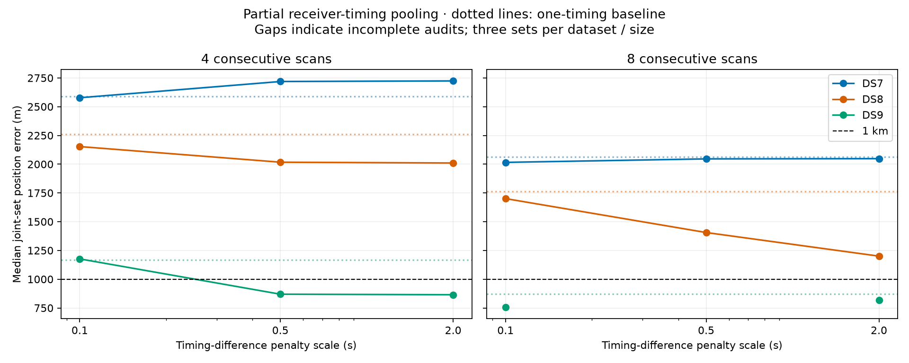

# Partial pooling of receiver timing differences: complete sensitivity study

**Do not promote timing regularization as a reliable sub-km solution.** Every complete DS7 and DS8 median remains above 1 km at both scan-set sizes. The audited late DS9 eight-scan errors remain above 3.7 km. Held prediction improves more often than geography, so predictive gains alone do not resolve the location problem. No strength is selected from these reference errors.

The frozen 0.1-, 0.5-, and 2-second regularization batches are complete. Each fits one position and separate RX0/RX1 timings per recording, penalizing deviations of each RX timing difference from its fitted common mean. The mean is unpenalized; this does not impose zero receiver delay. The scales are sensitivity arms, not calibrated timing uncertainties or reference-selected winners.

**53/54 selected solutions pass the numerical audit.** Among passing solutions, 30 improve position error and 46 improve held Doppler prediction versus one timing per recording. These counts include dependent arms and nested windows; they are not independent trials.

Median error in metres across early/middle/late joint scan-set estimates. A full median requires all three selected fits to pass. Single-scan accuracy is not measured by these tables.

| Scans | Model / penalty scale | DS7 | DS8 | DS9 |
|---:|---|---:|---:|---:|
| 4 | One timing per scan | 2,590 | 2,261 | 1,167 |
| 4 | Independent RX timings | 2,724 | 2,010 | 865 |
| 4 | Partial pooling: 0.1 s | 2,578 | 2,153 | 1,176 |
| 4 | Partial pooling: 0.5 s | 2,719 | 2,017 | 870 |
| 4 | Partial pooling: 2.0 s | 2,724 | 2,010 | 865 |
| 8 | One timing per scan | 2,064 | 1,762 | 870 |
| 8 | Independent RX timings | 2,048 | 1,201 | 818 |
| 8 | Partial pooling: 0.1 s | 2,016 | 1,701 | 754 |
| 8 | Partial pooling: 0.5 s | 2,046 | 1,406 | Incomplete |
| 8 | Partial pooling: 2.0 s | 2,048 | 1,200 | 818 |

| Scale | Audited / planned | Lower error vs one timing | Better held vs one timing | Lower error vs independent RX | Better held vs independent RX | Audited sub-km sets |
|---:|---:|---:|---:|---:|---:|---:|
| 0.1 s | 18/18 | 11/18 | 15/18 | 10/18 | 5/18 | 3 |
| 0.5 s | 17/18 | 9/17 | 15/17 | 10/17 | 6/17 | 4 |
| 2.0 s | 18/18 | 10/18 | 16/18 | 13/18 | 5/18 | 5 |

The recurring late DS9 eight-scan case remains in all planned denominators:

| Scale | Late DS9 eight-scan error (m) | Audit |
|---:|---:|---|
| 0.1 s | 3,798 | Pass |
| 0.5 s | 3,707 | Failed; value unvalidated |
| 2.0 s | 3,706 | Pass |

The same Student-t4/100 Hz shared-track scale likelihood, candidate banks, training/held split, offset prior, position bounds and timing bounds are retained. The penalty is subtracted only from the training objective; held scores contain no penalty. Raw training likelihood, penalty and penalized objective are recorded and verified separately. Training selects the highest qualified objective within each fixed scale, never a geographic winner or a cross-scale objective maximum.

214/216 starts qualify. 54/54 nested-baseline checks reproduce the tied model. The initial eight tests cover the penalty gradient, common-difference invariance and held-row preservation. Selected-fit audits replay objectives and use two finite-difference step sizes per parameter, retaining grid-crossing and derivative failures.

270 child process receipts; 270 exit zero. Total job wall time 2621.68 s, maximum 24.65 s, peak RSS 676,988 KiB. Child process exit is separate from optimizer qualification and audit success.

- DS9_late_8_s050: audit failed or unavailable; full aggregate remains incomplete.
  - Parameter 9: maximum derivative discrepancy 0.0176391; interpolation-grid crossing: True.

The launchers paused 15 times before starting another job when available memory fell below the frozen 5 GiB headroom requirement. All completed fit and audit jobs were sealed; unstarted jobs continued only after the original threshold was met. No completed job was rerun and no numerical or resource gate was relaxed. Launcher exits are separate from child process receipts. [s050 fit continuation](continue_s050.py), [s050 audit continuation](continue_held_s050.py), [s200 continuation](continue_s200.py), [bounded memory supervisor](supervise_s200.py), and these pause records preserve the administrative interruptions:

- [continuation-s050-02.json](continuation-s050-02.json)
- [continuation-s050-03.json](continuation-s050-03.json)
- [continuation-s050-04.json](continuation-s050-04.json)
- [continuation-s050-05.json](continuation-s050-05.json)
- [continuation-s050-06.json](continuation-s050-06.json)
- [continuation-s050-07.json](continuation-s050-07.json)
- [continuation-s050.json](continuation-s050.json)
- [continuation-s200-02.json](continuation-s200-02.json)
- [continuation-s200-03.json](continuation-s200-03.json)
- [continuation-s200-04.json](continuation-s200-04.json)
- [continuation-s200-05.json](continuation-s200-05.json)
- [continuation-s200-06.json](continuation-s200-06.json)
- [continuation-s200-07.json](continuation-s200-07.json)
- [continuation-s200-08.json](continuation-s200-08.json)
- [continuation-s200.json](continuation-s200.json)

Every panel result, failed start, fitted common delay, residual dispersion, penalty and material generic-only initialization difference is retained in the batch reports:

- [s010 results](RESULTS-s010.md), [data](summary-s010.json), [resources](resources-s010.json).
- [s050 results](RESULTS-s050.md), [data](summary-s050.json), [resources](resources-s050.json).
- [s200 results](RESULTS-s200.md), [data](summary-s200.json), [resources](resources-s200.json).

The previously exposed, unsurveyed single-site reference limits interpretation. A sub-km median across three sets does not establish sub-km accuracy for every window, independent satellite identity, measured receiver delays or calibrated resolution. This is a timing-only study, separate from the [receiver-cone experiment](../2026_09_29_rx_cone_position/README.md). Any combined model requires a separately declared comparison.

[Next-model proposal](NEXT-MODEL.md) describes a separate contrast-frequency control and the normalization questions for an unassociated-track branch. It is untested and contributes no result to this study.

[Protocol](PROTOCOL.md), [plan](plan.json), [tests](tests.log) and [hash inventory](evidence-sha256.json) bind the study. Completed s010 execution evidence from the earlier published checkpoint is preserved. Run tests and prepare once, then fit, held, summarize and write_batch_report for each strength in declared order; write_report assembles and seals completed results. Existing run folders are immutable. One bounded worker used cached inputs only, without RF collection, waveform reads, propagation or provider fetches.
