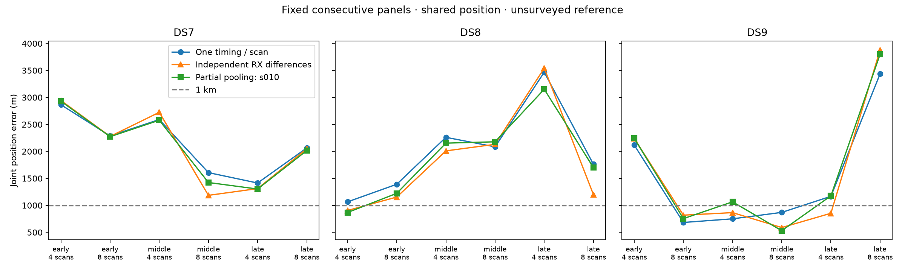

# Partial receiver timing: sigma = 0.1 seconds

This is one completed batch of the predeclared 0.1/0.5/2-second sensitivity study, not completion of all three strengths. One common location is fitted with separate RX0/RX1 timings per recording. A quadratic penalty shrinks recording-specific RX timing differences toward their fitted common mean. The mean is not shrunk toward zero. No strength is selected from reference error.

**18/18 selected solutions pass the audit.** Against the one-timing baseline, 11/18 have lower location error and 15/18 improve matched held Doppler prediction. Against independent receiver timings, the corresponding counts are 10/18 and 5/18. Held scores contain no regularization penalty.

| Dataset | Scans | Audited / planned | One-timing median (m) | Independent RX median (m) | Partial-pooling median (m) | Audited sub-km sets |
|---|---:|---:|---:|---:|---:|---:|
| DS7 | 4 | 3/3 | 2,590.063 | 2,724.293 | 2,577.628 | 0 |
| DS7 | 8 | 3/3 | 2,063.706 | 2,048.119 | 2,015.714 | 0 |
| DS8 | 4 | 3/3 | 2,260.918 | 2,009.576 | 2,153.055 | 1 |
| DS8 | 8 | 3/3 | 1,762.028 | 1,200.779 | 1,700.711 | 0 |
| DS9 | 4 | 3/3 | 1,167.327 | 865.315 | 1,176.488 | 0 |
| DS9 | 8 | 3/3 | 869.695 | 818.401 | 754.468 | 2 |

Medians are joint estimates across early/middle/late scan sets, not single-scan medians. Complete partial-pooling medians require all three selected fits to pass. Baseline columns use the matching validated subset if a batch is incomplete. Four-scan sets are nested within eight-scan sets.

| Panel | One timing (m) | Independent RX (m) | Partial pooling (m) | Held gain vs one timing (nats) | Held gain vs independent RX (nats) | Audit |
|---|---:|---:|---:|---:|---:|---|
| DS7_early_4 | 2,864.858 | 2,943.416 | 2,929.669 | +3.515 | +0.069 | Pass |
| DS7_early_8 | 2,287.191 | 2,277.528 | 2,272.877 | +15.983 | +1.047 | Pass |
| DS7_middle_4 | 2,590.063 | 2,724.293 | 2,577.628 | +21.903 | -5.882 | Pass |
| DS7_middle_8 | 1,606.608 | 1,185.607 | 1,423.458 | +212.192 | -28.261 | Pass |
| DS7_late_4 | 1,414.224 | 1,310.562 | 1,302.545 | +20.108 | +0.496 | Pass |
| DS7_late_8 | 2,063.706 | 2,048.119 | 2,015.714 | +25.365 | -2.672 | Pass |
| DS8_early_4 | 1,065.224 | 905.451 | 868.108 | +68.260 | -4.626 | Pass |
| DS8_early_8 | 1,390.877 | 1,153.776 | 1,222.680 | +143.890 | -18.959 | Pass |
| DS8_middle_4 | 2,260.918 | 2,009.576 | 2,153.055 | +47.300 | -3.253 | Pass |
| DS8_middle_8 | 2,084.608 | 2,131.008 | 2,177.883 | +59.768 | -0.204 | Pass |
| DS8_late_4 | 3,467.535 | 3,542.454 | 3,151.260 | +32.497 | -6.589 | Pass |
| DS8_late_8 | 1,762.028 | 1,200.779 | 1,700.711 | +22.500 | -40.362 | Pass |
| DS9_early_4 | 2,117.272 | 2,240.652 | 2,242.406 | -5.426 | +0.210 | Pass |
| DS9_early_8 | 682.990 | 818.401 | 754.468 | +97.284 | -15.471 | Pass |
| DS9_middle_4 | 750.643 | 865.315 | 1,065.195 | +14.190 | -28.601 | Pass |
| DS9_middle_8 | 869.695 | 588.914 | 530.855 | +24.641 | +20.001 | Pass |
| DS9_late_4 | 1,167.327 | 853.339 | 1,176.488 | -3.036 | -46.718 | Pass |
| DS9_late_8 | 3,435.817 | 3,879.206 | 3,798.294 | -6.565 | -262.377 | Pass |

Training selects the greatest penalized score among successful interior starts with gradient infinity norm at most 0.01. The raw likelihood, penalty, and penalized objective remain separately recorded and checked. Scores across different strengths are not a hyperparameter-selection criterion.

71/72 starts qualify; 18/18 tied-baseline checks pass. Scoring verified 2,405 execution/input bindings. The maximum selected-fit derivative discrepancy is 1.94102e-05.

90 process receipts; 90 exit zero. Total job wall time 825.69 s, maximum 24.65 s, peak RSS 676,988 KiB. Optimizer qualification and numerical audit success are separate from process exit.

- Retained unqualified start: DS7_late_4_s010 / northwest: ABNORMAL: .

No failed start or audit was retried, removed or reclassified.

| Panel | Fitted mean RX1−RX0 (s) | RMS deviation from mean (s) | Penalty |
|---|---:|---:|---:|
| DS7_early_4 | -0.006074 | 0.051843 | 0.537537 |
| DS7_early_8 | +0.009674 | 0.124659 | 6.215986 |
| DS7_middle_4 | -0.083292 | 0.102320 | 2.093858 |
| DS7_middle_8 | -0.063724 | 0.445402 | 79.353223 |
| DS7_late_4 | +0.165345 | 0.151009 | 4.560746 |
| DS7_late_8 | +0.188308 | 0.165923 | 11.012141 |
| DS8_early_4 | -0.023734 | 0.237735 | 11.303568 |
| DS8_early_8 | +0.156730 | 0.199121 | 15.859607 |
| DS8_middle_4 | -0.157317 | 0.203260 | 8.262929 |
| DS8_middle_8 | -0.055697 | 0.218486 | 19.094419 |
| DS8_late_4 | -0.099583 | 0.094324 | 1.779408 |
| DS8_late_8 | -0.015189 | 0.107867 | 4.654139 |
| DS9_early_4 | -0.079794 | 0.053628 | 0.575192 |
| DS9_early_8 | -0.286738 | 0.343610 | 47.227095 |
| DS9_middle_4 | -0.005649 | 0.156827 | 4.918916 |
| DS9_middle_8 | +0.067211 | 0.126512 | 6.402084 |
| DS9_late_4 | -0.083276 | 0.136496 | 3.726213 |
| DS9_late_8 | -0.118985 | 0.185910 | 13.825065 |

The additional baseline-derived start can find a different optimum. Below are panels where its selected penalized score exceeds the best generic start by more than 0.001 nats. Initialization is training-selected; a higher training score need not give lower reference error.

| Panel | Selected minus generic training (nats) | Selected error (m) | Generic-only error (m) |
|---|---:|---:|---:|
| DS8_late_8 | 2.246400 | 1,700.711 | 1,412.231 |
| DS9_middle_8 | 33.739384 | 530.855 | 1,013.789 |
| DS9_late_8 | 35.711877 | 3,798.294 | 2,823.473 |

These timings are fitted nuisance parameters, not independent measurements of receiver clock offsets. Their dispersion is regularized, so it cannot be interpreted as a measured timing uncertainty.

On the same held observations in the first four scans, 0/9 audited eight-scan fits improve prediction over the four-scan fit. The median change is -26.272 nats.

The exposed unsurveyed reference, dependent scan sets and previously explored single site do not establish blind sub-km accuracy. The late DS9 eight-scan result is retained in every relevant aggregate. This timing model is separate from the fixed receiver-cone experiment; no combined improvement is claimed.

[Complete batch data](summary-s010.json), [receipts](resources-s010.json), [protocol](PROTOCOL.md), [frozen plan](plan.json), and [tests](tests.log). Existing output directories are immutable evidence. One bounded worker used cached inputs only; no RF collection, waveform reads, propagation or provider fetches.
