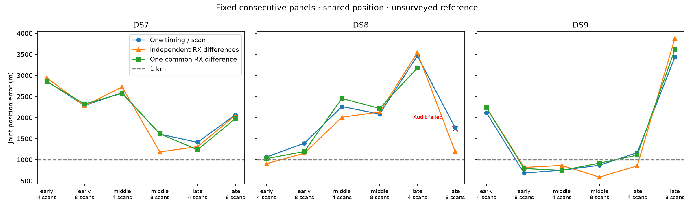

# A common receiver timing difference does not resolve short-window errors

One common RX1-minus-RX0 timing difference per scan set is **not promoted**.
Of 18 planned panels, 17 pass the selected-point audit. Among those 17,
geography improves over one timing per recording in 9 and held prediction
improves in 10. Compared with independent receiver timings, held prediction
improves in only 2/17, while geography improves in 9/17. Three validated sets
are below 1 km, all DS9; one set remains unvalidated. Stable receiver timing
alone does not explain the remaining short-window error.

| Dataset | Scans | One timing median (m) | Independent RX median (m) | Common RX difference median (m) | Audited panels |
|---|---:|---:|---:|---:|---:|
| DS7 | 4 | 2,590.063 | 2,724.293 | 2,573.850 | 3/3 |
| DS7 | 8 | 2,063.706 | 2,048.119 | 1,973.948 | 3/3 |
| DS8 | 4 | 2,260.918 | 2,009.576 | 2,453.542 | 3/3 |
| DS8 | 8 | 1,762.028 | 1,200.779 | **Incomplete** | 2/3 |
| DS9 | 4 | 1,167.327 | 865.315 | 1,108.213 | 3/3 |
| DS9 | 8 | 869.695 | 818.401 | 918.671 | 3/3 |

These are medians of joint estimates from three consecutive sets, not
single-scan medians. The DS8 eight-scan pooled median is intentionally absent:
late DS8 eight fails its declared numerical audit. On the **same two audited
DS8 eight-scan panels only**, medians are 1,737.743 / 1,642.392 / 1,705.697 m
for one timing / independent RX / common RX respectively. Those two-panel
values must not be compared with the full three-panel medians above.

## All eighteen panels

The prior models are the [one-timing baseline](../2026_09_29_consecutive_panels/README.md)
and [independent receiver timings](../2026_09_29_split_receiver_timing/README.md).
Errors are metres. Held changes below are common-minus-one-timing nats on
identical observations. A dagger denotes an unvalidated candidate estimate,
retained for diagnosis and excluded from validated performance claims.

| Panel | One timing | Independent RX | Common RX | Held change | Audit |
|---|---:|---:|---:|---:|---|
| DS7 early 4 | 2,864.858 | 2,943.416 | 2,856.683 | +1.146 | Pass |
| DS7 early 8 | 2,287.191 | 2,277.528 | 2,321.908 | +2.758 | Pass |
| DS7 middle 4 | 2,590.063 | 2,724.293 | 2,573.850 | +11.630 | Pass |
| DS7 middle 8 | 1,606.608 | 1,185.607 | 1,616.382 | +0.036 | Pass |
| DS7 late 4 | 1,414.224 | 1,310.562 | 1,236.252 | +8.284 | Pass |
| DS7 late 8 | 2,063.706 | 2,048.119 | 1,973.948 | -2.422 | Pass |
| DS8 early 4 | 1,065.224 | 905.451 | 1,025.781 | +3.927 | Pass |
| DS8 early 8 | 1,390.877 | 1,153.776 | 1,194.253 | +46.131 | Pass |
| DS8 middle 4 | 2,260.918 | 2,009.576 | 2,453.542 | -6.936 | Pass |
| DS8 middle 8 | 2,084.608 | 2,131.008 | 2,217.140 | -2.871 | Pass |
| DS8 late 4 | 3,467.535 | 3,542.454 | 3,177.107 | +18.863 | Pass |
| DS8 late 8 | 1,762.028 | 1,200.779 | 1,740.931† | +2.934† | **Failed** |
| DS9 early 4 | 2,117.272 | 2,240.652 | 2,237.990 | -4.687 | Pass |
| DS9 early 8 | 682.990 | 818.401 | **792.130** | +0.919 | Pass |
| DS9 middle 4 | 750.643 | 865.315 | **748.344** | -0.243 | Pass |
| DS9 middle 8 | 869.695 | 588.914 | **918.671** | +13.898 | Pass |
| DS9 late 4 | 1,167.327 | 853.339 | 1,108.213 | -2.841 | Pass |
| DS9 late 8 | 3,435.817 | 3,879.206 | 3,612.048 | -4.592 | Pass |

Late DS9 eight remains worse than the one-timing baseline despite improving
over the independent-RX result. Of the eight fully audited nested four/eight
pairs, seven lose held score on matched first-four observations. Late DS9 is
the exception (+1.732 nats); late DS8 is not counted because its eight-scan
audit failed. Full matched counts and changes are in summary.json.

## Model and controlled comparisons

[PROTOCOL.md](PROTOCOL.md) freezes the model before fitting. Each panel fits
one common E/N position, a center timing for each recording, and a common
receiver difference d. RX0 timing is center minus d/2 and RX1 timing is
center plus d/2. [pooled_timing.py](pooled_timing.py) applies this linear
constraint and its gradient chain rule over the unchanged zero-decay
Student-t4/100 Hz shared-track-scale objective. Receiver partitions, candidate
banks, weak offset prior, eligibility and training/held masks stay fixed.

Bounds are E/N +/-12 km, recording centers +/-4 s, and d +/-2 s. This keeps
both receivers within the original +/-5 s prediction bank. The center bound
is narrower than the baseline's timing bound; the experiment is not claimed
to isolate pooling independently of that domain restriction. Every old
selected point remains feasible at d=0, and every selected new fit is interior.
Fitted d ranges from -0.105682 to +0.165980 s across all candidate selections.
These nuisance estimates are not physical receiver latency measurements.

Four starts per panel use the same three generic positions and a fourth
training-derived baseline point with d=0. Selection uses greatest training
score among successful interior fits with gradient infinity norm <=0.01.
No geographic or held result selects a start. Extra-start training gains
over the best qualified generic start are at most 2.474e-10 nats here, so
the extra initialization makes no material score difference in this run.
Training gain over the baseline ranges from 0.0182 to 33.2514 nats across
all candidate selections; that alone does not establish a useful model.

## Qualification, preserved failures and numerical checks

All 90 processes complete with exit code zero: 72 fits and 18 audits.
**71/72 fits qualify**. DS9 early four / northwest returns optimizer ABNORMAL
despite a small gradient (0.0005922); it remains unqualified and excluded
from selection. All 18 selected fits qualify, but only **17/18 selected-point
audits pass**. Process completion is distinct from numerical qualification.

The failed late-DS8-eight audit is recording-center axis 8 (zero-based
parameter index). Its RX1 timing is approximately -1.249965977 s, only
34.023 microseconds from a quarter-second interpolation node. The declared
62.5-microsecond difference crosses that node and disagrees with the local
analytic derivative by 0.00583293, exceeding 0.002. The 31.25-microsecond
difference stays inside the interval and agrees to 2.159e-6, but **both**
steps were required to pass. No retry, smaller-step replacement, alternate
review or gate relaxation occurs. The original result and failed flag remain.

There are 324 finite-difference evaluations: 72 E/N and 252 center/common
timing checks. The maximum discrepancy across the 17 passing panels is
1.6695e-5. The failed check above is the largest overall. Every timing check
examines all affected expanded receiver timings for node crossings, and
requires agreement between its two numerical derivatives.

At d=0, all 18 nested-start checks reproduce the original held rows exactly,
training score within 8.731e-11, and E/N/tied timing gradients within 1.777e-13.
The three new [parameterization tests](test_pooled_timing.py) pass before
execution; [tests.log](tests.log) records unequal quadratic sensitivities,
finite-difference chain-rule checks, receiver ordering and box-limit checks.
The unchanged receiver filter and numerical likelihood retain their earlier
test evidence; no fresh run of those older tests is claimed.

The scorer verifies 1,830 execution/input bindings, original/new/free-RX
track identities and held counts, training replay and row sums within 1e-7,
selection qualification, and independently computed geographic distances
within 0.0001 m. All scripts pass Ruff lint and formatting. One worker uses
BLAS1/nice19, 4 GiB address-space and 180 s process caps, and at least 5 GiB
available memory before launch. Summed job wall time is 602.23 s, longest
job 15.35 s, peak RSS 675,780 KiB. No RF, waveform reads, propagation,
provider fetch, production component change or golden-fixture change.

## Decision and evidence

Keep both receiver-timing variants as measured ablations. The stable common
correction fails to retain most of the independent variant's predictive gain
and still leaves kilometre-scale errors. This does not establish that timing
is irrelevant, nor that nominal antenna tilt has been calibrated. A remaining
timing test is partial pooling: constrain recording-specific differences
toward a common value, with strength declared independently of reference error.
Any such experiment must retain these fixed panels, report all strengths and
failures, and separate held prediction from geographic performance.

The reference remains exposed and unsurveyed; nested panels are dependent
and all recordings come from one site. Neither blind accuracy, calibrated
resolution nor reliable short-window sub-km localization is established.
Complete-dataset sub-km results are separate from this experiment.

[plan.json](plan.json), [summary.json](summary.json), and [resources.json](resources.json)
retain exact inputs, every start, all comparisons and every receipt.
[evidence-sha256.json](evidence-sha256.json) binds report files and dependencies,
excluding itself. Reproduction order: tests, prepare.py, launch.py fit,
launch.py held, summarize.py. Existing outputs are immutable evidence and
may not be overwritten as retry destinations.
