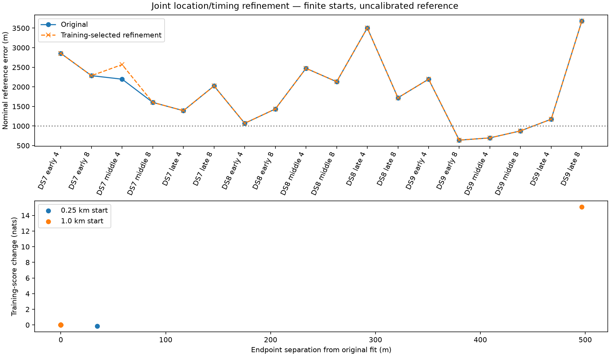

# Joint refinement from spatial-profile alternatives

All eighteen panels completed. Starts were selected by training score at each of two radii; held scores and reference errors never selected starts or winners.

| Panel | Start radius (km) | Qualified | Training change (nats) | Held change (nats) | Shift (m) | Nominal error (m) |
|---|---:|---|---:|---:|---:|---:|
| DS7_early_4 | 0.25 | True | -0.000000 | +0.000 | 0.00 | 2855.8 |
| DS7_early_4 | 1.0 | True | +0.000000 | +0.000 | 0.00 | 2855.8 |
| DS7_early_8 | 0.25 | True | +0.000000 | +0.000 | 0.00 | 2286.0 |
| DS7_early_8 | 1.0 | True | +0.000000 | +0.000 | 0.00 | 2286.0 |
| DS7_middle_4 | 0.25 | True | -0.000000 | +0.000 | 0.00 | 2196.1 |
| DS7_middle_4 | 1.0 | True | +15.091186 | +41.881 | 496.75 | 2568.5 |
| DS7_middle_8 | 0.25 | True | +0.000000 | -0.000 | 0.00 | 1603.6 |
| DS7_middle_8 | 1.0 | True | -0.000000 | -0.000 | 0.00 | 1603.6 |
| DS7_late_4 | 0.25 | True | -0.000000 | +0.000 | 0.00 | 1391.6 |
| DS7_late_4 | 1.0 | True | -0.000000 | +0.000 | 0.00 | 1391.6 |
| DS7_late_8 | 0.25 | True | -0.134279 | +7.709 | 34.70 | 2052.8 |
| DS7_late_8 | 1.0 | True | -0.000000 | +0.000 | 0.00 | 2023.6 |
| DS8_early_4 | 0.25 | True | -0.000000 | +0.000 | 0.00 | 1069.5 |
| DS8_early_4 | 1.0 | True | -0.000000 | +0.000 | 0.00 | 1069.5 |
| DS8_early_8 | 0.25 | True | -0.000000 | -0.000 | 0.00 | 1435.7 |
| DS8_early_8 | 1.0 | True | -0.000000 | -0.000 | 0.00 | 1435.7 |
| DS8_middle_4 | 0.25 | True | +0.000000 | +0.000 | 0.00 | 2473.8 |
| DS8_middle_4 | 1.0 | True | -0.000000 | +0.000 | 0.00 | 2473.8 |
| DS8_middle_8 | 0.25 | True | -0.000000 | -0.000 | 0.00 | 2130.8 |
| DS8_middle_8 | 1.0 | True | -0.000000 | -0.000 | 0.00 | 2130.8 |
| DS8_late_4 | 0.25 | True | -0.000000 | -0.000 | 0.00 | 3504.7 |
| DS8_late_4 | 1.0 | True | -0.000000 | +0.000 | 0.00 | 3504.7 |
| DS8_late_8 | 0.25 | True | -0.000000 | -0.000 | 0.00 | 1721.1 |
| DS8_late_8 | 1.0 | True | -0.000000 | -0.000 | 0.00 | 1721.1 |
| DS9_early_4 | 0.25 | True | +0.000000 | +0.000 | 0.00 | 2196.1 |
| DS9_early_4 | 1.0 | True | +0.000000 | -0.000 | 0.00 | 2196.1 |
| DS9_early_8 | 0.25 | True | -0.000000 | +0.000 | 0.00 | 639.5 |
| DS9_early_8 | 1.0 | True | -0.000000 | +0.000 | 0.00 | 639.5 |
| DS9_middle_4 | 0.25 | True | -0.000000 | +0.000 | 0.00 | 697.1 |
| DS9_middle_4 | 1.0 | True | +0.000000 | -0.000 | 0.00 | 697.1 |
| DS9_middle_8 | 0.25 | True | +0.000000 | +0.000 | 0.00 | 876.1 |
| DS9_middle_8 | 1.0 | True | +0.000000 | -0.000 | 0.00 | 876.1 |
| DS9_late_4 | 0.25 | True | -0.000000 | -0.000 | 0.00 | 1173.9 |
| DS9_late_4 | 1.0 | True | +0.000000 | -0.000 | 0.00 | 1173.9 |
| DS9_late_8 | 0.25 | True | -0.000000 | +0.000 | 0.00 | 3680.9 |
| DS9_late_8 | 1.0 | True | -0.000000 | +0.000 | 0.00 | 3680.9 |

## Training-selected outcomes

Retain the original result unless a qualified endpoint improves training score by more than 1e-6 nats. Errors below are medians of three early/middle/late sets, in metres. These are exposed unsurveyed-reference errors, not blind accuracy or calibrated resolution.

| Dataset | Scans per set | Original median | Refined median |
|---|---:|---:|---:|
| DS7 | 4 | 2196.1 | 2568.5 |
| DS7 | 8 | 2023.6 | 2023.6 |
| DS8 | 4 | 2473.8 | 2473.8 |
| DS8 | 8 | 1721.1 | 1721.1 |
| DS9 | 4 | 1173.9 | 1173.9 |
| DS9 | 8 | 876.1 | 876.1 |

The summary retains candidate MAP changes, conditional candidate-weight total variation, signal-responsibility changes and maximum timing changes. These describe model assignments, not independently verified satellite identities.

The auditor rechecks source/input/process hashes, start selection, qualification gates, derivative arithmetic, training/held sums, track correspondence and probability normalization. It does not independently reimplement the radio likelihood. Five prelaunch tests passed; no retries or changed scientific sources. Full execution resources and failures are retained per panel.

[Protocol](PROTOCOL.md), [summary](summary.json), [tests](tests.log), [complete evidence](evidence-sha256.json).
