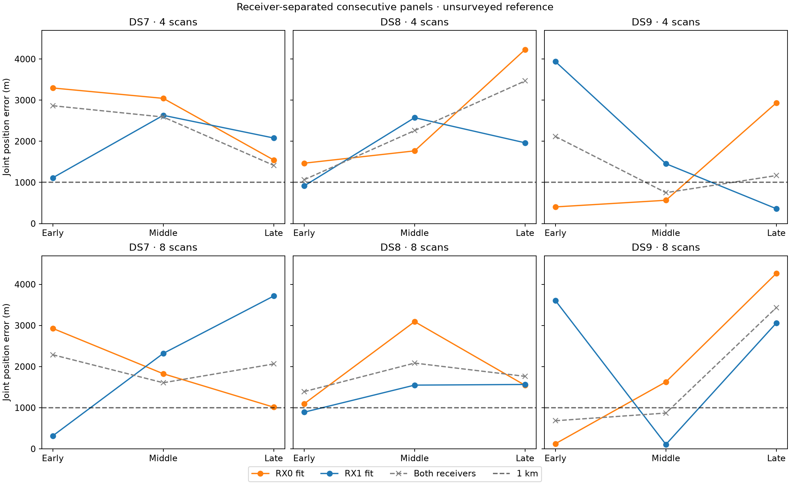

# Receiver-separated fits on consecutive DS7–DS9 panels

RX0 and RX1 produce substantially different fitted positions: **2,658 m median
separation**, ranging from 671 to 4,146 m across 18 panels. Each receiver's
fit improves its own held prediction in 32/36 cases, but **all 36 predictions
on the other receiver worsen** relative to the original both-receiver model.
Neither receiver consistently supplies the better geographic estimate.

This establishes receiver-dependent predictive disagreement under the current
model. It does not establish which receiver is correct, identify a hardware
defect, or validate a calibrated effect of the nominal 20-degree antenna tilt.
The cross-receiver test transfers both position and recording timing; their
effects are not separated here. Software-to-physical antenna mapping remains
provisional. Do not select or discard a receiver by exposed reference error.

## Median joint-panel errors

All entries are metres against the same exposed, unsurveyed reference. Each
median covers three early/middle/late panels of the indicated size, not three
individual scans. Every one of the 36 receiver-specific fits qualifies.

| Dataset | Scans/set | Both receivers | RX0 only | RX1 only | Sub-km counts: both / RX0 / RX1 |
|---|---:|---:|---:|---:|---|
| DS7 | 4 | 2,590 | 3,044 | 2,080 | 0/3 · 0/3 · 0/3 |
| DS7 | 8 | 2,064 | 1,825 | 2,320 | 0/3 · 0/3 · 1/3 |
| DS8 | 4 | 2,261 | 1,767 | 1,964 | 0/3 · 0/3 · 1/3 |
| DS8 | 8 | 1,762 | 1,544 | 1,549 | 0/3 · 0/3 · 1/3 |
| DS9 | 4 | 1,167 | **566** | 1,455 | 1/3 · 2/3 · 1/3 |
| DS9 | 8 | **870** | 1,628 | 3,061 | 2/3 · 1/3 · 1/3 |

Eight of 36 receiver-specific fits are sub-km. Seventeen improve geographic
error over their both-receiver control and 19 worsen. None of the six
eight-scan dataset/receiver medians is below 1 km. DS9 RX0's four-scan median
does not transfer to its eight-scan sets or consistently to the other datasets.

## Every panel

Exact chronological ordinals and sessions are unchanged from the
[original consecutive-panel report](../2026_09_29_consecutive_panels/README.md)
and retained in plan.json. Separation is the great-circle distance between
the two receiver-specific position estimates, without using the site reference.

| Dataset / block | Scans | Both error (m) | RX0 error (m) | RX1 error (m) | RX separation (m) |
|---|---:|---:|---:|---:|---:|
| DS7 early | 4 | 2,864.858 | 3,296.161 | 1,112.679 | 2,697.439 |
| DS7 early | 8 | 2,287.191 | 2,927.629 | **315.713** | 2,618.698 |
| DS7 middle | 4 | 2,590.063 | 3,043.718 | 2,631.431 | 3,300.289 |
| DS7 middle | 8 | 1,606.608 | 1,825.230 | 2,320.089 | 3,651.691 |
| DS7 late | 4 | 1,414.224 | 1,544.560 | 2,079.953 | 2,921.656 |
| DS7 late | 8 | 2,063.706 | 1,012.316 | 3,715.713 | 3,766.009 |
| DS8 early | 4 | 1,065.224 | 1,467.600 | **914.196** | 2,271.749 |
| DS8 early | 8 | 1,390.877 | 1,094.081 | **890.910** | 1,300.321 |
| DS8 middle | 4 | 2,260.918 | 1,767.062 | 2,574.375 | 916.673 |
| DS8 middle | 8 | 2,084.608 | 3,092.341 | 1,548.904 | 1,573.790 |
| DS8 late | 4 | 3,467.535 | 4,230.002 | 1,963.512 | 3,534.740 |
| DS8 late | 8 | 1,762.028 | 1,543.838 | 1,564.733 | 671.376 |
| DS9 early | 4 | 2,117.272 | **404.774** | 3,938.019 | 4,145.907 |
| DS9 early | 8 | **682.990** | **124.189** | 3,605.040 | 3,575.331 |
| DS9 middle | 4 | **750.643** | **566.180** | 1,455.200 | 1,650.712 |
| DS9 middle | 8 | **869.695** | 1,627.701 | **107.349** | 1,541.623 |
| DS9 late | 4 | 1,167.327 | 2,936.052 | **360.364** | 3,268.589 |
| DS9 late | 8 | 3,435.817 | 4,267.379 | 3,061.177 | 1,206.221 |

## Predictive transfer between receivers

For each source receiver, its selected position and all recording timings are
frozen when evaluating the other receiver. Candidate responsibilities and
stationary frequency offsets are computed from the target receiver's training
data under the same likelihood. Target position and timing are not refitted.
Each held delta compares exactly the same receiver's tracks/held observations
with the original both-receiver fit; receiver partitions are disjoint and
exhaustive. No held values select a source fit.

| Source fit | Own-receiver held gains | Other-receiver held gains |
|---|---:|---:|
| RX0 | 14/18 | 0/18 |
| RX1 | 18/18 | 0/18 |
| Total | 32/36 | 0/36 |

All receiver-specific training scores improve over their corresponding subset
at the original both-receiver point, so none is worse than that known feasible
training point. Own-held changes range from -33.768 to +219.045 nats;
other-held changes range from -577.398 to -8.372 nats. Exact per-fit deltas,
matched counts and training changes are in scores.json. Nested four/eight
sets overlap and are not independent replicates.

Fitted RX1-minus-RX0 recording timing differences reach **1.935 s** in absolute
value. Timing vectors and receiver position separations are retained for every
pair. These phenomenological fitted timing differences are not measured clock
offsets or satellite transit delays. The next diagnostic should distinguish
timing transfer from position transfer before interpreting this as a receiver
geometry or beam-calibration effect.

## Model, membership and qualification

[PROTOCOL.md](PROTOCOL.md) predeclares both receiver arms for all 18 original
panels. The 36 units preserve 72 distinct recording identities and the
original candidate banks, eligible tracks and train/held masks. Only the
software receiver partition changes. Both receivers must be present in every
recording. [receiver_filter.py](receiver_filter.py) preserves document and track
metadata without modifying the original data, and rejects unknown receiver
labels, duplicate track IDs and missing receiver coverage.

The numerical likelihood is unchanged: shared-track-scale Student-t4, 100 Hz,
decay zero, profiled weak-prior offsets, original visibility and catalogue
normalization. Each source receiver gets three generic E/N starts, (0,0),
(3,-3), (-3,3) km, with zero timing offsets. The original L-BFGS-B settings,
position +/-12 km and timing +/-5 s bounds remain. Highest training score
among successful interior starts with gradient infinity norm <=0.01 selects
the estimate. There are no geographic choices, warm starts, retries or
earlier-fit fallbacks.

All **144 scientific processes exit zero**: 108 source fits and 36 audits
covering both receivers. **105/108 starts qualify**, and every receiver unit
has a selected fit. Three optimizer ABNORMAL outcomes remain unqualified:
DS7 late4 RX0/southeast and DS9 late8 RX1/origin and southeast. Small gradients
do not override the optimizer-success requirement. Every alternative and
qualification flag remains in the evidence.

## Verification, resources and reproduction

Five receiver-partition tests pass, covering record retention, unchanged masks,
disjoint/exhaustive membership and invalid metadata. [validation.json](validation.json)
also checks all 18 original panel identities and all 36 receiver counts against
the original artifacts. The scorer verifies 1,538 execution/input bindings,
exact manifest slices, receiver partitions, training/held counts, both sides
of each predictive comparison, and unchanged transferred position/timing vectors.
Training-score replays and row sums agree within 1e-7. All 144 E/N finite-
difference checks pass with maximum discrepancy 1.801e-5 against tolerance
0.002. Independent spherical arithmetic agrees within 0.0001 m for reference
errors and receiver separations. Report scripts pass Ruff lint and formatting.
Unchanged numerical helpers retain their prior six-test evidence; no fresh
run of those unchanged tests is claimed.

One scientific worker ran at a time, BLAS1/nice19, with 12 GiB address-space
and 300-second process caps and >=14 GiB available memory before launch.
Summed job time 552.63 s; longest process 11.31 s; peak RSS 670,540 KiB.
No other scientific worker overlapped. There were no process failures,
timeouts, RF collection, waveform reads, propagation, provider fetch, public-
contract changes or golden-fixture changes.

[plan.json](plan.json) records exact membership and receiver track IDs.
[scores.json](scores.json), [resource-summary.json](resource-summary.json),
stage logs/results/seals and [evidence-sha256.json](evidence-sha256.json)
preserve the full experiment. Run order: receiver-filter tests, prepare.py,
launch.py source, launch.py transfer, score_plot.py. The transfer phase here
selects fits and audits both receivers; it does not optimize the target.

The reference remains exposed and unsurveyed. Smaller receiver-specific error
does not establish surveyed accuracy, calibrated confidence, emitter identity
or a deployable receiver-selection rule. Complete-dataset both-receiver errors
remain 527/736/229 m on DS7/DS8/DS9. Reliable short-window sub-km localization
remains unresolved, and this experiment does not justify discarding either RX.
