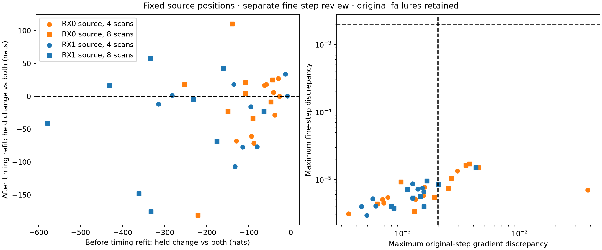

# Receiver timing transfer at frozen positions

Refitting target-receiver timings at the other receiver's frozen position
improves held prediction in all 36 directions across the 18 consecutive
four- and eight-scan panels. The median fraction of the prior transfer loss
recovered is **96.99%**. Only 17/36 then outperform the both-receiver fit on
the same target observations. Positions never change in this experiment:
this is evidence about timing transfer, not a new geographic improvement.

| Evaluation | Result |
|---|---:|
| Selected timing fits qualified | 36/36 |
| Original selected-point audits passed | 27/36 |
| Separate fine-step reviews passed | 36/36 |
| Held prediction improves over frozen timing transfer | 36/36 |
| Held prediction exceeds both-receiver baseline | 17/36 |
| Median fraction of prior held loss recovered | 96.99% |
| Largest absolute timing change | 1.9343 s |

## Design and interpretation

[PROTOCOL.md](PROTOCOL.md) freezes every RX0-to-RX1 and RX1-to-RX0 direction
in the [receiver-separated evaluation](../2026_09_29_receiver_panels/README.md).
The source receiver's selected position remains fixed. Only target timings
are optimized, using three starts: transferred timings, target-own timings,
and zero. Target-own position is never used. Selection uses training score
among successful interior fits with timing-gradient infinity norm <=0.01.
Held observations and geographic errors do not select a start.

The zero-decay shared-track-scale Student-t4/100 Hz likelihood, inputs,
candidate mixtures and observation partitions remain unchanged. Both sides
of every held comparison use identical target track identities and counts.
Target frequency offsets and candidate weights are profiled from training.
The timing correction can absorb several forms of mismatch; these results
do not identify physical receiver latency, beam tilt, or satellite direction.

The next justified model test is a common position with separate recording
timings for RX0 and RX1, evaluated on these same fixed panels. It must show
geographic and held-prediction benefits before promotion. No result here
establishes reliable short-window sub-km accuracy or calibrated confidence.

## Original failures and separate review

All 108 fitting processes completed; 106 starts qualified and every selected
fit qualified. Two target-own starts reported ABNORMAL termination and were
excluded: DS7 late four, RX0 source; DS9 middle eight, RX1 source.

Nine of 36 original audits failed the predeclared gradient discrepancy gate
at the 0.001 s centered-difference step. All original failed logs and exit
codes remain intact. [summary.json](summary.json) retains the original
27-pass/9-failure result and is not replaced by the later analysis.

[GRADIENT-REVIEW.md](GRADIENT-REVIEW.md) declares a separate study at all 36
unchanged selected points, with six fixed steps from 0.001 to 0.00003125 s.
No optimization is repeated. Both finest steps must remain within one bank
interpolation interval, agree with the analytic derivative within 0.002,
and agree with each other within 0.002 for every timing parameter.
All 36 pass this separate criterion. The largest analytic discrepancy is
0.0381406 at the original coarse steps and 0.0000168506 at the two finest
steps. The DS8 middle-four RX0-source coarse interval crosses a bank grid
node; the full per-coordinate step study records crossings and convergence.
The original failures remain failures under their original criterion.

All training-score replays agree within 1e-7. The 27 previously successful
held row sets are reproduced exactly. The review scorer verifies 2,663
execution/input bindings, fixed positions and timings, track identities,
observation counts, row sums, and the original and separate qualification
flags. [review-summary.json](review-summary.json) includes all 36 comparisons
under the explicit fine-step qualification above.

All report scripts pass Ruff lint and formatting. The copied receiver-filter
helper is byte-identical to the predecessor's five-tested helper, as recorded
in [validation.json](validation.json); no fresh helper test run is claimed.
All 180 processes are retained: 108 fits, 36 original audits (nine failures),
and 36 separate reviews. Summed job wall time is 634.06 s, longest job 8.51 s,
and peak RSS 664,172 KiB. Runs use one worker, BLAS1/nice19, 4 GiB address-space
and 180 s process caps, with at least 5 GiB available memory before launch.
No new RF collection, waveform read, propagation or provider fetch occurred.

## Reproduction and evidence

Run prepare.py, launch.py fit, launch.py held, and summarize.py for the
original experiment. The separate review uses review_launch.py followed by
review_summary.py. Existing output paths are evidence, not retry destinations.
[plan.json](plan.json) records exact inputs and starts;
[review-resources.json](review-resources.json) includes all process receipts;
[evidence-sha256.json](evidence-sha256.json) binds the report and dependencies,
excluding itself. Original and review protocols, failures, numerical checks
and full held rows are preserved alongside the summaries.

The panels overlap through their nested four/eight membership and come from
one site with an exposed, unsurveyed reference. These are dependent diagnostic
comparisons, not blind localization or new-site validation.
