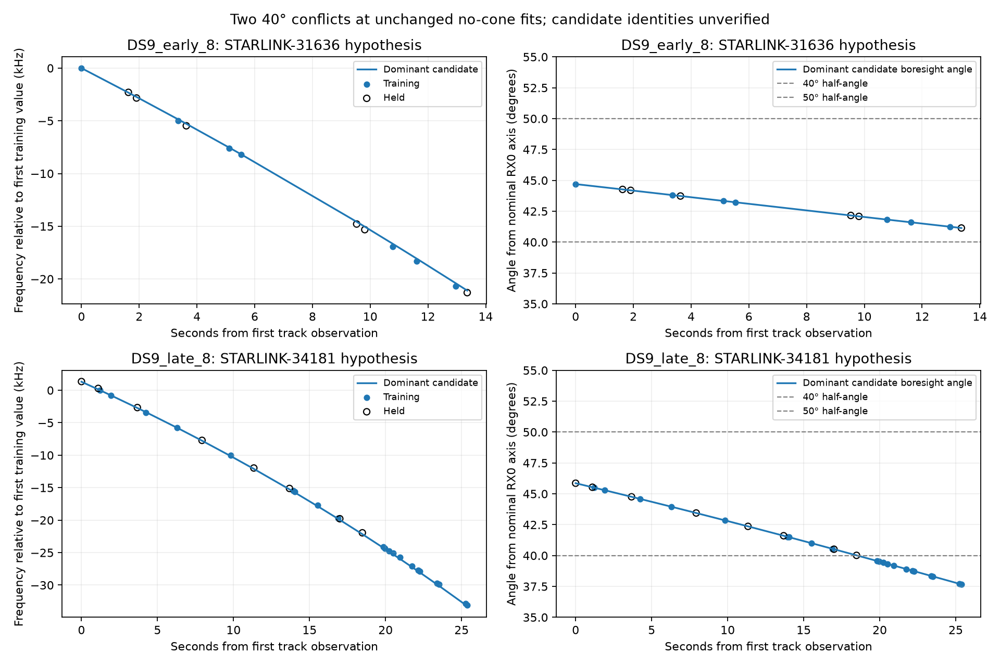

# RX0 tracks excluded by a 40-degree cone

Both whole-domain 40° exclusions have orderly exported timestamps and strong frequency-model support. Their dominant retained hypotheses fit the frequency changes after eliminating a free constant offset, but lie outside the assumed RX0 cone at the existing fit. This identifies a disagreement between frequency evidence and the assumed visibility boundary; it does not identify which assumption is wrong.

The two tracks were selected because of the previous geometric exclusion. This is post-hoc inspection, not an independent performance sample. No location, timing, candidate bank or model was refitted.

| Quantity | DS9 early eight | DS9 late eight |
|---|---:|---:|
| Observations | 13 | 29 |
| Training / held | 7 / 6 | 21 / 8 |
| Track span (s) | 13.360 | 25.371 |
| Training frequency slope (Hz/s) | -1604.5 | -1368.0 |
| Model signal responsibility | 0.99993552 | 1.00000000 |
| Conditional candidate training RMS (Hz) | 106.01 | 74.74 |
| Conditional candidate held RMS (Hz) | 99.93 | 60.67 |
| Free training constant offset (Hz) | -142715.9 | -145137.1 |
| Dominant candidate name | STARLINK-31636 | STARLINK-34181 |
| NORAD catalogue number | 59747 | 64144 |
| Stored bank index | 4703 | 6925 |
| Weight conditional on signal | 0.98895847 | 1.00000000 |
| Maximum training angle (degrees) | 44.699 | 45.497 |
| Maximum held angle (degrees) | 44.268 | 45.859 |

The plotted frequency curves are separately anchored at their first training observation. The model eliminates a free constant frequency offset, so the visual match is evidence about frequency change rather than agreement in absolute carrier frequency. RMS figures use the training-selected dominant candidate and its training-mean residual offset, then apply that same offset to held observations. They are conditional diagnostics, not new likelihood scores or satellite-identification probabilities.

## What the bookkeeping establishes

Both tracks are exported as RX0, channel 1, RF tuning center 10.71 GHz. This exact combination contains 95 of the 1,460 eligible tracks in the nine nonoverlapping DS9 eight-scan panels; two were excluded throughout the domain at 40°. The small selected sample does not establish a frequency-dependent beam or a channel fault. Exported receiver labels also do not independently calibrate the physical cable mapping.

The NPZ candidate IDs are **catalogue row indices**, not NORAD numbers. The pinned, digest-verified Space-Track baseline snapshots, filtered with the same labelled-debris rule, resolve the dominant hypotheses to STARLINK-31636 (59747) and STARLINK-34181 (64144). Each reconstructed roster has 11,130 records, matching its bank manifest. The output retains every candidate's index, catalogue number, name, weight and angle. These are retained hypotheses, not verified emitters; indices must not be treated as cross-snapshot satellite identities without resolving their roster.

Timestamps are strictly increasing within both exported tracks, covering 13.36 and 25.37 seconds. This does not verify hardware timestamp accuracy, cross-RX alignment or oscillator calibration. The exports do not establish pilot identity, waveform coherence or calibrated per-observation SNR; no raw IQ was inspected. The canonical frequency normalization remains unchanged.

## Modeling consequence

At 40°, every retained candidate for these two tracks is excluded throughout the declared position/timing domain. A hard-gated model with an unassociated alternative must therefore assign them to that alternative; it cannot count them as a complete satellite explanation. At the existing no-cone points, both dominant hypotheses remain inside 50° over training and held observations. Neither outcome calibrates the true beam.

Proceed with the previously proposed matched fixed-position hard-40°/50° versus soft-gate scoring check, retaining the normalized unassociated alternative. It can measure the prediction cost and reassociation caused by enforcing the boundary before a more expensive discontinuous geographic fit. Receiver pose error, sidelobe reception, bank incompleteness and incorrect association remain competing explanations. This inspection produces no new geographic accuracy result.

## Evidence

The existing no-cone training and held scores and candidate weights replay within the declared checks. Candidate angle bounds remain below the actual angles at those unchanged fitted points. All repository input hashes were checked against published evidence inventories before use and verified again after inspection. The cached TLE archive was accessed read-only through its reader; snapshot digests and collection times are retained in the output.

The single bounded process exited zero in 4.63 s, with peak RSS 385,620 KiB. No optimization, propagation, provider fetch, raw-waveform access or RF collection was performed. [Inspection data](inspection.json), [command receipt](launch.json), [resource receipt](resources.txt), [evidence hashes](evidence-sha256.json), and [preceding domain exclusion](../2026_09_29_cone_feasibility/README.md).
