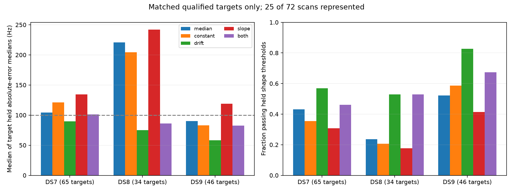

# Cross-RX alignment: drift transfers better than the timing-like term

**A linear time drift improves conditional frequency prediction on the qualified
subset; the first-order timing-like term does not justify promotion.** On the
145 targets where all five main arms qualify, drift improves held density over
a fitted constant on 101/145 and passes the fixed shape thresholds on 93/145,
versus 57/145 for that constant. These targets represent only 25 of 72 scans.
This is not a new position fit, calibrated hardware correction, or sub-km result.

The experiment preserves all 913 previously selected frequency-coherent pairs.
Every target is calibrated using other pairs in the same scan/channel/exact RF,
with its own frequency differences removed. No satellite nominee, receiver pose,
geographic estimate or reference coordinate enters calibration.

## Matched main comparison

Errors are medians of target-level held absolute-error medians, in Hz. Each
dataset column uses exactly the same targets for all five models. The two
shape thresholds remain median absolute error ≤100 Hz and 90th percentile
≤300 Hz; a low aggregate median alone does not mean every target passes.

| Model | DS7: 65 targets / 10 scans | DS8: 34 targets / 7 scans | DS9: 46 targets / 8 scans | Shape passes / 145 |
|---|---:|---:|---:|---:|
| Donor median offset | 104.1 | 220.7 | 90.2 | 60 |
| Fitted constant offset | 121.3 | 204.3 | 82.9 | 57 |
| Constant + time drift | **89.5** | **75.1** | **58.4** | **93** |
| Constant + frequency-slope feature | 134.3 | 242.0 | 118.7 | 45 |
| Constant + drift + slope | 101.2 | 86.0 | 82.5 | 79 |

The slope feature is the derivative of a quadratic fitted to the target's
training mean RX frequency. Its coefficient has units of seconds and represents
a first-order relative time alignment. It is not measured time of arrival.
Clock error, estimator delay, drift, wrong pairs and feature error can be
confounded. A poor result for this term does not prove that physical timing
errors are absent.

## Held predictive comparisons

Each cell is positive targets / matched targets, followed by the median change
in log density per held observation. Main contrasts use the shared population
above. Permutation controls use their own explicit matched intersections.

| Change | DS7 | DS8 | DS9 |
|---|---:|---:|---:|
| Fitted constant → drift | 44/65; +0.0634 | 24/34; +0.4029 | 33/46; +0.0377 |
| Donor median → drift | 39/65; +0.0398 | 25/34; +0.4959 | 33/46; +0.0370 |
| Fitted constant → slope | 31/65; −0.0014 | 15/34; −0.0349 | 15/46; −0.0159 |
| Drift → drift + slope | 28/65; −0.0134 | 16/34; −0.0064 | 15/46; −0.0120 |
| Shuffled donor times → correct times | 45/65; +0.0711 | 28/35; +0.5204 | 37/46; +0.0716 |
| Shuffled donor slopes → correct slopes | 35/65; +0.0050 | 16/34; −0.0001 | 20/46; −0.0017 |

The time control supports using chronological information in this diagnostic.
It does not establish a hardware mechanism. Omitted-pair folds share donors;
targets and scans are not independent trials, and no significance claim follows
from these counts. All datasets have already been explored.

## Coverage and qualification

Require four other selected pairs per target. Do not pool RF channels or scans
to meet that requirement. Of 913 targets, 680 lack enough donors. The remaining
233 qualify for the constant/median fits; 11 lack sufficient held coverage.
Drift and slope arms additionally reject large fitted coefficients. No target
was dropped because of a poor held outcome.

| Dataset | Selected targets | Median/constant scored | Drift scored | Slope scored | Both scored | Shared main population |
|---|---:|---:|---:|---:|---:|---:|
| DS7 | 293 | 86 | 65 | 65 | 65 | 65 |
| DS8 | 295 | 65 | 35 | 34 | 34 | 34 |
| DS9 | 325 | 71 | 46 | 46 | 46 | 46 |

Across all targets, drift has 155 qualified fits and 146 held scores; slope
and both have 154 qualified fits and 145 held scores. Time-permuted and
slope-permuted arms have 147 and 145 held scores respectively. All unqualified
fits, coefficients and reasons remain in result.json; summary.json retains
per-dataset coverage. Missing controls never count as defeats.

The model solves an unconstrained least-squares problem with equal weight per
donor pair. It then rejects coefficients outside ±20 Hz/s for drift or ±5 s
for the slope term. This is a qualification rule, not constrained optimization.
Rank and condition checks also apply; no rank failures occurred here. The
coefficient bounds reject 78 drift fits and 79 slope/both fits among donor-eligible
targets. These are prototype limits, not measured hardware bounds.

## Validation and next geographic gate

Seven tests pass: synthetic recovery, held isolation, target-response exclusion,
median control, donor/rank/bound failures, deterministic permutations and
polynomial features. A separate QR-based auditor reconstructs features and
coefficients, checks every gate and held score, and exactly replays the earlier
donor-median residuals on matching targets. Frozen sources and inputs verify.

The single process exited zero in 0.60 seconds, with peak RSS 110,488 KiB under
the 90-second/4-GiB cap. No retries, geographic fits, RF, raw IQ, propagation,
candidate-bank/archive reads, provider fetches or production changes occurred.

The [next proposal](NEXT.md) considers a conservative differential-drift
localization test while preserving missing calibrations and the unresolved
common-mode frequency ambiguity. Neither the pairing nor this diagnostic
verifies shared satellite identity, so a merged-track model is not yet warranted.

[Protocol](PROTOCOL.md), [tests](tests.log), [all targets and coefficients](result.json),
[audited aggregates](summary.json), [frozen plan](plan.json),
[input seal](input-seal.json), [process receipt](launch.json),
[complete evidence hashes](evidence-sha256.json).
