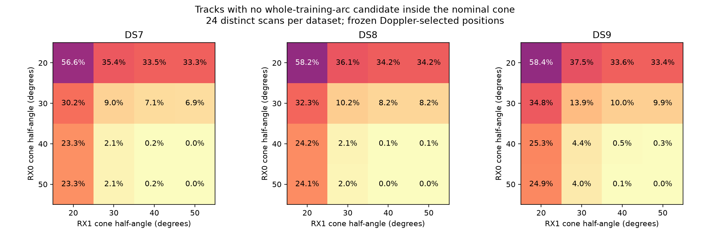

# Scan-consistent RX cone support on DS7, DS8 and DS9

The requested cone grid now has a completed **fixed-position support audit**.
With nominal axes separated by 20 degrees, narrow cones reject substantial
parts of the retained candidate banks. A 50-degree half-angle for both RXs
admits at least one whole-training-track candidate for every track in all
72 distinct scans. This is geometric support, **not a new position fit,
verified satellite association, or demonstrated sub-km improvement**.

Angles here are **half-angles from the receiver pointing axis**: a 20-degree
entry means a 40-degree full opening. This interpretation was stated before
execution and remains provisional pending operator clarification. Width is
separate from the 20-degree separation between receiver axes.

| Equal RX half-angles | DS7 unsupported tracks | DS8 unsupported tracks | DS9 unsupported tracks |
|---|---:|---:|---:|
| 20 degrees | 811/1,434 (56.6%) | 835/1,434 (58.2%) | 852/1,460 (58.4%) |
| 30 degrees | 129/1,434 (9.0%) | 146/1,434 (10.2%) | 203/1,460 (13.9%) |
| 40 degrees | 3/1,434 (0.2%) | 2/1,434 (0.1%) | 7/1,460 (0.5%) |
| 50 degrees | 0/1,434 | 0/1,434 | 0/1,460 |

Unsupported means **no candidate in the stored bank stays inside the cone
at every training observation of that track**. It does not prove that no
satellite in the full catalogue could satisfy it.

| Equal RX half-angles | DS7 fully supported scans | DS8 fully supported scans | DS9 fully supported scans |
|---|---:|---:|---:|
| 20 degrees | 0/24 | 0/24 | 0/24 |
| 30 degrees | 0/24 | 0/24 | 0/24 |
| 40 degrees | 21/24 | 23/24 | 17/24 |
| 50 degrees | 24/24 | 24/24 | 24/24 |

A fully supported scan has at least one supporting bank candidate for every
retained track, under the same position, axes and cone widths. This is a
necessary compatibility check; it does not enforce identity sharing across
unverified cross-RX pairs or prove continuous visibility between samples.

All sixteen RX0/RX1 width combinations were evaluated, including unequal
widths. Among these grid points, fully supporting all tracks in a dataset
requires (RX0,RX1) = (40,50) or (50,50) for DS7; (50,40) or (50,50) for DS8;
and (50,50) for DS9. These are support outcomes under assumed axes and fixed
positions, not selected or calibrated beamwidths. No outcome is promoted
as a hardware measurement.

## Compatibility with Doppler evidence

A cone may contain an alternative candidate while excluding the candidate
favored by Doppler. The following mean retained **training-posterior mass**
uses the original model's weights, with every track included, including zeros.
It is a descriptive mass-retention diagnostic, not a new likelihood score or
a calibrated probability of a correct satellite identity.

| Equal RX half-angles | DS7 retained mass | DS8 retained mass | DS9 retained mass |
|---|---:|---:|---:|
| 20 degrees | 12.83% | 12.64% | 12.15% |
| 30 degrees | 53.71% | 49.62% | 45.71% |
| 40 degrees | 92.01% | 90.20% | 85.46% |
| 50 degrees | 98.42% | 97.82% | 95.56% |

Thus a hard 30-degree gate would force major association changes or leave
unexplained tracks. It cannot be applied as if it were a neutral cleanup.
At 50 degrees, most of the existing Doppler mass survives, but that alone
does not establish useful geographic information.

Held angles are evaluated only after training-cone support is fixed. The
exported conditional held mass is the fraction of that supported training
posterior whose trajectory also remains inside the cone at all held times.
Its denominator excludes zero stored training mass and is explicit in every
aggregate. It is not an unconditional detection accuracy or held Doppler
score. Zero stored posterior mass and zero geometric support are reported
separately because floating-point weights can underflow.

## Orientation controls

The nominal axes are (-sin10,0,cos10) and (+sin10,0,cos10) in east/north/up.
Swapped axes and a co-pointed zenith control use the same positions, timings,
candidate trajectories and baseline posterior weights. At equal 40-degree
half-angles, the unsupported-track counts are:

| Control | DS7 | DS8 | DS9 |
|---|---:|---:|---:|
| Nominal opposing axes | 3 | 2 | 7 |
| Swapped opposing axes | 59 | 49 | 87 |
| Both axes at zenith | 37 | 40 | 71 |

This is useful geometric compatibility evidence for the nominal assignment
within this audit. It does not calibrate the cable mapping or world pose, and
it does not overturn the earlier negative predictive-transfer results for
[soft nominal beam features](../2026_09_28_rx_nominal_beam_cv/README.md).
The existing station evidence gives nominal mount tilt, not surveyed world
boresights or a measured antenna response. Unknown orientation, sidelobes,
false detections, bank incompleteness and incorrect associations remain
possible explanations for unsupported tracks.

## What is shared within a scan

[PROTOCOL.md](PROTOCOL.md) fixes all eighteen consecutive four/eight panels.
Each uses the [one-timing model's](../2026_09_29_consecutive_panels/README.md)
training-selected location and timings. A single pair of axes/widths applies
throughout the entire panel, which is stronger than consistency within one
scan. A candidate retains its trajectory and timing across the whole track;
neither cone nor position is adjusted separately to rescue a track.

The audit reads cached ECEF positions, applies the baseline's linear timing
interpolation, constructs the same WGS84 surface receiver location, rotates
unit line-of-sight vectors into ENU, and checks their dot products against
the fixed axes. Every training sample must pass. Held samples never decide
training support. There is no geographic refit, no ground-truth selection,
no new propagation and no new receiver timing fit in this audit.

All eighteen panels are retained: 6,505 track memberships, representing
4,328 distinct tracks and 72 distinct recordings. Main tables and heatmaps
use only the nine nonoverlapping eight-scan panels, giving 24 distinct scans
per dataset. Nested four-scan results remain in summary.json but are not
double-counted in those tables. The audit includes 864 panel/control/width
combinations, with track-level support for every declared cone.

## Verification and next model

All eighteen bounded processes exit zero and all panels validate. The scorer
verifies 872 execution/input bindings, exact track identities and observation
counts, unchanged fitted parameters, normalized posterior weights, support
monotonicity as cones widen, and explicit held-conditioning denominators.
Three [geometry tests](test_cones.py) pass: frame/interpolation, nominal
separation/swap, and whole-track support with held isolation. [tests.log](tests.log)
records the run. All scripts pass Ruff lint and formatting.

One worker ran after the previous timing fitting batch was terminal, with
BLAS1/nice19, a 90-second process cap, 4 GiB address-space cap and at least
5 GiB available memory. Summed job wall time is 41.90 s, longest job 3.40 s,
and peak RSS 666,480 KiB. No failures, retries, new RF, raw-waveform reads,
provider fetch, production component change or golden-fixture change.

The next geographic test should use the same scan-wide geometry in a joint
position/association model, compare no-cone and predeclared cone variants,
and explicitly retain unexplained detections through a soft-edge or outlier
model. A hard all-track model must report infeasibility instead of dropping
tracks. Pose uncertainty must be shared across the scan; it cannot be fitted
separately for every candidate. Paired identities require independently
supported cross-RX correspondences. Report position and predictive changes
separately, including the late DS9 failure.

The reference is exposed and unsurveyed, and these are previously explored
single-site datasets. The audit provides no new geographic-error estimate,
confidence interval, blind result or proof of sub-km resolution.

[plan.json](plan.json), [summary.json](summary.json), [resources.json](resources.json)
and [evidence-sha256.json](evidence-sha256.json) retain the complete design,
all support outcomes and receipts, with hashes excluding the hash inventory
itself. Reproduction order: tests, prepare.py, launch.py, summarize.py.
Existing output directories are immutable evidence, not retry destinations.
