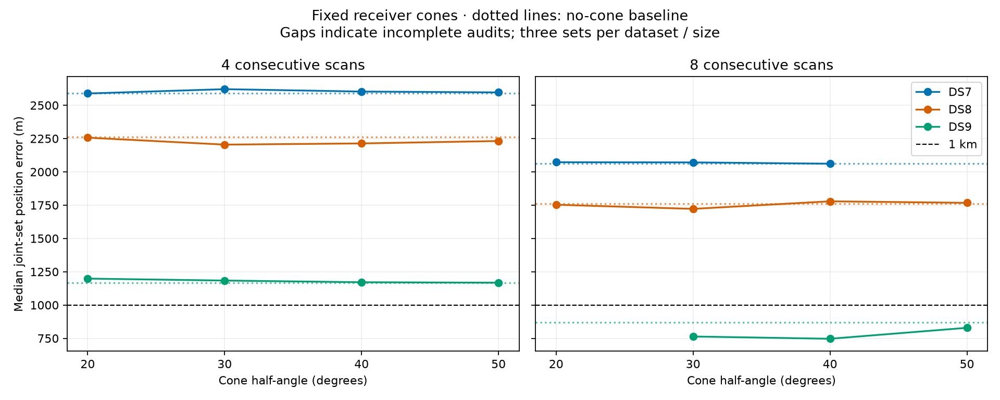

# Joint location with scan-consistent receiver cones

**Do not promote this soft-cone model as a reliable sub-km solution.** No tested width establishes sub-km performance across DS7/DS8/DS9. Every complete DS7 and DS8 median remains above 1 km, and the late DS9 eight-scan error exceeds 3 km in every width arm. The broad goal remains open.

The complete predeclared 20°, 30°, 40°, and 50° half-angle sweep fits one common position and one timing per recording, with fixed receiver axes and cone widths throughout each scan set. Each candidate keeps one trajectory across its track. The nominal axes point 10° west/east of zenith (20° apart); that world pose and receiver mapping remain assumptions, not calibrated measurements. Half-angle means a 20° arm has a 40° full opening; this interpretation is provisional.

**70/72 selected solutions pass the numerical audit.** Among those, 49 improve reference position error and 29 improve held Doppler prediction. These are paired descriptive counts across dependent sensitivity arms, not independent trials or a width-selection rule.

## Position results

Median error in metres across early/middle/late scan sets. Each cell requires all three selected fits to pass. These are joint set estimates, not single-scan medians. Four-scan sets are nested in eight-scan sets.

| Scans | Cone half-angle | DS7 | DS8 | DS9 |
|---:|---|---:|---:|---:|
| 4 | No cone | 2,590 | 2,261 | 1,167 |
| 4 | 20° | 2,589 | 2,257 | 1,198 |
| 4 | 30° | 2,621 | 2,205 | 1,184 |
| 4 | 40° | 2,603 | 2,214 | 1,171 |
| 4 | 50° | 2,597 | 2,232 | 1,168 |
| 8 | No cone | 2,064 | 1,762 | 870 |
| 8 | 20° | 2,072 | 1,753 | Incomplete |
| 8 | 30° | 2,071 | 1,722 | 764 |
| 8 | 40° | 2,061 | 1,779 | 747 |
| 8 | 50° | Incomplete | 1,767 | 829 |

| Half-angle | Audited / planned | Lower position error | Better held Doppler | Audited sub-km sets |
|---:|---:|---:|---:|---:|
| 20° | 17/18 | 12/17 | 7/17 | 2 |
| 30° | 18/18 | 14/18 | 8/18 | 4 |
| 40° | 18/18 | 14/18 | 5/18 | 3 |
| 50° | 17/18 | 9/17 | 9/17 | 3 |

The following diagnostics use only audited panels. A negative median error change favors the cone model. Controls are evaluated at the nominal fitted point and are not independently optimized alternatives. Neither a positive control count nor a small reference-error change establishes direction evidence.

| Half-angle | Median error change (m) | Median held change (nats) | Nominal beats swapped | Nominal beats co-pointed |
|---:|---:|---:|---:|---:|
| 20° | -8.779 | -0.629 | 9/17 | 9/17 |
| 30° | -43.632 | -1.630 | 10/18 | 4/18 |
| 40° | -20.332 | -1.497 | 8/18 | 4/18 |
| 50° | -1.208 | +0.394 | 12/17 | 11/17 |

## What consistency means here

For a candidate, the cone factor uses its maximum boresight angle over all training observations in that track. The factor is 0.01 + 0.99 times a sigmoid with a fixed 2° edge. It reweights the Doppler candidate mixture while location and timing are fitted. Its 1% floor retains out-of-cone explanations; this is a soft compatibility factor, not a calibrated beam or clutter probability. The earlier [support audit](../2026_09_29_rx_cone_consistency/README.md) tested all sixteen RX0/RX1 width pairs; this location study tests four equal-width pairs.

A limitation follows directly from the mixture: if every candidate of a track has the same locally constant cone factor c, its mixture becomes c times the no-cone mixture. That adds log(c) to training score but leaves its position gradient and normalized candidate weights unchanged; the factor also cancels from the conditional held score. The soft floor approaches this regime far outside a narrow cone. Thus the floor retains unexplained tracks but does not automatically reduce their frequency-based pull on position. This algebraic limitation is not a measured count of floor-saturated tracks.

Held Doppler predictions condition on the same training-derived factor. Held angles do not change that factor. Consequently this does not enforce a hard cone at every held sample, score non-detections, or verify shared satellite identity across receiver tracks. Those require a detection model and independently supported cross-RX associations. Swapped-axis and co-pointed controls are evaluated at the nominal fitted point without refitting, so they are conditional diagnostics.

## Candidate-weight changes

This post-fit descriptive diagnostic compares training candidate weights with the no-cone baseline on audited panels. Total variation is half the sum of absolute weight differences: zero means identical distributions, one means disjoint support. Changes combine the cone factor and refitted position/timing; they do not isolate the cone's direct contribution. Most-probable candidates are retained-bank hypotheses, not verified identities. Track appearances repeat across nested four/eight sets and must not be counted as independent trials.

| Half-angle | Audited track appearances | Most-probable candidate changes | Mean total variation | Median | 95th percentile |
|---:|---:|---:|---:|---:|---:|
| 20° | 6,020 | 85 | 0.015840 | 5.21e-16 | 0.068562 |
| 30° | 6,505 | 145 | 0.024045 | 8.46e-16 | 0.154773 |
| 40° | 6,505 | 118 | 0.019080 | 2.11e-16 | 0.080631 |
| 50° | 6,041 | 51 | 0.008776 | 9.04e-17 | 0.011113 |

[Per-panel association diagnostics](association-diagnostic.json) retain the denominators. Small weight changes explain limited reassociation, but do not validate the existing candidate assignments or establish why they are concentrated.

## Numerical evidence and retained failures

279/288 optimizer starts qualify. Selection uses training score only, never reference error. All 72 baseline-derived starts reproduce the no-cone score, gradient and held rows. Initial synthetic tests cover neutral equivalence, derivatives, held-data isolation and receiver symmetry; a separate independent Student-t calculation verifies the conditional held-density algebra for all four widths.

360 process receipts: 360 exit zero. Total job wall time 3467.94 s, maximum 30.77 s, peak RSS 682,552 KiB. Process success is distinct from scientific qualification and selected-fit audit success.

- **DS9_middle_8_c20**: selected-fit audit failed or unavailable; excluded from complete medians, retained in planned denominator.
  - Parameter 3: maximum derivative discrepancy 0.0958908; grid crossing: True.
- **DS7_middle_8_c50**: selected-fit audit failed or unavailable; excluded from complete medians, retained in planned denominator.
  - Parameter 2: maximum derivative discrepancy 0.032176; grid crossing: True.

The c30 fit launcher stopped with exit 143; its cause was not established. Its final child had completed with GNU time exit status 0 before the launcher wrote the exit receipt. That receipt was recovered from saved evidence, and only the twelve unstarted fits were launched with identical commands and limits. No completed fit was rerun. The c30 batch report links the recovery record and continuation code. The launcher interruption remains distinct from the child process receipts and scientific qualification failures.

No failed optimizer start or audit was retried, removed or reclassified. Each batch report lists its unqualified starts and all eighteen panel outcomes:

- [20° results](RESULTS-c20.md), [complete data](summary-c20.json), [resource receipts](resources-c20.json).
- [30° results](RESULTS-c30.md), [complete data](summary-c30.json), [resource receipts](resources-c30.json).
- [40° results](RESULTS-c40.md), [complete data](summary-c40.json), [resource receipts](resources-c40.json).
- [50° results](RESULTS-c50.md), [complete data](summary-c50.json), [resource receipts](resources-c50.json).

## Interpretation and next tests

The scan-wide cone constraint is now exercised in a joint position model. No width is selected from these exposed reference errors. The unsurveyed reference, assumed world pose, retained candidate bank and previously explored single-site panels limit conclusions: nominal sub-km cases do not establish blind accuracy or calibrated confidence. Widths are sensitivity arms, not fitted hardware beamwidths. Wider cones can be geometrically feasible without adding enough directional information to improve location.

Next priorities are shared pose/beam uncertainty with independent calibration, an explicit unassociated-track alternative and a reception/non-reception likelihood that retains clutter, and independently validated cross-RX track associations to constrain travel direction. Any future cone-plus-receiver-timing experiment must be separately frozen and evaluated; this report does not combine those models. The partial-timing s050/s200 studies remain pending, and [s010](../2026_09_29_partial_receiver_timing/RESULTS-s010.md) is a separate completed batch.

[Protocol](PROTOCOL.md), [frozen plan](plan.json), [initial tests](tests.log), [independent predictive test](predictive-tests.log), and [hash inventory](evidence-sha256.json) provide reproduction evidence. Run tests and prepare once, then fit, held audit, summarize and write_batch_report for c20/c30/c40/c50 in order; write_report assembles and seals the completed study. Existing run directories are immutable evidence. One bounded worker used cached inputs; no RF collection, waveform reads, propagation or provider fetches.
