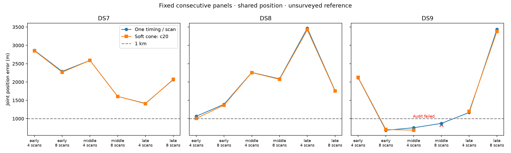

# 20-degree half-angle: joint location batch

This is one predeclared width batch, not a completed comparison of all four widths. No width is selected from reference errors. Cone axes and widths remain fixed across every track in a panel; the fitted parameters are position and recording timings.

**17/18 selected fits pass the audit.** Among passing panels, geography improves in 12/17 and matched held Doppler prediction improves in 7/17. Failed panels remain in the planned denominator; partial-subset medians are separately labeled in the JSON and are not substituted for complete medians below.

| Dataset | Scans | Audited / planned | Cone median error (m) | Sub-km audited sets |
|---|---:|---:|---:|---:|
| DS7 | 4 | 3/3 | 2,588.564 | 0 |
| DS7 | 8 | 3/3 | 2,072.452 | 0 |
| DS8 | 4 | 3/3 | 2,256.834 | 0 |
| DS8 | 8 | 3/3 | 1,753.249 | 0 |
| DS9 | 4 | 3/3 | 1,198.434 | 1 |
| DS9 | 8 | 2/3 | Incomplete | 1 |

Medians are across joint scan-set estimates, not independent single scans.

| Panel | Baseline error (m) | Cone error (m) | Held change (nats) | Audited |
|---|---:|---:|---:|---|
| DS7_early_4 | 2,864.858 | 2,853.739 | -9.746 | Pass |
| DS7_early_8 | 2,287.191 | 2,266.646 | -0.141 | Pass |
| DS7_middle_4 | 2,590.063 | 2,588.564 | +0.076 | Pass |
| DS7_middle_8 | 1,606.608 | 1,607.056 | +2.739 | Pass |
| DS7_late_4 | 1,414.224 | 1,406.903 | -3.921 | Pass |
| DS7_late_8 | 2,063.706 | 2,072.452 | -5.797 | Pass |
| DS8_early_4 | 1,065.224 | 1,004.719 | +0.703 | Pass |
| DS8_early_8 | 1,390.877 | 1,368.468 | -0.998 | Pass |
| DS8_middle_4 | 2,260.918 | 2,256.834 | +1.895 | Pass |
| DS8_middle_8 | 2,084.608 | 2,071.901 | +2.094 | Pass |
| DS8_late_4 | 3,467.535 | 3,423.529 | +0.231 | Pass |
| DS8_late_8 | 1,762.028 | 1,753.249 | -0.629 | Pass |
| DS9_early_4 | 2,117.272 | 2,126.745 | +4.450 | Pass |
| DS9_early_8 | 682.990 | 703.091 | -3.174 | Pass |
| DS9_middle_4 | 750.643 | 684.993 | -2.031 | Pass |
| DS9_middle_8 | 869.695 | 835.362 (unvalidated) | -1.192 (unvalidated) | Failed / unavailable |
| DS9_late_4 | 1,167.327 | 1,198.434 | -4.753 | Pass |
| DS9_late_8 | 3,435.817 | 3,377.169 | -0.726 | Pass |

Training-only selection and retained failures:

- 68/72 optimizer starts qualify.
- 18/18 baseline-derived starts reproduce the saved no-cone model.
- Scoring verifies 1,377 execution/input bindings.
- Job wall time 876.76 s; maximum 30.77 s; peak RSS 682,268 KiB.
- Retained unqualified start: DS7_late_4_c20 / southeast: ABNORMAL: .
- Retained unqualified start: DS8_late_4_c20 / northwest: ABNORMAL: .
- Retained unqualified start: DS9_middle_8_c20 / southeast: ABNORMAL: .
- Retained unqualified start: DS9_middle_8_c20 / northwest: CONVERGENCE: RELATIVE REDUCTION OF F <= FACTR*EPSMCH.

The factor has a fixed 2-degree soft edge and 1% floor; it is not a calibrated beam or clutter likelihood. Held scores condition on training cone compatibility and do not score held detections or impose hard held-cone membership. Swapped/co-pointed controls in the JSON are evaluated at the nominal fitted point without refitting.

The exposed unsurveyed reference and dependent, previously explored single-site panels do not establish blind accuracy or calibrated sub-km resolution.

See [protocol](PROTOCOL.md), [batch evidence](summary-c20.json), [receipts](resources-c20.json), [initial tests](tests.log), and [independent conditional-density test](predictive-tests.log). No retries, outcome-based exclusions or relaxed gates are used.
