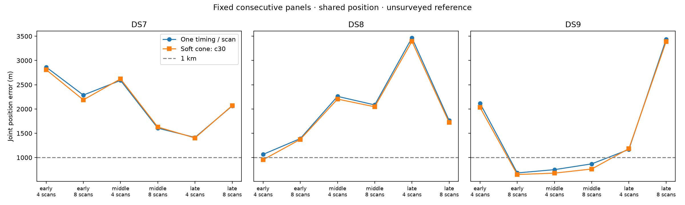

# 30-degree half-angle: joint location batch

This is one predeclared width batch, not a completed comparison of all four widths. No width is selected from reference errors. Cone axes and widths remain fixed across every track in a panel; the fitted parameters are position and recording timings.

**18/18 selected fits pass the audit.** Among passing panels, geography improves in 14/18 and matched held Doppler prediction improves in 8/18. Failed panels remain in the planned denominator; partial-subset medians are separately labeled in the JSON and are not substituted for complete medians below.

| Dataset | Scans | Audited / planned | Cone median error (m) | Sub-km audited sets |
|---|---:|---:|---:|---:|
| DS7 | 4 | 3/3 | 2,621.007 | 0 |
| DS7 | 8 | 3/3 | 2,071.071 | 0 |
| DS8 | 4 | 3/3 | 2,204.630 | 1 |
| DS8 | 8 | 3/3 | 1,722.031 | 0 |
| DS9 | 4 | 3/3 | 1,183.792 | 1 |
| DS9 | 8 | 3/3 | 763.731 | 2 |

Medians are across joint scan-set estimates, not independent single scans.

| Panel | Baseline error (m) | Cone error (m) | Held change (nats) | Audited |
|---|---:|---:|---:|---|
| DS7_early_4 | 2,864.858 | 2,811.146 | -10.048 | Pass |
| DS7_early_8 | 2,287.191 | 2,188.411 | -6.853 | Pass |
| DS7_middle_4 | 2,590.063 | 2,621.007 | -2.805 | Pass |
| DS7_middle_8 | 1,606.608 | 1,629.710 | +2.213 | Pass |
| DS7_late_4 | 1,414.224 | 1,403.414 | -1.980 | Pass |
| DS7_late_8 | 2,063.706 | 2,071.071 | -2.640 | Pass |
| DS8_early_4 | 1,065.224 | 954.432 | +0.315 | Pass |
| DS8_early_8 | 1,390.877 | 1,374.254 | -3.619 | Pass |
| DS8_middle_4 | 2,260.918 | 2,204.630 | -1.280 | Pass |
| DS8_middle_8 | 2,084.608 | 2,046.163 | -5.811 | Pass |
| DS8_late_4 | 3,467.535 | 3,396.177 | +2.950 | Pass |
| DS8_late_8 | 1,762.028 | 1,722.031 | +5.043 | Pass |
| DS9_early_4 | 2,117.272 | 2,031.916 | +2.288 | Pass |
| DS9_early_8 | 682.990 | 650.667 | +3.535 | Pass |
| DS9_middle_4 | 750.643 | 678.862 | +0.567 | Pass |
| DS9_middle_8 | 869.695 | 763.731 | +6.019 | Pass |
| DS9_late_4 | 1,167.327 | 1,183.792 | -2.689 | Pass |
| DS9_late_8 | 3,435.817 | 3,388.550 | -14.992 | Pass |

Training-only selection and retained failures:

- 71/72 optimizer starts qualify.
- 18/18 baseline-derived starts reproduce the saved no-cone model.
- Scoring verifies 1,379 execution/input bindings.
- Job wall time 859.18 s; maximum 26.44 s; peak RSS 682,552 KiB.
- Retained unqualified start: DS9_early_8_c30 / origin: ABNORMAL: .

Administrative interruption: launcher session 56034 stopped with exit 143 (cause not established). The child DS9_middle_4_c30/fit/baseline had already completed with GNU time exit status 0 and a completion log. Its missing exit receipt and seal were recovered from that evidence. The twelve unstarted fits then continued with identical commands and resource limits. No completed fit was rerun. [Recovery evidence](runs/DS9_middle_4_c30/fit/baseline/recovery.json) and [continuation code](resume_c30.py) preserve the interruption separately from scientific fit failures.

The factor has a fixed 2-degree soft edge and 1% floor; it is not a calibrated beam or clutter likelihood. Held scores condition on training cone compatibility and do not score held detections or impose hard held-cone membership. Swapped/co-pointed controls in the JSON are evaluated at the nominal fitted point without refitting.

The exposed unsurveyed reference and dependent, previously explored single-site panels do not establish blind accuracy or calibrated sub-km resolution.

See [protocol](PROTOCOL.md), [batch evidence](summary-c30.json), [receipts](resources-c30.json), [initial tests](tests.log), and [independent conditional-density test](predictive-tests.log). No retries, outcome-based exclusions or relaxed gates are used.
