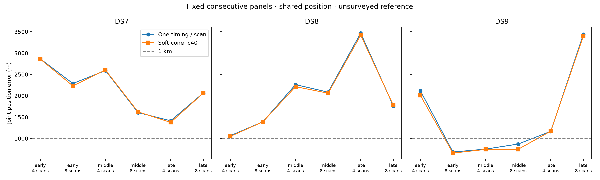

# 40-degree half-angle: joint location batch

This is one predeclared width batch, not a completed comparison of all four widths. No width is selected from reference errors. Cone axes and widths remain fixed across every track in a panel; the fitted parameters are position and recording timings.

**18/18 selected fits pass the audit.** Among passing panels, geography improves in 14/18 and matched held Doppler prediction improves in 5/18. Failed panels remain in the planned denominator; partial-subset medians are separately labeled in the JSON and are not substituted for complete medians below.

| Dataset | Scans | Audited / planned | Cone median error (m) | Sub-km audited sets |
|---|---:|---:|---:|---:|
| DS7 | 4 | 3/3 | 2,602.997 | 0 |
| DS7 | 8 | 3/3 | 2,061.238 | 0 |
| DS8 | 4 | 3/3 | 2,213.521 | 0 |
| DS8 | 8 | 3/3 | 1,778.785 | 0 |
| DS9 | 4 | 3/3 | 1,171.211 | 1 |
| DS9 | 8 | 3/3 | 746.703 | 2 |

Medians are across joint scan-set estimates, not independent single scans.

| Panel | Baseline error (m) | Cone error (m) | Held change (nats) | Audited |
|---|---:|---:|---:|---|
| DS7_early_4 | 2,864.858 | 2,858.234 | -10.103 | Pass |
| DS7_early_8 | 2,287.191 | 2,231.474 | -8.777 | Pass |
| DS7_middle_4 | 2,590.063 | 2,602.997 | -4.911 | Pass |
| DS7_middle_8 | 1,606.608 | 1,622.719 | -2.323 | Pass |
| DS7_late_4 | 1,414.224 | 1,376.985 | -3.045 | Pass |
| DS7_late_8 | 2,063.706 | 2,061.238 | -0.466 | Pass |
| DS8_early_4 | 1,065.224 | 1,048.796 | -2.112 | Pass |
| DS8_early_8 | 1,390.877 | 1,389.875 | -7.151 | Pass |
| DS8_middle_4 | 2,260.918 | 2,213.521 | -0.882 | Pass |
| DS8_middle_8 | 2,084.608 | 2,060.373 | -4.633 | Pass |
| DS8_late_4 | 3,467.535 | 3,417.545 | +6.717 | Pass |
| DS8_late_8 | 1,762.028 | 1,778.785 | +9.402 | Pass |
| DS9_early_4 | 2,117.272 | 2,009.504 | -0.143 | Pass |
| DS9_early_8 | 682.990 | 657.810 | +4.223 | Pass |
| DS9_middle_4 | 750.643 | 744.310 | +2.390 | Pass |
| DS9_middle_8 | 869.695 | 746.703 | +6.051 | Pass |
| DS9_late_4 | 1,167.327 | 1,171.211 | -0.623 | Pass |
| DS9_late_8 | 3,435.817 | 3,396.136 | -9.128 | Pass |

Training-only selection and retained failures:

- 69/72 optimizer starts qualify.
- 18/18 baseline-derived starts reproduce the saved no-cone model.
- Scoring verifies 1,377 execution/input bindings.
- Job wall time 846.59 s; maximum 26.53 s; peak RSS 682,144 KiB.
- Retained unqualified start: DS7_middle_4_c40 / baseline: ABNORMAL: .
- Retained unqualified start: DS7_late_4_c40 / baseline: ABNORMAL: .
- Retained unqualified start: DS8_middle_4_c40 / northwest: ABNORMAL: .

The factor has a fixed 2-degree soft edge and 1% floor; it is not a calibrated beam or clutter likelihood. Held scores condition on training cone compatibility and do not score held detections or impose hard held-cone membership. Swapped/co-pointed controls in the JSON are evaluated at the nominal fitted point without refitting.

The exposed unsurveyed reference and dependent, previously explored single-site panels do not establish blind accuracy or calibrated sub-km resolution.

See [protocol](PROTOCOL.md), [batch evidence](summary-c40.json), [receipts](resources-c40.json), [initial tests](tests.log), and [independent conditional-density test](predictive-tests.log). No retries, outcome-based exclusions or relaxed gates are used.
