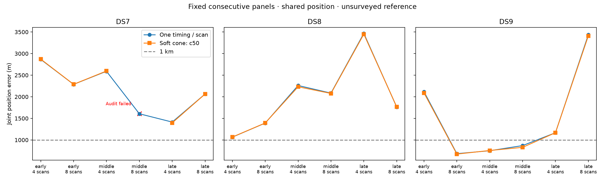

# 50-degree half-angle: joint location batch

This is one predeclared width batch, not a completed comparison of all four widths. No width is selected from reference errors. Cone axes and widths remain fixed across every track in a panel; the fitted parameters are position and recording timings.

**17/18 selected fits pass the audit.** Among passing panels, geography improves in 9/17 and matched held Doppler prediction improves in 9/17. Failed panels remain in the planned denominator; partial-subset medians are separately labeled in the JSON and are not substituted for complete medians below.

| Dataset | Scans | Audited / planned | Cone median error (m) | Sub-km audited sets |
|---|---:|---:|---:|---:|
| DS7 | 4 | 3/3 | 2,596.667 | 0 |
| DS7 | 8 | 2/3 | Incomplete | 0 |
| DS8 | 4 | 3/3 | 2,231.707 | 0 |
| DS8 | 8 | 3/3 | 1,767.399 | 0 |
| DS9 | 4 | 3/3 | 1,167.698 | 1 |
| DS9 | 8 | 3/3 | 828.972 | 2 |

Medians are across joint scan-set estimates, not independent single scans.

| Panel | Baseline error (m) | Cone error (m) | Held change (nats) | Audited |
|---|---:|---:|---:|---|
| DS7_early_4 | 2,864.858 | 2,871.962 | -4.446 | Pass |
| DS7_early_8 | 2,287.191 | 2,288.381 | -4.283 | Pass |
| DS7_middle_4 | 2,590.063 | 2,596.667 | -3.546 | Pass |
| DS7_middle_8 | 1,606.608 | 1,610.103 (unvalidated) | -2.729 (unvalidated) | Failed / unavailable |
| DS7_late_4 | 1,414.224 | 1,395.747 | -0.843 | Pass |
| DS7_late_8 | 2,063.706 | 2,062.497 | +0.841 | Pass |
| DS8_early_4 | 1,065.224 | 1,067.617 | +0.394 | Pass |
| DS8_early_8 | 1,390.877 | 1,393.146 | -2.334 | Pass |
| DS8_middle_4 | 2,260.918 | 2,231.707 | -1.182 | Pass |
| DS8_middle_8 | 2,084.608 | 2,077.022 | -2.577 | Pass |
| DS8_late_4 | 3,467.535 | 3,450.300 | +3.415 | Pass |
| DS8_late_8 | 1,762.028 | 1,767.399 | +4.218 | Pass |
| DS9_early_4 | 2,117.272 | 2,089.180 | +1.570 | Pass |
| DS9_early_8 | 682.990 | 673.346 | +2.124 | Pass |
| DS9_middle_4 | 750.643 | 756.212 | +2.235 | Pass |
| DS9_middle_8 | 869.695 | 828.972 | +2.457 | Pass |
| DS9_late_4 | 1,167.327 | 1,167.698 | -1.666 | Pass |
| DS9_late_8 | 3,435.817 | 3,410.805 | +1.056 | Pass |

Training-only selection and retained failures:

- 71/72 optimizer starts qualify.
- 18/18 baseline-derived starts reproduce the saved no-cone model.
- Scoring verifies 1,377 execution/input bindings.
- Job wall time 885.41 s; maximum 23.42 s; peak RSS 682,496 KiB.
- Retained unqualified start: DS7_early_4_c50 / origin: ABNORMAL: .

The factor has a fixed 2-degree soft edge and 1% floor; it is not a calibrated beam or clutter likelihood. Held scores condition on training cone compatibility and do not score held detections or impose hard held-cone membership. Swapped/co-pointed controls in the JSON are evaluated at the nominal fitted point without refitting.

The exposed unsurveyed reference and dependent, previously explored single-site panels do not establish blind accuracy or calibrated sub-km resolution.

See [protocol](PROTOCOL.md), [batch evidence](summary-c50.json), [receipts](resources-c50.json), [initial tests](tests.log), and [independent conditional-density test](predictive-tests.log). No retries, outcome-based exclusions or relaxed gates are used.
