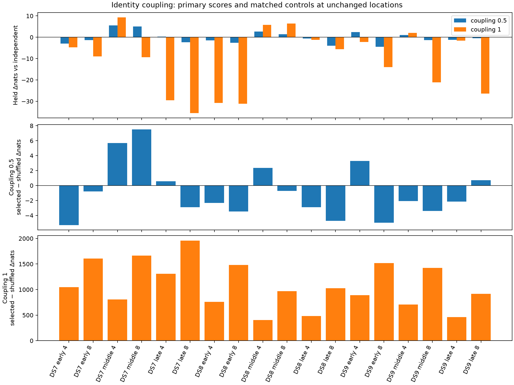

# Shared satellite assignments do not improve held prediction consistently

**All eighteen fixed-position panels complete and replay the independent model.
Neither coupling strength is promoted to geographic fitting.** Coupling 0.5
improves held prediction on 7/18 panels with median change −0.936 nats; coupling
1 improves 4/18 with median change −7.317 nats. This is a completed negative
predictive result, not a new geographic estimate or sub-km result.

| Coupling inside both-signal state | Better held / 18 | Median Δnats vs independent | Better than shuffled / 18, matched population | Median selected-minus-shuffled Δnats |
|---|---:|---:|---:|---:|
| 0.5 | 7 | −0.936 | 6 | −2.105 |
| 1 | 4 | −7.317 | 18 | +998.028 |

There are no primary-score ties at 1e-7-nat reporting tolerance. Four/eight panels
overlap, and all datasets were already explored; counts are descriptive rather
than independent trials or blind identity validation.

## Every primary outcome

| Panel | Coupling 0.5 Δnats | Coupling 1 Δnats |
|---|---:|---:|
| DS7 early 4 | −2.988 | −4.717 |
| DS7 early 8 | −1.328 | −8.991 |
| DS7 middle 4 | +5.578 | +9.269 |
| DS7 middle 8 | +5.030 | −9.350 |
| DS7 late 4 | +0.324 | −29.557 |
| DS7 late 8 | −2.392 | −35.545 |
| DS8 early 4 | −1.413 | −30.803 |
| DS8 early 8 | −2.602 | −31.194 |
| DS8 middle 4 | +2.725 | +5.755 |
| DS8 middle 8 | +1.350 | +6.418 |
| DS8 late 4 | −0.650 | −1.280 |
| DS8 late 8 | −4.036 | −5.642 |
| DS9 early 4 | +2.374 | −2.176 |
| DS9 early 8 | −4.535 | −14.047 |
| DS9 middle 4 | +1.089 | +2.093 |
| DS9 middle 8 | −1.381 | −21.194 |
| DS9 late 4 | −1.221 | −1.566 |
| DS9 late 8 | −0.413 | −26.455 |

## Model and controls

Each pair retains independent signal assignments, a shared catalogue-row
assignment, two mixed signal/background states, and both-background. The
five prior masses sum to one. Coupling acts only within the both-signal prior;
q=.2, noise=100 Hz, background slope=2000 Hz/s, coordinates and timings remain
unchanged. Separate track constants are removed by the original contrasts.
This is identity coupling, not calibrated frequency stitching, a shared clock,
beam modeling or arrival-order inference. Conditional cross-RX noise independence
is an explicit assumption, not a demonstrated physical property.

All original tracks and observations are retained once. Primary arms use all
913 selected pairs across 72 distinct scans. Matched controls use 886 pairs;
27 singleton pairs remain independent in both matched alternatives. The primary
and matched-control populations are reported separately.

All 913 actual pairs have a common training-visible candidate. Shuffled pairs
lack common visible support in 596/886 cases; their shared-assignment prior mass
is transferred explicitly to both-background. Thus the large full-coupling gap
against shuffled partners also reflects different admissible support and the
declared fallback. It does not establish physical identity or overturn the
negative comparison with the independent model. Coupling 0.5 does not reliably
beat even its matched shuffle control.

## Validation and decision

Nine tests pass, including normalized pair/predictive densities, zero-coupling
replay, held isolation, swap symmetry, correct/wrong synthetic pairs, empty
support, namespace validation and observation partitioning. Every panel's
zero-coupling training/held scores and every individual track score reproduce
published q020 values within 1e-7. An independent auditor explicitly enumerates
all candidate-assignment alternatives and reconstructs every arm's likelihood,
pair membership, prior mass and held-score arithmetic. Source/input hashes verify.

All eighteen children exit zero. Summed child wall time 43.92 seconds, maximum
3.40 seconds, peak RSS 678,536 KiB. No failures, retries, new RF, raw IQ,
propagation, provider/archive reads, production changes or golden-fixture changes.

Do not launch a location-fitting grid for this likelihood on these results.
The [next proposed diagnostic](NEXT.md) checks how much spatial information
remains after scan timing is profiled, rather than assuming that high candidate
agreement supplies additional localization information.

[Frozen protocol](PROTOCOL.md), [plan](plan.json), [tests](tests.log),
[audited summary and matched contrasts](summary.json), [per-panel potentials and scores](runs/),
[complete evidence inventory](evidence-sha256.json).
