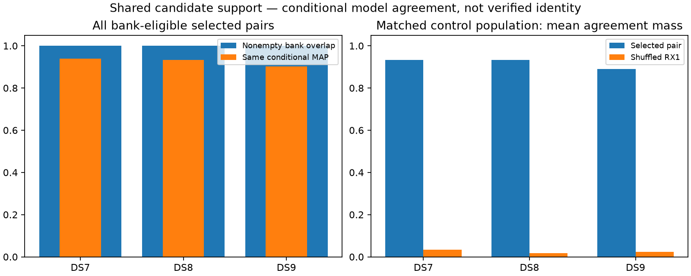

# Selected RX pairs usually support the same satellite candidate

**All 913 selected pairs have shared bank candidates, and 843 have the same
conditional training MAP candidate.** On the matched control population,
817/886 selected pairs agree versus 22/886 shuffled partners. This supports
testing an uncertain shared-identity alternative; it is not verified satellite
identity, held predictive validation, or a new geographic result.

| Dataset | Selected / eligible pairs | Nonempty intersection | Median shared candidates | Same conditional MAP | Agreement mass >0.99 |
|---|---:|---:|---:|---:|---:|
| DS7 | 293 / 293 | 293 | 11 | 275 | 260 |
| DS8 | 295 / 295 | 295 | 11 | 275 | 261 |
| DS9 | 325 / 325 | 325 | 10 | 293 | 259 |

All 913 pairs are bank-eligible; none contains one of the seven exported tracks
excluded by the original bank eligibility rules. No pair is removed for weak
agreement. Candidate IDs are catalogue row indices, interpreted only within the
same manifest and pinned snapshot. They are not NORAD IDs or externally verified
associations.

## Matched partner controls

Within each scan/channel/exact RF group, rotate the selected RX1 partners once
in sorted-pair order. The 27 singleton pairs have no control and remain in the
main census. A shuffled partner is not known to be a different physical emitter.

| Dataset | Matched pairs | Selected same MAP | Shuffled same MAP | Mean selected agreement mass | Mean shuffled agreement mass |
|---|---:|---:|---:|---:|---:|
| DS7 | 286 | 268 | 9 | 0.9332 | 0.0338 |
| DS8 | 281 | 262 | 5 | 0.9334 | 0.0178 |
| DS9 | 319 | 287 | 8 | 0.8900 | 0.0236 |

Selected agreement mass exceeds its control on 871/886 pairs, is lower on ten,
and ties on five. These are descriptive, dependent comparisons, not independent
trials or an identity-confidence calibration.

Agreement mass is the sum of products of the two independent conditional signal
weights over equal catalogue rows. Both distributions already depend on their
training-fitted location and Doppler observations; frequency-based pair selection
also uses training data. This is secondary compatibility evidence, not a new
independent observation. Stored zero mass is distinct from an absent candidate;
no selected pair has an overlap with zero positive stored products.

The conditional distributions omit the background probability. Both tracks have
signal responsibility >0.5 in 269/293 DS7, 269/295 DS8 and 291/325 DS9 pairs.
All pairs remain in the tables, including the 84 that fail this descriptive
signal-responsibility threshold. No threshold here chooses future fit membership.

## What this adds, and what remains

For 780/913 pairs, independent conditional agreement mass already exceeds 0.99.
Simply tying candidate identities may therefore add little new information for
most selected pairs. The remaining ambiguity and receiver visibility still
merit a normalized shared-versus-independent model, but that model must earn
its value on held prediction before geographic promotion. A long stitched
frequency curve additionally requires defensible relative receiver calibration;
shared catalogue support alone does not supply it.

[Next model proposal](NEXT.md). No new position fit, geographic error, calibrated
beam geometry, reception-order inference or sub-km result is produced here.

## Verification

Six tests pass: known overlap, disjoint support, stored-zero versus absent
support, ordering/swap symmetry, namespace mismatch, and invalid IDs/weights.
The independent dictionary-based auditor reconstructs every pair and control
from the published selected IDs, and recomputes all agreement arithmetic.
Frozen sources, observations, manifests, banks and posterior artifacts verify.

The one bounded child exits zero in 0.81 seconds with peak RSS 110,840 KiB.
It reads candidate-ID arrays only from cached NPZs, not orbital arrays. No fits,
propagation, archive/provider reads, raw IQ, RF collection, production changes
or golden-fixture changes occurred. There were no retries.

[Protocol](PROTOCOL.md), [tests](tests.log), [plan](plan.json),
[all pairs, candidate IDs and weights](result.json), [audited summary](summary.json),
[input seal](input-seal.json), [complete evidence inventory](evidence-sha256.json).
