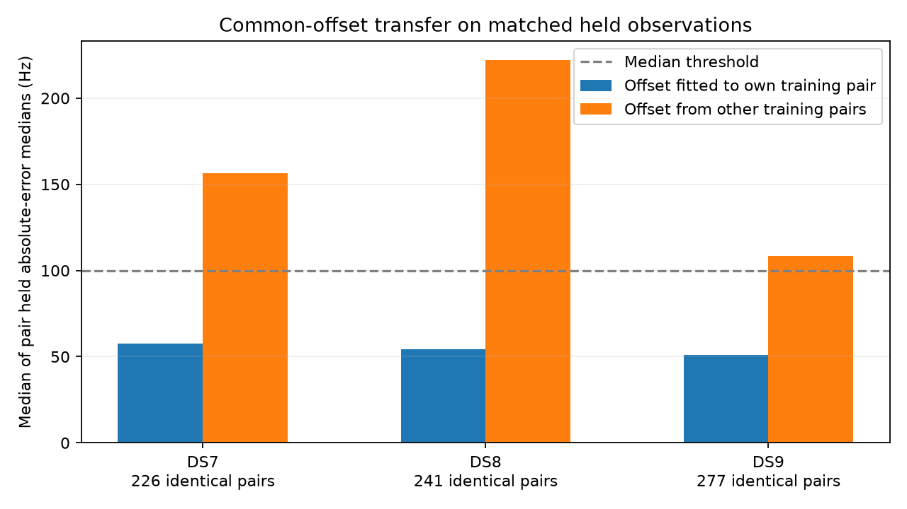

# Cross-RX frequency trajectories: agreement transfers, a common offset often does not

**The two receivers contain many frequency-coherent track pairs, but a single
constant receiver offset is not supported across most eligible pairs.** Training
selection retains 913 pairs across all 72 scans. Of 879 pairs with sufficient
held data, 753 pass the frozen frequency-agreement thresholds. When the offset
comes from other pairs in the same scan/channel/RF, only 254/744 eligible pairs
pass. Do not impose that common-offset model in a geographic fit yet.

This is agreement between processed frequency trajectories, not RF phase
coherence, verified satellite identity, travel direction or a new location
estimate. It audits the existing observation exports; it does not independently
validate their upstream detection/tracking pipeline against raw IQ.

## Complete census and training-only pairing

The census includes all exported tracks from nine nonoverlapping eight-scan
panels, 24 scans per dataset. Nested four-scan panels are not double-counted.
The 4,335 exported tracks include seven excluded from the earlier geographic
banks: three DS7 and four DS8. The earlier bank-eligible denominator is 4,328.

| Dataset | Exported tracks | Same-channel/RF candidate pairs | Timestamp-matched pairs | Training-eligible pairs | Training-shape passes | Selected pairs |
|---|---:|---:|---:|---:|---:|---:|
| DS7 | 1,437 | 5,375 | 1,021 | 820 | 303 | 293 |
| DS8 | 1,438 | 5,401 | 957 | 775 | 306 | 295 |
| DS9 | 1,460 | 5,555 | 1,025 | 797 | 347 | 325 |

Matches require a common visit and timestamps within 1 ms. Ambiguous timestamp
edges are rejected without consulting frequency. Both-training observations
choose pairs; both-held observations evaluate them; mixed masks do neither.
Training eligibility requires five matches over five seconds. Shape thresholds
are median absolute residual ≤100 Hz and 90th percentile ≤300 Hz after a
training median frequency offset. Reciprocal best tracks must beat any eligible
runner-up by at least 0.1 nat per observation under the fixed Student-t4 score.

Selected pairs have unique track IDs on each side. This does not establish
independence of upstream physical detections. All candidate pairs, unmatched
and ambiguous counts, offsets, margins and selected observation indices remain
in result.json. No satellite nominee or geographic reference selects a pair.

114 DS7, 126 DS8 and 145 DS9 selected pairs have no eligible alternative on
either endpoint; their selection does not supply a measured runner-up margin.
Every scan has at least one selected pair. Held availability requires three
both-held observations spanning five seconds; 15/9/10 selected pairs respectively
lack this coverage and remain visible rather than becoming held failures.

## Held agreement using each pair's training offset

| Dataset | Pairs with held coverage | Held shape passes | Median of pair held absolute-error medians | Narrow beats broad | Actual beats reversed RX1 sequence |
|---|---:|---:|---:|---:|---:|
| DS7 | 278 | 225 | 60.0 Hz | 278/278 | 278/278 |
| DS8 | 286 | 241 | 56.3 Hz | 286/286 | 286/286 |
| DS9 | 315 | 287 | 51.3 Hz | 315/315 | 315/315 |

The narrow conditional density uses scale 100√2 Hz; the broad comparator uses
2000 Hz with the same training offset and observations. The reversal control
reverses RX1 separately in training and held partitions and refits only its
training offset. It is a conditional permutation diagnostic, not a causal
forecast or a verified wrong-satellite control. Similar Doppler curves can still
belong to different emitters. Positive score differences do not verify identity.

## Does an offset transfer across pairs?

Use at least two other selected training pairs in the same scan/channel/RF to
predict the target pair's offset. The target's frequency differences and all
held values are excluded from that donor estimate. The following comparison
uses exactly the same held pairs in both columns, unlike comparing populations
with different donor availability.

| Dataset | Identical held pairs | Own-offset shape passes | Donor-offset shape passes | Own-offset median absolute error | Donor-offset median absolute error |
|---|---:|---:|---:|---:|---:|
| DS7 | 226 | 187 | 67 | 57.6 Hz | 156.4 Hz |
| DS8 | 241 | 207 | 60 | 54.5 Hz | 222.0 Hz |
| DS9 | 277 | 251 | 127 | 50.8 Hz | 108.3 Hz |

Error columns are medians of pair-level held absolute-error medians. On this
matched subset, own offsets pass on 645/744 pairs, versus 254/744 for donor
offsets. Donor offsets improve held density on only 32/226, 16/241 and 27/277
pairs respectively. A free constant for each pair can fit trajectory similarity
without establishing a shared receiver calibration.

The separate [census overview](coherence.png) shows all available own-pair scores
and the smaller donor-eligible population; its right-hand medians have different
denominators. The figure above and table use matched populations for transfer.

## Decision and verification

The measured result supports testing why offsets differ across pairs before
stitching trajectories. Relative time alignment, frequency drift, estimator
bias and incorrect pairing remain alternatives. The [next proposed comparison](NEXT.md)
would test training-only receiver-alignment models on omitted pairs. It has not
been run here. There is no new geographic fit or sub-km improvement in this census.

Seven synthetic tests passed before sources and inputs were frozen. A separate
auditor reconstructs visit/timestamp matches using dictionary edges and degree
counts, training eligibility and reciprocal selection, and held/donor score
arithmetic. It verifies every frozen input and process binding. The sole bounded
process exited zero in 1.91 seconds, with peak RSS 75,832 KiB. No retries, new RF,
raw IQ, propagation, archive/provider reads or production changes occurred.

[Protocol](PROTOCOL.md), [tests](tests.log), [72-scan plan](plan.json),
[complete pair evidence](result.json), [audited dataset aggregates](summary.json),
[matched transfer](transfer.json), [input seal](input-seal.json),
[process receipt](launch.json), [complete hashes](evidence-sha256.json).
