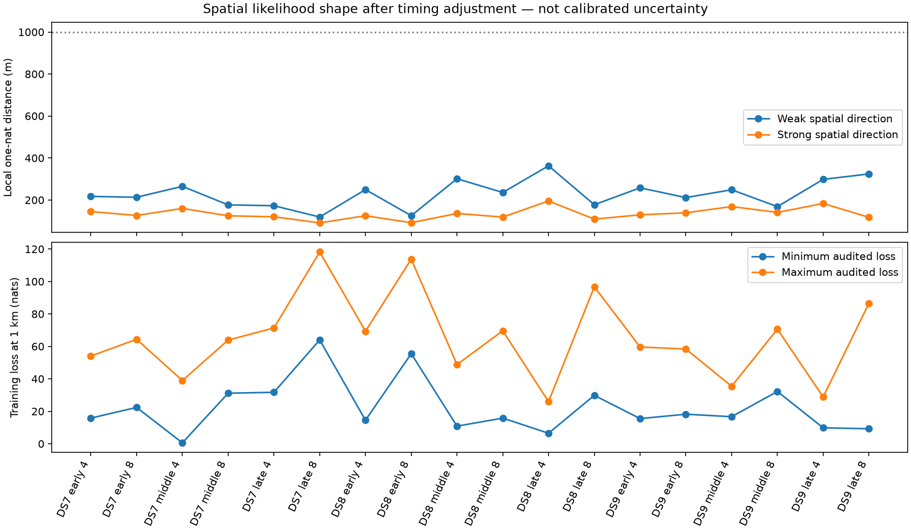

# Spatial likelihood shape after scan timing adjustment

All eighteen curvature checks and all 144 finite-displacement timing audits
pass. Local one-nat distances range from **91 to 363 m**, but these are
likelihood-shape measurements, not position errors or confidence radii.
The experiment does not establish reliable sub-km localization.

There is an important nonlinear alternative: in **DS7 middle four scans**, a
position exactly 1 km from the original training-selected location loses only
**0.546726 training nats**, versus **39.067859 nats** predicted by local
curvature. Its held score improves by **35.152890 nats**. The direction is the
positive **strong** spatial eigenvector, not the weak direction. Both timing
starts converge to effectively the same score; the selected timing is audited.
There is no horizon-visible-set change. This is evidence that local curvature
does not capture the full spatial ambiguity; this fixed probe is not itself
a newly optimized geographic mode.

In the other seventeen panels, each of the four tested 1 km displacements
loses at least 6.472 training nats after timing optimization. Four directions
do not establish global uniqueness, and narrow curvature does not establish
accurate or calibrated inference. Receiver geometry, candidate association,
orbit and clock errors remain possible model limitations.

## All panels

One-nat distances are in metres, ordered weak/strong spatial direction after
profiling timing. Loss ranges use both signs of both directions at 1 km.
Held improvements count all eight probes (250 m and 1 km), not independent
trials or model selections. Nested four/eight panels are dependent.

| Panel | One-nat distance, weak / strong (m) | 1 km training loss min / max (nats) | Held better / 8 |
|---|---:|---:|---:|
| DS7 early 4 | 217 / 145 | 15.805 / 54.031 | 3 |
| DS7 early 8 | 213 / 126 | 22.391 / 64.382 | 2 |
| DS7 middle 4 | 265 / 160 | 0.547 / 38.940 | 2 |
| DS7 middle 8 | 177 / 125 | 31.144 / 63.897 | 1 |
| DS7 late 4 | 173 / 120 | 31.709 / 71.349 | 2 |
| DS7 late 8 | 119 / 91 | 63.979 / 118.184 | 1 |
| DS8 early 4 | 250 / 125 | 14.487 / 69.361 | 3 |
| DS8 early 8 | 125 / 92 | 55.512 / 113.765 | 1 |
| DS8 middle 4 | 301 / 136 | 10.834 / 48.825 | 2 |
| DS8 middle 8 | 236 / 119 | 15.786 / 69.602 | 1 |
| DS8 late 4 | 363 / 195 | 6.472 / 25.935 | 3 |
| DS8 late 8 | 178 / 109 | 29.817 / 96.748 | 2 |
| DS9 early 4 | 258 / 129 | 15.500 / 59.624 | 3 |
| DS9 early 8 | 212 / 139 | 18.195 / 58.376 | 2 |
| DS9 middle 4 | 249 / 169 | 16.662 / 35.440 | 2 |
| DS9 middle 8 | 169 / 141 | 32.210 / 70.619 | 2 |
| DS9 late 4 | 298 / 183 | 9.815 / 28.835 | 3 |
| DS9 late 8 | 324 / 117 | 9.240 / 86.579 | 1 |

## What was tested

The original q=0.20 normalized frequency-contrast/trend model, training masks,
candidate banks and training-selected locations are unchanged. The study uses
all eighteen early/middle/late four/eight panels from DS7/DS8/DS9, representing
72 distinct recordings. It does not add cones or fit new positions.

Central differences of the complete training gradient produce the observed
negative Hessian at two step scales. The timing Schur complement gives local
spatial curvature and the linear timing response. Distances sqrt(2/lambda)
are the quadratic approximation's one-nat loss scale.

Each panel then evaluates eight fixed spatial offsets. Timing alone is fitted
from the original and linearized starts, within the original bounds. Selection
uses training score only. Held scores never choose directions, timing starts,
or fitted parameters. The [protocol](PROTOCOL.md) records the frozen bounds,
steps, numerical gates and resource limits.

The exceptional DS7 probe is at E/N (-1.246054, 2.184894) km in the inherited
search frame. Its fourth scan timing changes from -1.354480 to -0.661687 s.
This large nonlinear timing change motivates [a further mode check](NEXT.md).
It does not identify the responsible satellite or prove a clock defect.

## Verification and limits

Five synthetic tests passed before execution, including an independent
minimization of a known quadratic nuisance profile. All eighteen child
processes exited zero. Of 288 timing starts, 284 qualified; all 144 selected
profiles passed the frozen derivative audit. Failed starts remain in results;
no retries or relaxed gates were used. No profile changes the horizon-visible
candidate set. Held prediction improves at 36/144 probes, descriptively.

The independent [summary auditor](summarize.py) verifies input/source seals,
baseline score replay, steps, matrix symmetrization and qualifications. It
reconstructs the Schur complement through a Cholesky factorization, eigenvalues,
probe positions, quadratic losses, training-only selections and derivative
checks. It audits exported arithmetic and gates; it is not an independent RF
likelihood implementation or held-log-density reconstruction.

Summed child wall time is 783.59 s, longest child 77.11 s, peak RSS 668,892 KiB.
Children ran sequentially with BLAS1, nice19, a 90 s timeout and 4 GiB address
space limit. No RF collection, waveform analysis, new propagation, provider
fetches, archive reads or production changes were performed.

The site reference is exposed and unsurveyed. Neither these local scales nor
the sampled displacement losses are calibrated uncertainty, blind accuracy,
or proof that remaining geographic error is entirely systematic. Results
cover the declared model and probes, not every possible mode or model.

[Summary](summary.json), [tests](tests.log), [plan](plan.json),
[input seal](input-seal.json), [complete evidence hashes](evidence-sha256.json).
Scientific results and execution sources are preserved unchanged.
