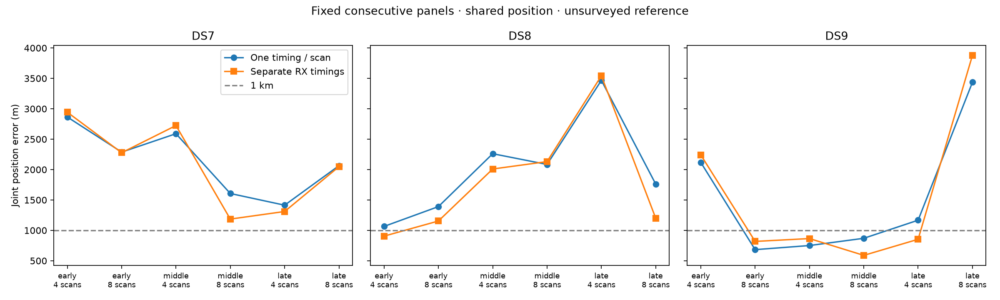

# Common position with separate receiver timings

Separate RX0/RX1 timings improve geography in **10/18** fixed consecutive
panels and matched held prediction in **17/18**. Five selected sets are below
1 km, versus three with one timing per recording. All 18 selected fits pass
the declared audits. This is a useful partial improvement, but **does not
deliver reliable short-window sub-km localization**: DS7 remains above 1 km
in every window and late DS9 eight worsens to 3,879 m.

| Dataset | Scans | Prior median error (m) | Separate RX timing median (m) | Prior / new sub-km sets |
|---|---:|---:|---:|---:|
| DS7 | 4 | 2,590.063 | 2,724.293 | 0/3 / 0/3 |
| DS7 | 8 | 2,063.706 | 2,048.119 | 0/3 / 0/3 |
| DS8 | 4 | 2,260.918 | 2,009.576 | 0/3 / 1/3 |
| DS8 | 8 | 1,762.028 | 1,200.779 | 0/3 / 0/3 |
| DS9 | 4 | 1,167.327 | 865.315 | 1/3 / 2/3 |
| DS9 | 8 | 869.695 | 818.401 | 2/3 / 2/3 |

Medians summarize three joint-panel estimates, not independent single scans.
No failed panel is removed from a denominator. Baseline results are the
[same frozen consecutive panels](../2026_09_29_consecutive_panels/README.md).

## Every panel, including regressions

Errors are metres; held changes are nats versus the prior one-timing model
on identical held observations. Early/middle/late membership was fixed before
this experiment. Four scans are the first half of their paired eight.

| Dataset / block | Prior 4 | New 4 | Prior 8 | New 8 | Held gain 4 / 8 |
|---|---:|---:|---:|---:|---:|
| DS7 early | 2,864.858 | 2,943.416 | 2,287.191 | 2,277.528 | +3.446 / +14.937 |
| DS7 middle | 2,590.063 | 2,724.293 | 1,606.608 | 1,185.607 | +27.785 / +240.453 |
| DS7 late | 1,414.224 | 1,310.562 | 2,063.706 | 2,048.119 | +19.612 / +28.037 |
| DS8 early | 1,065.224 | **905.451** | 1,390.877 | 1,153.776 | +72.886 / +162.849 |
| DS8 middle | 2,260.918 | 2,009.576 | 2,084.608 | 2,131.008 | +50.553 / +59.971 |
| DS8 late | 3,467.535 | 3,542.454 | 1,762.028 | 1,200.779 | +39.086 / +62.862 |
| DS9 early | 2,117.272 | 2,240.652 | **682.990** | **818.401** | -5.636 / +112.755 |
| DS9 middle | **750.643** | **865.315** | **869.695** | **588.914** | +42.790 / +4.640 |
| DS9 late | 1,167.327 | **853.339** | 3,435.817 | 3,879.206 | +43.682 / +255.812 |

Predictive gains do not guarantee geographic gains. Late DS9 eight is the
clearest example: held prediction improves by 255.812 nats while geographic
error increases by 443.389 m. All nine eight-minus-four comparisons still
lose held score on their matched first-four observations (range -57.855 to
-4.491 nats). Those paired values and observation counts are in summary.json.
Shared-position disagreement across observations therefore remains unresolved.

## Model and initialization ablation

[PROTOCOL.md](PROTOCOL.md) declares the experiment. The same zero-decay,
Student-t4/100 Hz shared-track-scale likelihood now receives two exhaustive,
disjoint receiver partitions of each recording. One E/N position is common
to all tracks; timings are ordered all RX0 recordings, then all RX1 recordings.
Candidate banks, offset profiling, eligibility and train/held partitions are
unchanged. No production component or likelihood implementation changes.

Each panel has the prior three generic starts plus one explicitly declared
nested start: the previous training-selected position and duplicated timings.
Every start qualifies. Selection uses only the greatest training score,
never held prediction or reference error. Training gain is positive in all
18 panels, as expected for a more flexible nested model with this extra start.
The fourth start also affects optimization, so the total comparison is not
claimed to isolate parameterization independently of initialization.

The extra start produces materially greater training scores in three panels:

| Panel | Generic-only error (m) | Four-start selected error (m) | Training gain from extra start (nats) |
|---|---:|---:|---:|
| DS7 middle 4 | 2,150.327 | 2,724.293 | 4.365 |
| DS7 middle 8 | 1,101.575 | 1,185.607 | 23.225 |
| DS8 middle 8 | 2,214.517 | 2,131.008 | 41.541 |

DS8 middle four also selects the nested start, with a numerically negligible
score gap and sub-metre error difference. All other selections are generic
starts. Generic-only values above are optimizer-qualified diagnostics; only
the four-start selections receive the full independent selected-point audits.
The DS7 examples show explicitly that geography does not choose the result.

## Verification and resource bounds

All 72 fits and 18 audits exit zero; all 72 fits qualify and all 18 audits
pass. At every panel's tied nested point, the split objective reproduces
the unsplit training score and held rows. The maximum score difference is
8.731e-11; the maximum discrepancy after summing receiver timing gradients
is 1.777e-13. Track membership is exhaustive, disjoint and unchanged. The
persisted baseline held rows are reproduced exactly, not just their sum.

All 504 selected-point finite-difference checks pass: 72 E/N checks at
0.001/0.0005 km and 432 timing checks at 0.0000625/0.00003125 s. Timing
intervals avoid interpolation nodes, and both fine differences agree with
the analytic derivative and each other within 0.002. Maximum analytic
discrepancy across all checks is 1.919e-5. The fine timing steps were declared
before fitting, informed by the preceding
[fixed-point timing review](../2026_09_29_receiver_timing/README.md).
No original coarse-step failure from that earlier experiment is reclassified.

The scorer verifies 1,248 execution/input bindings, training replay and row
sums within 1e-7, identical baseline/new track identities and held counts,
selection qualification and independent geographic distances within 0.0001 m.
Seven existing numerical/receiver-partition tests pass in [tests.log](tests.log).
[validation.json](validation.json) records the command and the copied filter's
byte identity to the tested predecessor. All report scripts pass Ruff lint
and formatting; no golden fixture changes.

One worker uses BLAS1/nice19, a 4 GiB address-space cap, a 180 s process cap
and at least 5 GiB available memory before each launch. Summed job wall time
is 678.70 s, longest job 18.24 s, peak RSS 677,220 KiB. All receipts are in
[resources.json](resources.json). No retries, relaxed gates, new RF,
waveform reads, propagation or provider fetches occurred.

## Next decision and limitations

Keep this variant as a measured timing ablation, not a universal replacement.
The fitted RX1-minus-RX0 timing varies in sign and magnitude across recordings,
reaching 4.098 s in late DS9 eight. It is a nuisance parameter absorbing model
disagreement, not a measurement of physical latency or a calibrated beam
crossing. Receiver timing flexibility alone does not establish satellite
direction from the nominal 20-degree tilt difference.

Next compare a pooled receiver timing offset and a constrained per-recording
timing difference on the same frozen panels. Training-only parameter selection
and explicit regularization/initialization ablations are needed to distinguish
stable receiver structure from flexible compensation. Also retain the late
DS9 failure as a required case; do not filter it using the known reference.

The exposed operator reference is unsurveyed, all data are from one site,
and nested four/eight panels are dependent. These results do not establish
calibrated resolution, blind accuracy, confidence intervals or new-site
generalization. Full-dataset sub-km results remain separate; this experiment
only changes the short-window model.

[plan.json](plan.json) records exact inputs and all starts;
[summary.json](summary.json) retains every alternative, selected timing vector,
matched held comparison and aggregate. [evidence-sha256.json](evidence-sha256.json)
binds the report and dependencies, excluding itself. Reproduction order is
prepare.py, launch.py fit, launch.py held, summarize.py. Existing output paths
are immutable evidence and must not be used as retry destinations.
