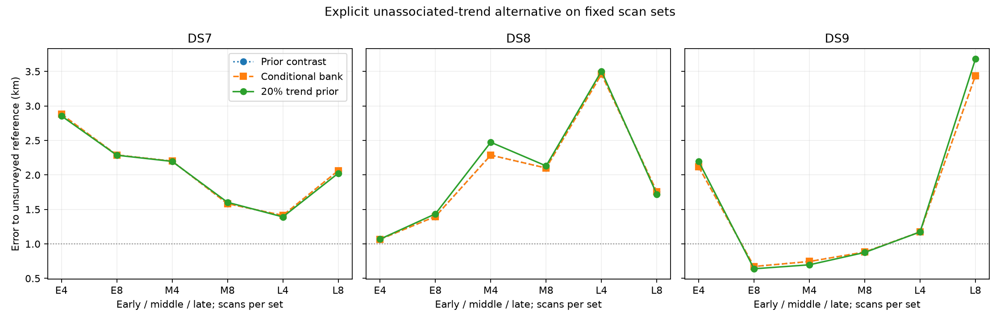
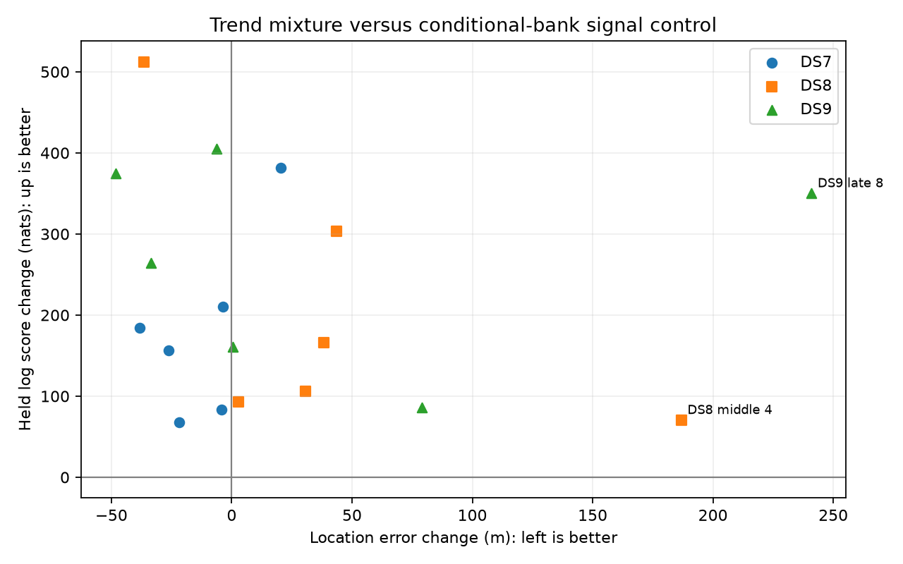

# Conditional-bank signal and unassociated-trend comparison

**Do not promote this trend mixture as a reliable sub-km localization solution.** Better held prediction did not translate into consistent geographic improvement; the nominal sub-km count is unchanged.

The q000 control normalizes the satellite mixture over retained candidates passing the training horizon gate. q020 uses that same signal density plus a fixed 20% prior probability of an unassociated linear frequency trend, with a 2000 Hz/s slope scale. Both use normalized Student-t4 frequency-contrast densities. No receiver cone or separate RX timing is added.

Eight prelaunch tests pass. Both selected fits pass audit on 18/18 paired panels. Among these, the trend branch improves location on 9/18 and held prediction on 18/18. These are descriptive counts on dependent single-site panels.

Nominal sub-km sets passing numerical audit: q000 3/18; q020 3/18. These exposed-reference counts do not demonstrate calibrated resolution.

The late DS9 eight-scan error increases from 3.440 km to 3.681 km. Every DS7 and DS8 dataset/size median remains above 1 km. The broader goal remains open.

## Median joint-set error

Metres over early/middle/late sets; all three selected audits are required. Prior contrast is the preceding full-catalogue-divisor control; its training scores cannot be directly compared with these arms.

| Dataset | Scans | Prior contrast | Conditional bank q000 | Trend mixture q020 |
|---|---:|---:|---:|---:|
| DS7 | 4 | 2,200.3 | 2,200.3 | 2,196.1 |
| DS7 | 8 | 2,061.9 | 2,061.9 | 2,023.6 |
| DS8 | 4 | 2,287.0 | 2,287.0 | 2,473.8 |
| DS8 | 8 | 1,757.6 | 1,757.6 | 1,721.1 |
| DS9 | 4 | 1,173.5 | 1,173.5 | 1,173.9 |
| DS9 | 8 | 882.5 | 882.5 | 876.1 |

## Every planned fit

Responsibilities are conditional-bank model weights, not measured satellite probabilities. Their sum is descriptive effective signal weight. Values near zero can leave geographic parameters uninformative even when numerical convergence succeeds. The complete results also retain qualifying-start position spread and training-score span; neither optimizer convergence nor a small exposed-reference error establishes identifiability.

| Panel / arm | Error m | Audit | Qualified starts | Signal weight sum / tracks | Tracks signal > 0.5 |
|---|---:|---|---:|---:|---:|
| DS7_early_4_q000 | 2881.926 | Pass | 3/3 | 239.000 / 239 | 239 |
| DS7_early_8_q000 | 2289.516 | Pass | 3/3 | 486.000 / 486 | 486 |
| DS7_middle_4_q000 | 2200.318 | Pass | 3/3 | 231.000 / 231 | 231 |
| DS7_middle_8_q000 | 1583.280 | Pass | 3/3 | 464.000 / 464 | 464 |
| DS7_late_4_q000 | 1413.520 | Pass | 3/3 | 247.000 / 247 | 247 |
| DS7_late_8_q000 | 2061.863 | Pass | 3/3 | 484.000 / 484 | 484 |
| DS8_early_4_q000 | 1066.687 | Pass | 3/3 | 255.000 / 255 | 255 |
| DS8_early_8_q000 | 1397.496 | Pass | 3/3 | 485.000 / 485 | 485 |
| DS8_middle_4_q000 | 2286.976 | Pass | 3/3 | 234.000 / 234 | 234 |
| DS8_middle_8_q000 | 2100.105 | Pass | 3/3 | 464.000 / 464 | 464 |
| DS8_late_4_q000 | 3461.032 | Pass | 3/3 | 246.000 / 246 | 246 |
| DS8_late_8_q000 | 1757.612 | Pass | 3/3 | 485.000 / 485 | 485 |
| DS9_early_4_q000 | 2116.957 | Pass | 3/3 | 248.000 / 248 | 248 |
| DS9_early_8_q000 | 672.929 | Pass | 3/3 | 491.000 / 491 | 491 |
| DS9_middle_4_q000 | 745.328 | Pass | 3/3 | 241.000 / 241 | 241 |
| DS9_middle_8_q000 | 882.478 | Pass | 3/3 | 485.000 / 485 | 485 |
| DS9_late_4_q000 | 1173.533 | Pass | 3/3 | 236.000 / 236 | 236 |
| DS9_late_8_q000 | 3439.973 | Pass | 3/3 | 484.000 / 484 | 484 |
| DS7_early_4_q020 | 2855.797 | Pass | 3/3 | 219.582 / 239 | 220 |
| DS7_early_8_q020 | 2286.000 | Pass | 3/3 | 459.976 / 486 | 459 |
| DS7_middle_4_q020 | 2196.053 | Pass | 3/3 | 224.358 / 231 | 225 |
| DS7_middle_8_q020 | 1603.573 | Pass | 3/3 | 441.782 / 464 | 443 |
| DS7_late_4_q020 | 1391.623 | Pass | 3/3 | 239.535 / 247 | 240 |
| DS7_late_8_q020 | 2023.561 | Pass | 3/3 | 465.972 / 484 | 467 |
| DS8_early_4_q020 | 1069.519 | Pass | 3/3 | 246.400 / 255 | 247 |
| DS8_early_8_q020 | 1435.665 | Pass | 3/3 | 465.809 / 485 | 466 |
| DS8_middle_4_q020 | 2473.754 | Pass | 3/3 | 221.232 / 234 | 222 |
| DS8_middle_8_q020 | 2130.848 | Pass | 3/3 | 441.395 / 464 | 444 |
| DS8_late_4_q020 | 3504.674 | Pass | 3/3 | 215.172 / 246 | 215 |
| DS8_late_8_q020 | 1721.066 | Pass | 3/3 | 439.297 / 485 | 441 |
| DS9_early_4_q020 | 2196.073 | Pass | 3/3 | 237.182 / 248 | 237 |
| DS9_early_8_q020 | 639.499 | Pass | 3/3 | 465.981 / 491 | 466 |
| DS9_middle_4_q020 | 697.083 | Pass | 3/3 | 213.225 / 241 | 213 |
| DS9_middle_8_q020 | 876.132 | Pass | 3/3 | 449.693 / 485 | 452 |
| DS9_late_4_q020 | 1173.946 | Pass | 3/3 | 218.141 / 236 | 219 |
| DS9_late_8_q020 | 3680.856 | Pass | 3/3 | 438.076 / 484 | 438 |

## Paired effect of the trend branch

q020 minus q000; lower error and higher held score favor the trend branch. Invalid pairs remain in the planned denominator.

| Panel | Error change m | Held change nats |
|---|---:|---:|
| DS7_early_4 | -26.128 | +156.129 |
| DS7_early_8 | -3.516 | +210.271 |
| DS7_middle_4 | -4.265 | +83.593 |
| DS7_middle_8 | +20.293 | +381.413 |
| DS7_late_4 | -21.897 | +67.421 |
| DS7_late_8 | -38.302 | +184.156 |
| DS8_early_4 | +2.833 | +93.077 |
| DS8_early_8 | +38.169 | +165.837 |
| DS8_middle_4 | +186.778 | +70.256 |
| DS8_middle_8 | +30.743 | +106.053 |
| DS8_late_4 | +43.641 | +303.642 |
| DS8_late_8 | -36.546 | +512.362 |
| DS9_early_4 | +79.117 | +86.377 |
| DS9_early_8 | -33.430 | +264.039 |
| DS9_middle_4 | -48.246 | +374.823 |
| DS9_middle_8 | -6.346 | +404.953 |
| DS9_late_4 | +0.413 | +160.392 |
| DS9_late_8 | +240.883 | +349.902 |

## Matched first-four held predictions

Eight minus four, on the same first-four observations.

| Arm | Dataset | Block | Held change nats |
|---|---|---|---:|
| q000 | DS7 | early | -51.315 |
| q000 | DS7 | middle | +22.052 |
| q000 | DS7 | late | -11.622 |
| q000 | DS8 | early | -65.439 |
| q000 | DS8 | middle | -12.023 |
| q000 | DS8 | late | -6.298 |
| q000 | DS9 | early | -71.792 |
| q000 | DS9 | middle | -35.141 |
| q000 | DS9 | late | -10.141 |
| q020 | DS7 | early | -46.329 |
| q020 | DS7 | middle | +22.004 |
| q020 | DS7 | late | -9.000 |
| q020 | DS8 | early | -65.872 |
| q020 | DS8 | middle | -13.507 |
| q020 | DS8 | late | +2.614 |
| q020 | DS9 | early | -73.553 |
| q020 | DS9 | middle | -39.069 |
| q020 | DS9 | late | -2.456 |

## Failures and evidence

108/108 starts qualify; 36/36 selected audits pass. 144 child receipts, 144 exit zero. Total job wall time 826.85 s; maximum 16.60 s; peak RSS 666,564 KiB.

All frozen hashes and selections were independently verified. Every selected fit checks all position/timing derivatives at two steps; q000 additionally checks the pointwise score correction, gradient and held prediction against the old contrast model. This is not global objective equivalence when visibility counts change. Distance calculations agree with independent vector geometry within 0.0001 m.

The bank was data-selected and omits catalogue hypotheses. No calibrated association confidence, clutter classification, or complete detection likelihood is claimed. Fixed trend priors are uncalibrated prototype assumptions. Exposed, unsurveyed reference errors are not blind resolution evidence. No new RF data were collected.

[Protocol](PROTOCOL.md), [tests](tests.log), [frozen plan](plan.json), [complete results and all starts](summary.json), [source/input seal](input-seal.json).

[Next cone-model proposal](NEXT-CONE.md): transfer incompatible satellite prior mass to the explicit trend alternative, with shared scan geometry and separately tested predictive geometry. This is a design proposal, not an evaluated cone-plus-trend model.
