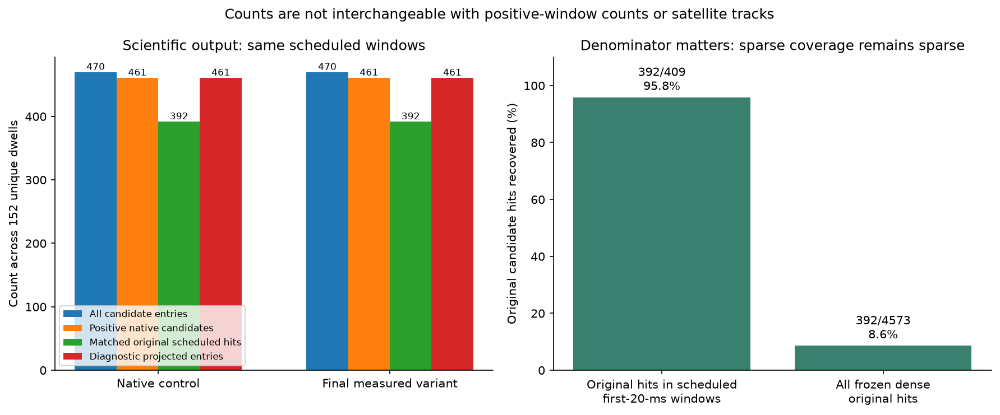
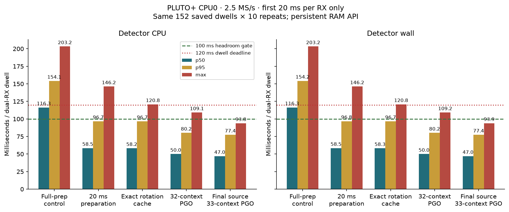

# ARM GLRT implementation recovery and runtime comparison

Report date: 2026-09-30. ARM implementation: commit
`17a2aecdf56ed69c5c0057138d570ea0c662f2c0`. Measurements were collected on
2026-09-29; this report consolidates existing evidence and adds no new benchmark
or deployment qualification. Standard deployment behavior refers to the
[2026-09-29 deployed pipeline audit](../2026_09_29_adaptive_glrt_audit/README.md),
not a fresh inspection of running services on the report date.

The maintained native ARM detector can process the standard main analysis
geometry at 2.5 MS/s within the measured 120 ms dwell budget, using a persistent
RAM context on one PLUTO+ Cortex-A9 core. The optimized implementation preserves
all candidates from its native baseline. It recovers **95.84% of frozen standard
reference candidate hits on the same scheduled windows**, but equivalence to
the deployed fractional GLRT pipeline has **not** been established. The native
component is opt-in and has not been integrated into the live capture worker.

## Implementation and standard pipeline

The implementation lives in
[`src/leo/analysis/native_glrt`](../../src/leo/analysis/native_glrt/README.md).
Its C RAM API accepts interleaved dual-RX CI16 and returns bounded candidate
structures. The maintained builder produces a static library, saved-input CLI,
and persistent qualification client. The numerical component has no radio,
network, storage, or database dependency. Building it does not select it in the
adaptive scan pipeline.

| Property | Current native ARM implementation | Standard adaptive scan pipeline in the audit |
|---|---|---|
| Main analysis geometry for a 120 ms dwell | Explicit 120 ms stride: first 20 ms per RX, two windows total | First 20 ms per RX, two windows total |
| Numerical detector | Source-owned Wave8-derived native search and scorer, with inherited approximations | Acquisition, integer GLRT scoring, fractional timing and CFO refinement, and fractional decision score |
| Latest optimization behavior | Candidate settings, window placement and native numerical output preserved | Unchanged by this ARM work |
| Execution | Persistent native RAM context for qualified timing; saved-file CLI also available | Server analysis of retained visits, producing sealed metrics and plots |
| Selected relative-phase processing | Not included | Additional 20 ms-stride GLRT on up to 64 selected dwells, followed by phase analysis |
| Tracking and position | Diagnostic projection comparison only | Separate trajectory, catalogue and position stages consume main metrics |
| Live adaptive feedback | Not connected | Whole-visit energy classification; not the standard offline GLRT result |

The native default remains dense 10 ms stride for compatibility; the real-time
result requires explicit **120 ms stride**. Neither an API default nor a dense
research experiment describes the automatic main pipeline's actual schedule.

For longer visits, main analysis uses the actual valid span. At 120 ms stride,
240 ms and 360 ms dwells have two and three probes per receiver respectively.
The headroom measurements below cover 120 ms dwells only. A 20 ms window is the
input excerpt; it does not imply coherent integration of every sample for the
whole 20 ms.

## Recovery and exact window counts

The primary panel is **152 unique saved DS7 dwells at 2.5 MS/s**, a subset of
DS7. It is not full DS7 and is not a new DS8 or DS9 qualification. Each method
runs **304 unique 20 ms receiver-windows**. Ten timing repetitions produce
3,040 receiver-window executions, not 3,040 independent scientific observations.

Three comparisons must remain distinct: exact equality to the native control,
recovery against the frozen original reference on matching windows, and recovery
against every window of the dense original reference.

| ARM approach | Unique windows run | Native positive windows | Native positive candidates retained | Frozen original scheduled positive windows recovered | Frozen original scheduled candidate hits recovered |
|---|---:|---:|---:|---:|---:|
| Native control before these optimizations | 304 | 144 | 461 baseline | 143/148 | 392/409 |
| Final ordinary build | 304 | 144 | **461/461** | **143/148** | **392/409** |
| Final build with profile-guided optimization | 304 | 144 | **461/461** | **143/148** | **392/409** |

All **470 native candidate entries**, including non-positive entries, retain
identical ordered values and counters after excluding timing fields. Both
optimized builds also preserve all 144 native positive windows. The frozen
reference has 148 positive windows in this schedule, of which 143 contain at
least one matching recovered candidate: **96.62% positive-window recovery**.
Candidate recovery is **392/409 = 95.84%**. A window can contain multiple hits,
so those denominators are not interchangeable.

The frozen dense reference searches **3,344 windows**, with **1,682 positive
windows and 4,573 positive candidates**. This sparse ARM mode recovers
**392/4,573 = 8.57%** of those dense candidate hits. Most dense windows are
never searched by the sparse schedule. That percentage is not the recovery
against the standard main pipeline's matching schedule.

The original reference uses the historical timing/CFO matching procedure.
It predates the deployed fractional refinement. Consequently, **95.84% must
not be described as measured recovery of the current deployed server detector**.
Unmatched native candidates are not automatically false positives; no labelled
false-positive rate was established by this comparison.

The downstream diagnostic projector produces 461 identical entries before and
after optimization. Its adapter uses zero fractional offsets and synthetic UTC
authority. This establishes stability of that diagnostic transformation, not
equivalence of deployed timestamps, tracks, satellite identities or positions.
See the [scientific results and matcher boundaries](../2026_09_29_arm_sparse_headroom/RESULTS.md).

## Runtime on one ARM core

These are physical PLUTO+ CPU0 measurements on identical saved dwells. The
detector interval surrounds the public native RAM API call, including input
preparation, proposals, search, scoring, per-call allocation and cleanup.
File preload and context creation are outside this interval.

| ARM build over 152 dwells and 10 repetitions | Mean wall ms | p50 wall ms | p95 wall ms | Maximum wall ms | Calls at or above 120 ms |
|---|---:|---:|---:|---:|---:|
| Matched native control | 117.95 | 116.34 | 154.20 | 203.22 | 595/1,520 |
| Final ordinary build | **49.64** | **48.19** | **78.22** | **96.05** | **0/1,520** |
| Final build with profile-guided optimization | **48.45** | **47.00** | **77.45** | **93.93** | **0/1,520** |

The final PGO build is approximately **2.43 times faster in mean detector wall
time than the matched native control**. This is not a server-to-ARM speedup.
There is no matched timing measurement of the deployed fractional server
pipeline in this qualification, so its runtime and a cross-platform speedup
remain unmeasured here. The earlier 119.56 ms mean and 195.50 ms peak came from
a different panel; the table uses the fresh matched control throughout.

Detector CPU mean/p95/maximum are **49.63/78.22/96.05 ms** for the ordinary
build and **48.44/77.45/93.81 ms** for PGO. Both pass the preferred gate of
maximum CPU and wall time at most 100 ms, leaving at least 20 ms of a 120 ms
period on the measured panel. No warm-up calls were excluded.

The PGO compiler trained on 33 contexts, including a measured expensive case;
119 contexts were held out from compiler training. Those held-out calls have
**78.42 ms p95 and 93.06 ms maximum wall time**. This is not an independent
holdout of the entire optimization process. The ordinary build also passes
without PGO.

## Sustained behavior and end to end limits

A separate stress test repeats the 16 slowest upper-edge control dwells 100
times in shuffled order, in one persistent process. These **1,600 calls** are
deliberately expensive cases, not an unbiased new dataset.

| Final PGO stress interval | Mean ms | p50 ms | p95 ms | Maximum ms |
|---|---:|---:|---:|---:|
| Detector CPU | 74.98 | 74.43 | 91.75 | 94.17 |
| Detector wall | 75.00 | 74.44 | 91.75 | 94.17 |
| Persistent client cycle wall | 76.36 | 75.70 | 92.94 | 95.34 |

All candidates remain unchanged. The worst detector call leaves **25.83 ms,
or 21.5% of the dwell period**. No call exceeds the 100 ms gate. The client
cycle includes monitoring, serialization and output flush but still excludes
preload, startup, setup and capture; it is not radio end-to-end timing.

The stress run contains approximately 120 seconds of detector execution.
SoC XADC temperature reaches 75.67 degrees Celsius; peak RSS reaches
67.59 MiB within the first 16 calls and then plateaus. RSS includes the input
panel and qualification manifest, not only detector memory. Clock throttling
was not independently measured. Finite observed maxima are not a universal
hard-real-time guarantee.

Context creation averages about **101.48 ms wall time**. Five fresh-process
CLI measurements take **210–360 ms**, including file input, setup, analysis,
output and exit. The CLI therefore misses a 120 ms per-dwell deadline. A
persistent caller is required to obtain the qualified throughput.

Concurrent capture, DMA contention, tuning, queueing, feedback application and
position estimation are not included. If processing waits for a full dwell,
capture-start-to-result latency includes the 120 ms acquisition itself; the
next dwell can be captured while the previous dwell is analyzed.

## Sources of the speed improvement

The largest change prepares only the first 20 ms actually consumed by the
120/120 geometry, while retaining full-input validation. Reused buffers avoid
repeated allocation and release. Exact cached rotations and four-frequency
NEON dot products reduce repeated conditioned-scoring work, and the context
retains its fine FFT plan. PGO adds a smaller optional improvement. No new
candidate reduction or precision tradeoff was introduced in this optimization.

| Mean CPU phase per dwell | Native control ms | Final PGO ms |
|---|---:|---:|
| Input preparation | 60.694 | 8.682 |
| Proposal generation and ranking | 16.246 | 15.256 |
| Search and scoring | 31.723 | 24.116 |
| Cleanup | 8.808 | 0.008 |

These disjoint phases omit small bookkeeping and outer overhead. Compiler and
allocation interactions prevent treating experimental speedups as additive.
The inherited native algorithm's approximation to the original detector remains.

## Supported rates and qualification gaps

| Sample rate | Final PGO mean wall ms | Maximum wall ms | Evidence | Meets 120 ms detector budget |
|---|---:|---:|---|---|
| 2.5 MS/s | 48.45 | 93.93 | 152 dwells, 10 repeats, plus separate stress | Yes on measured panels |
| 5 MS/s | 180.12 | 217.09 | 8 dwells, 2 repeats | No |
| 7.5 MS/s | 265.49 | 327.66 | 8 dwells, 2 repeats | No |
| 10 MS/s | 302.71 | 424.70 | 8 dwells, 2 repeats | No |

Higher-rate saved outputs remain exactly equal to the native control. Host
tests and sanitizers cover all 36 rate/dwell/stride combinations. Longer-dwell
scientific checks are synthetic. The final physical memory checks pass
7.5 MS/s by 360 ms and 10 MS/s by 240 ms; 10 MS/s by 360 ms still fails under
the qualified 220,000 KiB memory cap. Geometry support is not real-time support.

Before claiming replacement of standard adaptive analysis, run the native and
deployed fractional detectors on identical source-bound windows and compare
positive windows, individual candidates, fractional timing/CFO, projected
observations and downstream tracks. Separately qualify the persistent worker
with concurrent capture and bounded feedback. Position processing needs its
own compute and scientific validation; detector headroom alone establishes
neither position accuracy nor an available whole-system CPU budget.

## Evidence and reproducibility

The [ARM qualification report](../2026_09_29_arm_sparse_headroom/README.md)
contains all eight measured variants, CPU/wall boundaries, source and binary
receipts, raw evidence archives, thermal plots and component validation.
[Reproduction instructions](../2026_09_29_arm_sparse_headroom/EXECUTION.md)
cover the maintained builder and replay clients. The publication tree passed
63 tests plus the separately documented sanitizer run.

The [deployed pipeline audit](../2026_09_29_adaptive_glrt_audit/README.md)
establishes the standard main schedule, fractional analysis and selected-dwell
phase replay. The [ARM performance index](../../docs/research/arm-glrt-performance.md)
links implementation history. Historical research binaries, including the
dense 445 ms Wave8 result and the earlier reduced-detector RAM replay, are
different workloads and are not substituted for this implementation's evidence.
