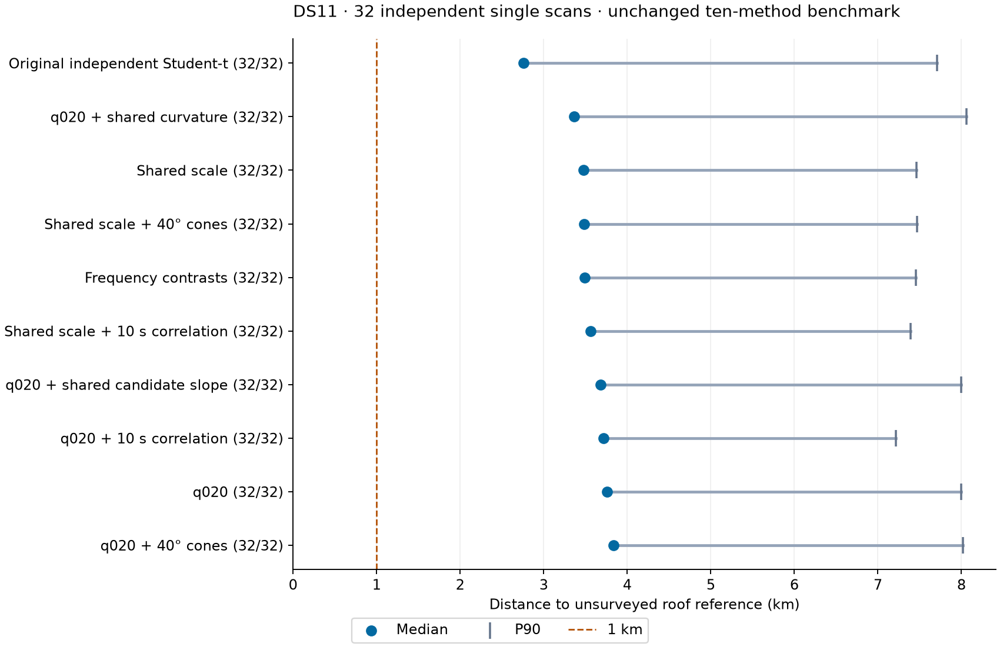

# DS11: ten methods on 32 independent single scans

**All 320 evaluations qualify. The original independent Student-t model has the lowest median reference distance, 2759 m.** Correlated q020, the DS10 pilot leader, reaches 3714 m here. Its DS10 advantage does not replicate on this later cohort. No method establishes reliable sub-kilometre single-scan localization.

[DS11](../2026_09_30_ds11_post_ds10/README.md) contains 87 complete recordings after DS10's last admitted capture end, 2026-09-29 12:55:05.057462 UTC, through the fixed request cutoff 2026-09-30 01:40:39 UTC. Six incomplete candidates were excluded. The benchmark uses 32 chronological ranks selected before fitting by `floor(i*(87-1)/31)`, with no quality, distance or rate-based selection and no replacements. The selected rates are 4 / 9 / 5 / 14 recordings at 2.5 / 5 / 7.5 / 10 MS/s. These are 32 independent fits per method, not one 32-scan joint fit.

## Results

| Method | Median m | P90 m | Maximum m | Below 1 km | Qualified | Median runtime s |
|---|---:|---:|---:|---:|---:|---:|
| Original independent Student-t | 2759 | 7708 | 8540 | 2/32 | 32/32 | 24.78 |
| q020 + shared curvature | 3364 | 8059 | 9336 | 2/32 | 32/32 | 5.83 |
| Shared scale | 3476 | 7462 | 9398 | 1/32 | 32/32 | 2.81 |
| Shared scale + 40° cones | 3481 | 7465 | 9405 | 1/32 | 32/32 | 4.17 |
| Frequency contrasts | 3491 | 7456 | 9399 | 1/32 | 32/32 | 2.41 |
| Shared scale + 10 s correlation | 3564 | 7389 | 9619 | 3/32 | 32/32 | 2.51 |
| q020 + shared candidate slope | 3678 | 7999 | 8654 | 1/32 | 32/32 | 5.48 |
| q020 + 10 s correlation | 3714 | 7217 | 9291 | 3/32 | 32/32 | 2.86 |
| q020 | 3759 | 8000 | 9342 | 0/32 | 32/32 | 2.36 |
| q020 + 40° cones | 3837 | 8018 | 9345 | 0/32 | 32/32 | 4.71 |

All methods qualify on the same 32 scans, so the matched-complete medians are identical to the displayed medians. P90 uses linear empirical interpolation. Counts use unrounded distances; the slope arm's minimum is 999.6008 m and therefore counts below 1 km despite rounding to 1000 m in the detailed table.

Runtime includes startup, loading, three optimization starts and numerical audits. Slope and curvature also include the required same-scan q020 fit. Engineering recovery overhead is recorded separately. Host load and the launcher amendment limit precise timing comparisons with earlier datasets.

## What this changes

The DS10 eight-scan pilot favored correlation: median 1363 m for correlated q020 and 1423 m for shared-scale correlation, versus 2009 m for the original baseline. DS11 gives 3714 m, 3564 m and 2759 m respectively. These are different populations, not paired measurements of a temporal deterioration. The frozen-method replication does show that the DS10 ranking was not stable.

Within DS11, correlated q020 has a 34.6% higher median than the original baseline and improves only 15/32 paired scans; shared-scale correlation has a 29.1% higher median and improves 14/32. Correlated q020 does have the lowest P90, 7217 m, and both correlation arms have three sub-km results. This is a tradeoff, not consistent dominance.

The original baseline remains the median-error benchmark, but takes about 25 seconds per scan versus roughly 2–3 seconds for the fast shared-scale/contrast variants. Nominal 40° cones add no median benefit to shared scale and worsen q020's median. Shared curvature improves q020's median but has the worst P90 and beats the original baseline on only 16/32 scans. Neither slope nor curvature justifies promotion as a generally more accurate single-scan model from this result. Their extra terms are active: slope has 8–20 eligible groups per scan and curvature 7–20.

Keep the original baseline and a fast shared-scale control in subsequent matched comparisons. Correlation can remain a tail-error challenger, but the DS10 result alone is insufficient to choose it as the default. Further work should test identifiable timing and receiver geometry against the same fixed scans before adding more flexibility or tuning to this reference.

## Accuracy limits and predictive diagnostic

Distances use the existing **unsurveyed** roof reference `[37.849056280893684, -122.48575489722863]`, with mean Earth radius 6371008.8 m. Installation/reference continuity is unconfirmed for DS11; this is reference distance, not independently verified absolute accuracy. The fixed configured center is already **809.03 m** from that reference. Only one original-baseline fit and at most three fits from any method beat this constant control. Isolated sub-km outcomes therefore do not establish measurement-derived sub-km capability.

[TABLE.md](TABLE.md) includes the common-q020 held-score diagnostic. Shared scale, contrasts and cone variants stay close to q020's held score; the independent and correlation variants lose substantially under that scoring model. This does not reverse the localization ranking: predictive fit and reference distance are different objectives. The diagnostic uses the same q020 held model for every fitted point, existing within-track masks and reused candidate banks. It is not a comparison of incompatible native likelihoods or a future-scan holdout.

## Frozen method and audit

The [protocol](PROTOCOL.md) predates fitting. The same ten DS10 method implementations, three location starts, bounds, hyperparameters, candidate policies, masks and qualification gates were retained. `q020` means a fixed 20% unassociated linear-trend mixture. Cone angles are half-angles; the shared-scale arm uses soft compatibility and the q020 arm routes rejected mass to background. Slope/curvature groups use only the current scan's qualified q020 training result. No pooled estimate or reference distance seeds or selects a fit.

The effective fit budget is three starts, 100 iterations / 160 function evaluations per start, and a 90-second process cap, with two concurrent workers and one BLAS thread each. The inherited config retains older execution-description fields; [run.py](run.py) and the protocol define this benchmark's actual starts and budgets.

[verification.json](verification.json) confirms **320/320 selected fits**, **937/960 qualified optimizer starts**, all selected slope/curvature quadrature checks, all 32 artifact bindings, and unchanged model hashes. Selecting the highest qualified training score leaves 23 rejected starts visible in the individual result files. Nineteen tests pass: 17 admission/provenance/seal tests and two metric tests. No production model or golden fixture changed.

The [engineering amendments](AMENDMENTS.md) preserve four initial launcher failures and three preprocessing timeouts. The uv cache blocked on bulk-filesystem I/O before Python started. The direct installed Python launcher reproduced all three starts of a completed shared-scale fit exactly, including its selected result. Original logs and receipts remain. The three export recoveries reused unchanged observation files and completed the same orbit-bank stage in about 69–71 seconds each. Thirty input-failure placeholders were superseded by actual evaluations of those same scans; they were not failed scientific fits. No qualified-result filtering, scan replacement, scientific retry or fit-budget expansion occurred.

## Artifacts

- [Full aggregate and 32 × 10 per-scan table](TABLE.md), including DS10 comparison and scan IDs.
- [Aggregate CSV](metrics.csv), [per-scan CSV](per-scan.csv), [DS10 comparison CSV](ds10-comparison.csv), and [machine-readable summary](summary.json).
- [Frozen input plan](plan.json), [pre-evaluation selection](export-plan.json), [implementation hashes](implementation.json), and [amendment evidence](amendment-evidence.json).
- [SVG figure](single-scan-errors.svg), [verification](verification.json), and [evidence hashes](evidence.sha256).

`runs/` retains all model outputs, logs and receipts. `exports/` contains the 32 validated observation/orbit-bank bundles. Source recordings remain referenced in place. No RF collection, raw-IQ reprocessing, production change or remote publication occurred.
