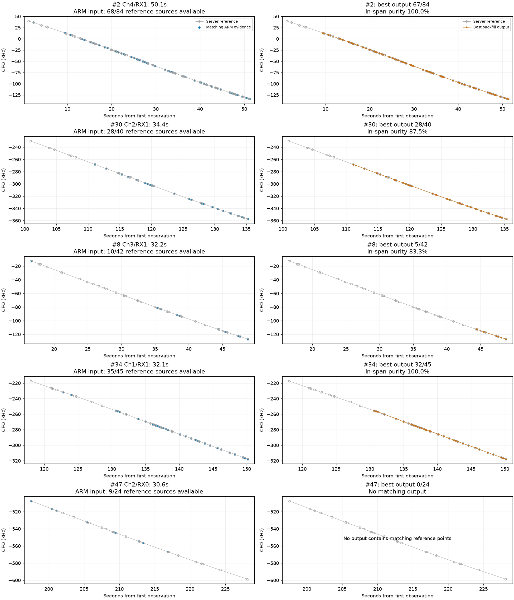

# Five remaining long server segments

Four of the five cannot meet the unchanged >=80% source-coverage criterion
using the frozen ARM GLRT input, even with perfect grouping. The fifth (#2)
is one available point short and is separated from that point by a 7.116 s
gap. The same rolling-backfill implementation recovers all five from server
GLRT input with 100% source coverage and 100% in-span source purity.

| Reference | Lane | Duration | Server sources | Matching ARM input | Best ARM output | Minimum needed | Diagnosis |
|---|---|---:|---:|---:|---:|---:|---|
| #2 | Ch4/RX1 | 50.1 s | 84 | 68 (81.0%) | 67 (79.8%) | 68 | One isolated early point omitted across 7.116 s gap |
| #30 | Ch2/RX1 | 34.4 s | 40 | 28 (70.0%) | 28 (70.0%) | 32 | Tracker already includes every available matching source |
| #8 | Ch3/RX1 | 32.2 s | 42 | 10 (23.8%) | 5 (11.9%) | 34 | Severe input loss; available evidence split by 18.684 s and 5.732 s gaps |
| #34 | Ch1/RX1 | 32.1 s | 45 | 35 (77.8%) | 32 (71.1%) | 36 | Three available early points separated by 6.576 s gap; input ceiling still below threshold |
| #47 | Ch2/RX0 | 30.6 s | 24 | 9 (37.5%) | 0 | 20 | Sparse evidence in groups of 3 and 6 across 4.369 s gap; neither reaches eight-source confirmation alone |

The same best matching counts occur in the prior coarse-seeded tracker.
Combining consistent points across every rolling-backfill output does not
increase these counts: this is not a case of complete coverage scattered
among emitted track fragments. #2/#34 best-output purity is 100%, #30 is
87.5%, and #8 is 83.3%; their coverage failures are not purity failures.
#47 has no matching output, so a purity percentage is not meaningful.

## Point-level checks

- **#2:** 16 reference source groups are absent from the ARM input. The one
  available but omitted source is visit 17 / RX1 / probe 0, at 2.294790 s.
  Its CFO agrees with the server within 11.1 Hz. The next matching ARM point
  is at 9.410842 s; all remaining 67 available sources are in the output.
  The 4 s association/backfill gap rule prevents directly joining this
  isolated point to the retained portion. This is a nearly recovered track
  failing a strict 80% cutoff, not an absent 50 s trajectory.
- **#30:** 12 reference source groups are absent. All 28 available matching
  sources are already grouped in one output. Tracking changes alone cannot
  supply the four additional reference sources needed to pass.
- **#8:** 32 reference source groups are absent. Available matching points
  form clusters of 1, 4, and 5 under the 4 s gap rule. The output contains
  the final five; even collecting all ten would reach only 23.8% coverage.
- **#34:** Nine reference source groups are absent. One additional source
  has ARM candidates but none within the unchanged 2.5 kHz circular CFO
  gate. Three usable early points at 121.239, 122.844, and 124.027 s are
  omitted; the retained 32 begin at 130.603 s. Joining those three would
  reach 35/45, still one source short of the required 36.
- **#47:** 15 reference source groups are absent. Nine matching observations
  remain between 197.526 and 216.825 s, split 3+6 by the 4 s gap rule. This
  shows why the eight-source confirmation requirement is difficult to meet
  from the matching evidence; no output contains any matching sources.

Gaps above are measured between available reference-matching observations;
they do not assert that the lane contains no other candidates. Times are
relative to the first projected observation. This audit distinguishes missing
sources from wrong-CFO candidates in the saved input; it does not establish
why the upstream ARM detector omitted those sources.

## Implication

For #2, a narrowly gated long-gap attachment is a useful next experiment,
with curvature uncertainty and competing-branch checks before accepting an
isolated point. Widening every association gate or relaxing the evaluation
threshold would not establish correctness. #34 could also gain three points,
but four of these five need improved upstream detection coverage to pass the
current server-agreement criterion. Sparse trajectories may still be useful
for later satellite association despite failing that criterion.

No tracker, thresholds, reference fixture, or hardware state changed in this
audit. Ref #10 remains the sole approved exception. The source audit script is
`../audit_missing_long.py`; `audit.json` contains per-reference, per-source,
best-output, input-ceiling, fragment-union, and server-input control evidence.

