# Three DS9 scans on PLUTO+: ARM versus server

Three distinct 300-second DS9 recordings completed on PLUTO+ at 192.168.1.15,
with replay origins 300 seconds apart. All **6,649 dwells** were processed with
**zero loss**, using a bounded 48-dwell queue. Processing used local recorded IQ;
this was not a live RF acquisition test. Each original dwell contains 120 ms of
dual-receiver IQ at 2.5 MS/s; sparse GLRT analyzes its first 20 ms. Original
capture epochs and capture-specific TLE authority were preserved.

**The experiment completed, but real-time qualification and independent
full-chain positioning reproducibility remain open.** The loaded downstream
chains took 304.410 and 310.180 seconds against a 300-second limit, and maximum
dwell latency was 5.479 seconds against a five-second limit. Increasing the
queue from 32 to 48 removed the three dropped dwells seen in the initial trial.
The scientific algorithms were unchanged.

## Stage results

| Metric | Scan 1: f363 | Scan 2: b34e | Scan 3: ee28 |
|---|---:|---:|---:|
| Completed dwells | 2,215 | 2,218 | 2,216 |
| ARM passing GLRT candidates | 16,191 | 18,397 | 14,059 |
| Standard-server passing GLRT candidates | 10,066 | 12,095 | 8,563 |
| Matched server GLRT candidates | 8,245 (81.9%) | 9,562 (79.1%) | 6,870 (80.2%) |
| Server track segments represented | 55/62 | 58/64 | 53/62 |
| Short / medium / long segments represented | 7/9 · 23/25 · 25/28 | 5/5 · 20/22 · 33/37 | 12/14 · 22/29 · 19/19 |
| One-to-one track matches | 45 | 46 | 41 |
| ARM track hypotheses / unmatched outputs | 80 / 35 | 86 / 40 | 75 / 34 |
| Peak queued dwells | 2 | 40 | 17 |
| Maximum dwell latency, seconds | 0.337 | 5.479 | 2.394 |

The native host control uses the ARM detector algorithm: all CFOs, epochs,
ranks and passing decisions agree exactly; score differences are below 5.56e-16.
The standard server uses a different fractional GLRT algorithm. Its match rule
is same visit/receiver, circular epoch within two samples and CFO within 10 kHz,
with one-to-one candidate matching. Candidate-count ratios are not recall.

Tracking represents 166/188 eligible server segments (88.3%), using the frozen
membership comparison (2.5 kHz circular CFO tolerance, coverage and purity at
least 0.8). Only scan 1 excludes the previously agreed problematic reference #10.
An unmatched ARM output is not necessarily a false detection. Colours identify
tracks within a panel; colours do not establish cross-pipeline correspondence.

## Scan 1 — scan-fw-f363c7f29141d0b1, lower-edge templates

### GLRT

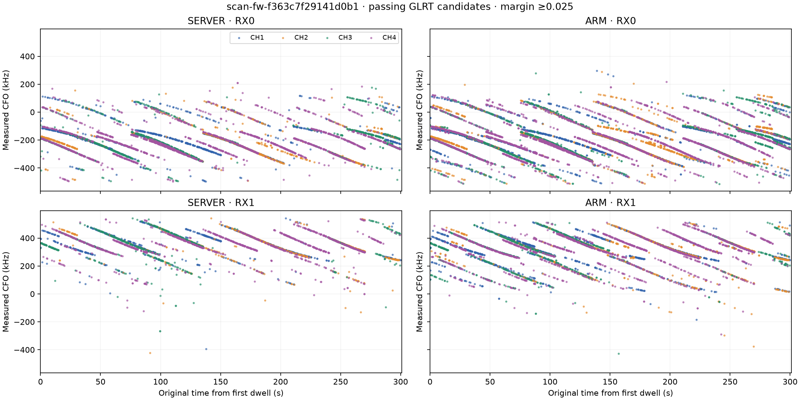

### Tracks

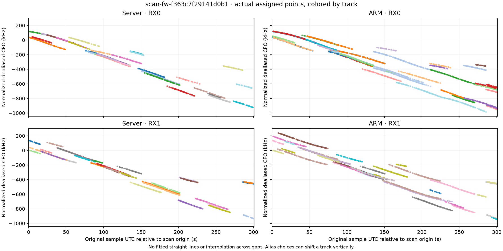

### Positioning

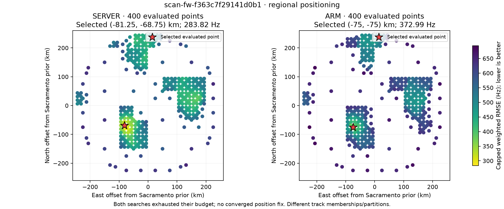

## Scan 2 — scan-fw-b34e380766e24b3b, lower-edge templates

### GLRT

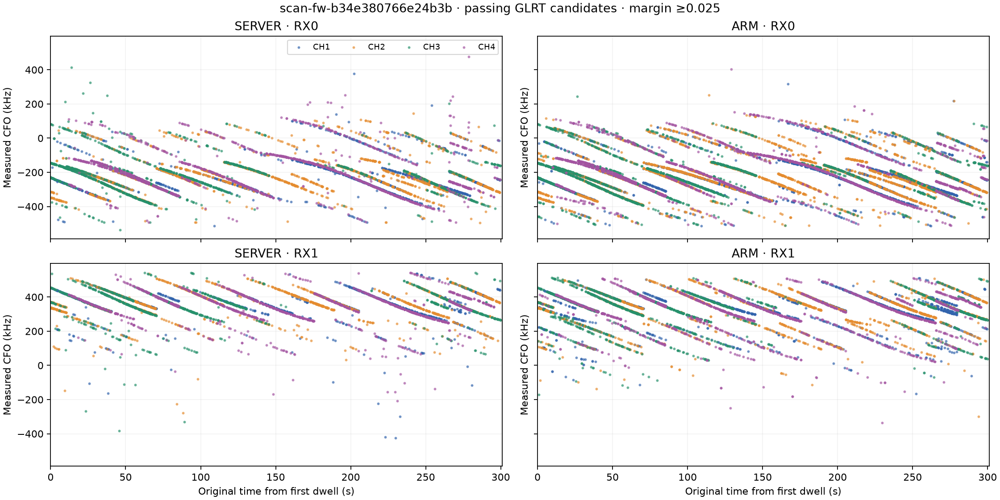

### Tracks

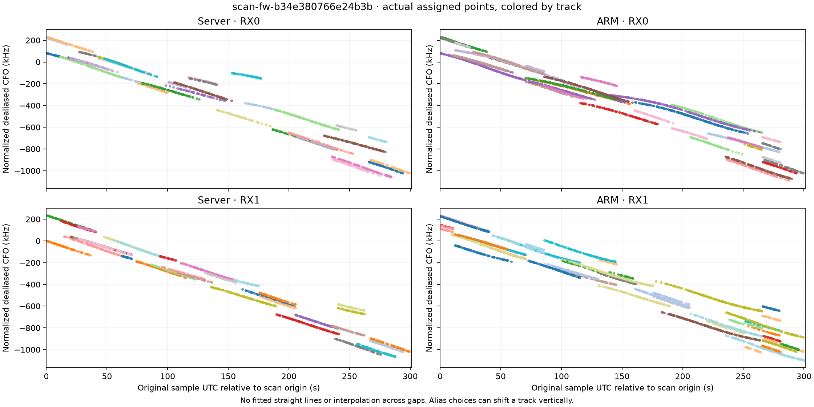

### Positioning

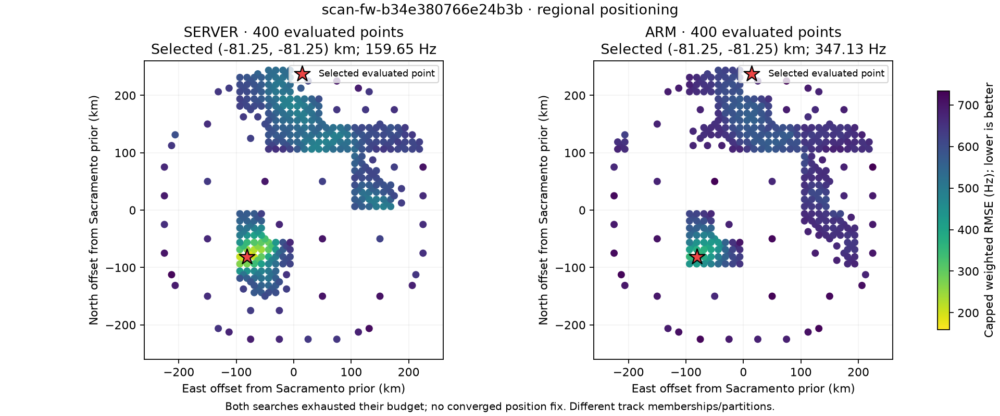

## Scan 3 — scan-fw-ee2831131a88440f, upper-edge templates

### GLRT

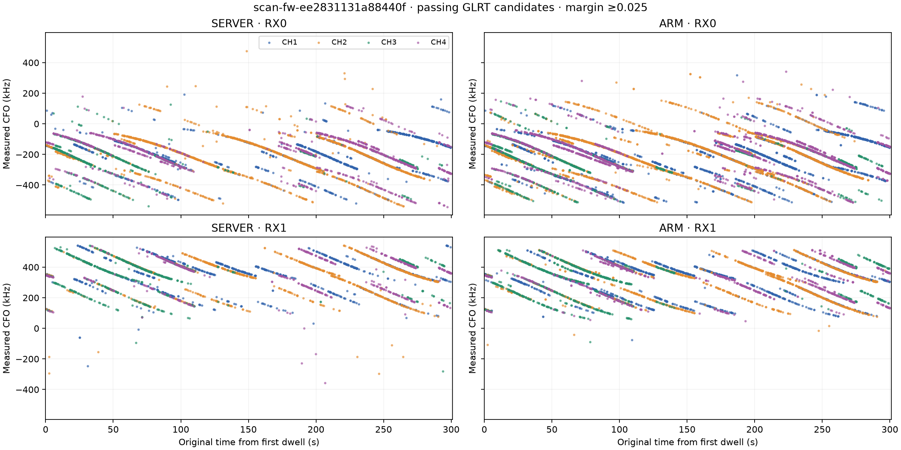

### Tracks

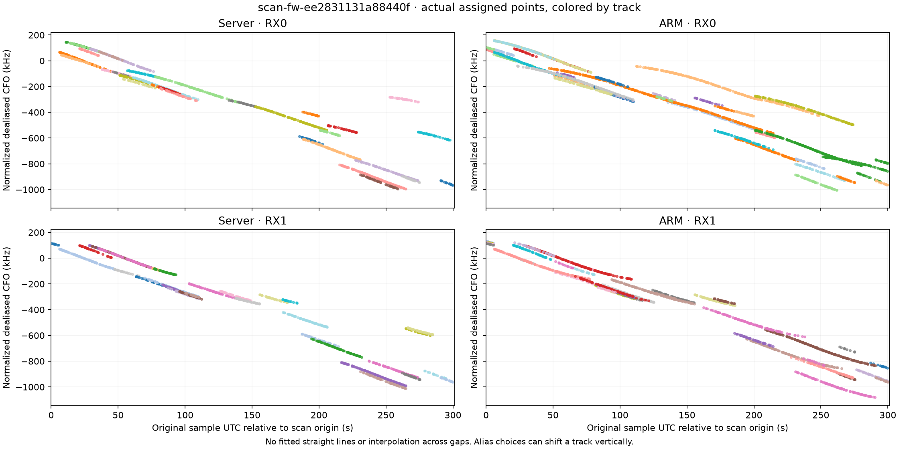

### Positioning

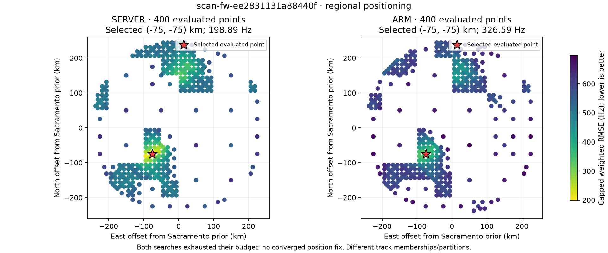

## Interpreting the positioning plots

Each plot shows actual evaluated locations, with no interpolated surface, and
the selected point marked with a star. Axes are offsets from the Sacramento
prior (38.5816° N, 121.4944° W); both panels use the same colour scale. Only this
common region is compared: published server results also contain a Reno prior,
which was not searched by the timed ARM chain.

Server GLRT and tracking were freshly replayed. Server positioning uses the
existing completed published analysis for each capture; ARM positioning is from
the physical run. Both regional searches stopped at their 400-point budget,
with `complete:false`. A selected point is **not a converged or validated
position fix**. Different track memberships and partitions mean absolute
objective scores are not directly comparable accuracy measures.

Identical-checkpoint host/ARM observations, support, seeds and tracks match
byte-for-byte. All 400 positioning coordinates agree on these controls;
score differences are below 6.03e-11 Hz. Satellite/time-offset choices agree;
association numeric differences are below 7.4e-10 Hz, within the predeclared
1e-9 Hz tolerance. The last two association JSON files are not byte-identical,
so the original strict-byte failures in the qualification summary remain intact.

An independent raw-IQ-to-position native host replay exposes a material issue:
private track identity hashes include floating fit summaries. Tiny roundoff
changes these identities and the training/held-out partition despite identical
track memberships. For scan 3 the selected native host offsets are
(-81.25, -81.25) km versus ARM (-75, -75) km. A versioned membership-based
identity policy is the next correctness fix; this report does not claim it is
fixed. The plots show the actual measured outputs, without adjusting them.

Physical ARM orbit propagation agrees with server states to 1.93e-10 km per
component. On identical published memberships, association satellite/time-offset
choices agree for 59/59, 55/55 and 63/63 tracks at each of two fixed sites;
maximum individual held-out residual difference is 0.117 Hz. These controls
do not establish full-chain server equivalence.

## ARM runtime and queue behaviour

| Measured stage, seconds | Scan 1 | Scan 2 | Scan 3 |
|---|---:|---:|---:|
| GLRT summed active call wall time | 260.701 | 292.530 | 284.625 |
| Observation/support projection summed wall time | 7.531 | 8.768 | 6.901 |
| Seed generation | 3.914 | 4.408 | 2.832 |
| Tracking | 4.181 | 5.361 | 3.583 |
| Conversion / exclusive membership selection | 2.661 | 2.938 | 1.942 |
| Orbit generation | 5.660 | 5.483 | 5.151 |
| Regional positioning: 400 points | 282.332 | 289.210 | 218.393 |
| Selected-point associations | 4.619 | 2.454 | 1.804 |
| Other positioning overhead | 0.993 | 0.265 | 0.226 |
| Downstream elapsed time, controller measurement | 304.410 | 310.180 | 233.975 |

The first two downstream chains overlap the next detector; scan 3 is an
unloaded drain and does not demonstrate loaded throughput. IQ file I/O overlaps
the detector worker and must not be added to active GLRT time. Summed call wall
time, process CPU time and paced lifetime are different measurements. The CPU
chart below includes the whole detector process, not only GLRT calls.

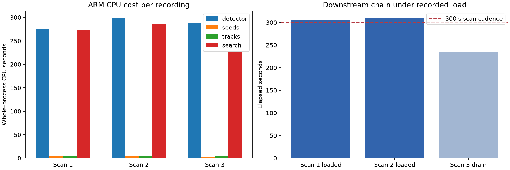

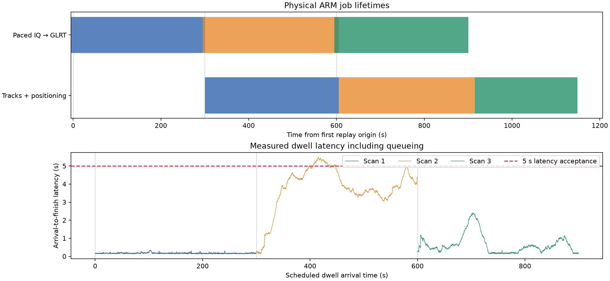

Peak sampled aggregate RSS was 299,516 KiB (292.5 MiB); five-second sampling can
miss peaks and double-count shared pages. Peak IQ-buffer use was 41/50.
Time from first replay origin to final completion was 1,149.021 seconds.
The recordings retain gaps in their original science epochs; this is not an
uninterrupted 900-second RF observation. Pi/RTL-SDR and live RF remain unqualified.

## Validation and archived evidence

The final component-owned bench regression run passed **148 tests in 32.79 s**.
All 6,649 exported full-dwell hashes/events were independently checked against
server decompression before hardware execution.

- [Original qualification verdicts](qualification-summary.json)
- [Association roundoff audit](native-association-roundoff.json)
- [Predeclared comparison policy](comparison-policy.json)
- [Regression test output](final-bench-tests.log)
- [Original plot and positioning source hashes](source-provenance.json)
- [Publication file hashes](SHA256SUMS)

Each scan directory includes the compact plotted positioning points in
`positioning.json`. Reproduce all three positioning PNGs with
`python plot_positioning.py` (Matplotlib required). GLRT and track PNGs are
preserved outputs of the completed comparison run. Full raw IQ, large intermediate
products and device access material are not part of this report publication.
