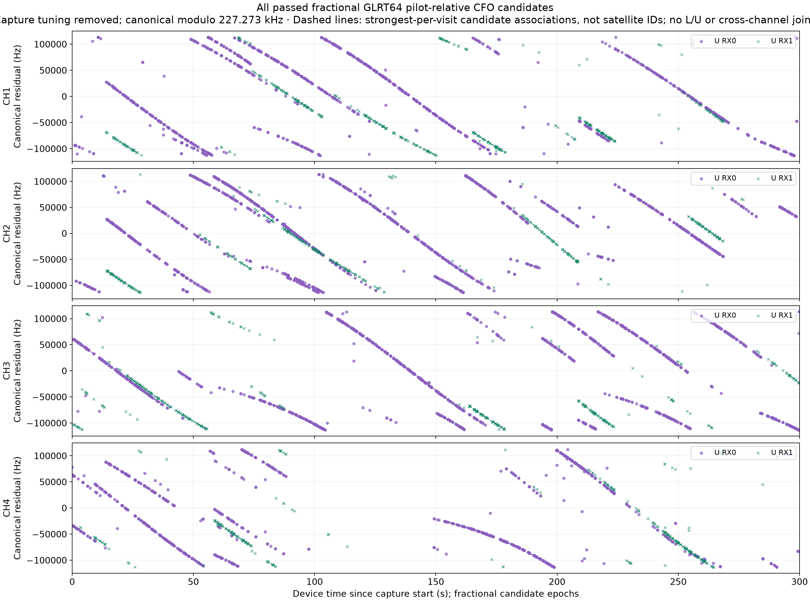
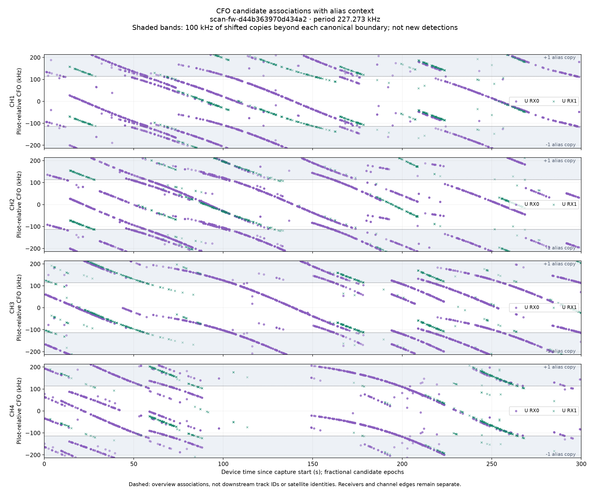
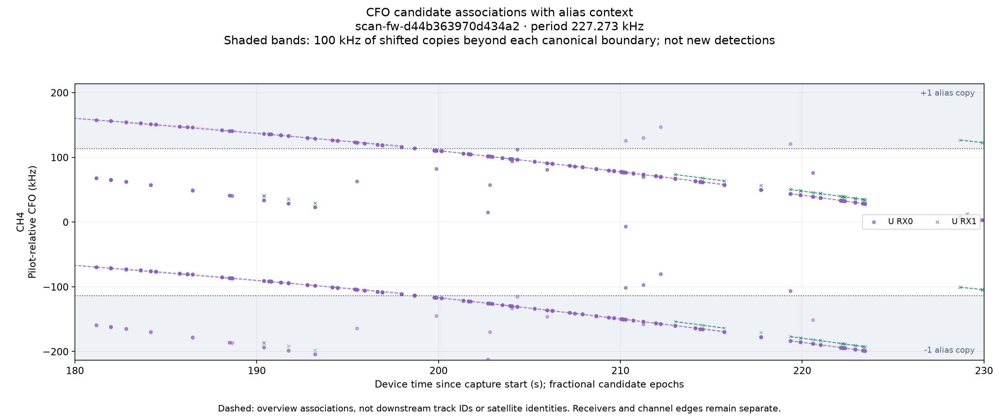

# CFO alias-context prototype

Recording: `scan-fw-d44b363970d434a2`. This additive comparison preserves the
original published CFO PNG byte for byte. It renders 7,354 sealed, passed
fractional candidates without reading IQ, collecting RF, or changing production
analysis or tracking. Source and artifact hashes are in [evidence.json](evidence.json).

## Original and companion

The alias period is **227.272727 kHz**, so the canonical interval runs from
−113.636364 to +113.636364 kHz. The companion extends each channel by **100 kHz
on either side** to ±213.636364 kHz. Shaded regions contain exact ±one-period
copies, not additional candidates or independent evidence. RX and edge styles
are preserved. The dashed polynomial associations are those used by the
overview, not downstream track IDs or satellite identifications.

### Original published PNG



### Companion with adjacent aliases



### Channel 4 near 200 seconds



## Does CH4 wrap near 200 seconds?

**Yes: the RX0 upper-edge candidate arc is consistent with one descending
track crossing the canonical boundary.** Representative plotted candidates are:

| Device time, seconds | Canonical CFO, kHz | Continuous descending branch, kHz |
|---:|---:|---:|
| 198.672350 | −113.282 | −113.282 |
| 199.755028 | +110.763 | −116.510 |

Subtracting one alias period from the later point gives a change of approximately
−3.229 kHz over 1.083 seconds, rather than a physical +224 kHz jump.
These are candidate-association observations, not proof of a satellite identity.

The saved production tracklets include:

| Tracklet prefix | RX / edge | Start–end, seconds | Observations | Normalized slope, Hz/s |
|---|---|---:|---:|---:|
| `c766e0bbb07c` | RX0 upper | 188.091–199.774 | 20 | −2574.6 |
| `c01c70c71f5e` | RX0 upper | 199.755–223.470 | 45 | −3358.7 |

A bounded replay of only the 1,041 CH4 RX0 candidate rows, using the production
reconstruction defaults, reproduced these exact tracklet IDs. The first
tracklet includes support centers at **198.681833 and 199.764510 seconds**,
on opposite sides of the plotted wrap. Thus the display boundary did not stop
that tracklet. The longer arc is nevertheless represented by adjacent tracklets.
See [wrap-audit.json](wrap-audit.json).

## What the downstream algorithm does

`ScannerTrackingService` reconstructs trajectories from numerical candidates,
not from PNG pixels. Its normalized Hough detector compares residuals modulo
the pilot alias spacing and fits dealiased frequencies. Each retained point has
a relative alias index. Constant alias lifts between independently fitted
tracklets are arbitrary and cannot establish different emitters.

The overview's dashed associations use a separate polynomial fitter on
canonicalized CFOs, with no modulo residual. They should not be used to infer
what the downstream tracker retained.

Alias handling permits continuity; it does not guarantee one ID for an entire
long arc. The production detector uses straight-line segments, a 2.5 kHz
normalized residual gate, a 4-second maximum gap, minimum 8 observations and
4 seconds of support, and at most 8 tracks per lane. Curvature, changing slope,
missing observations, and competing candidates can fragment a track. The
different fitted slopes above are consistent with this limitation; this
prototype does not claim to isolate every cause of the split.

## Reproduction and validation

From this worktree, with its source on `PYTHONPATH` and the deployed dependencies:

```bash
OPENBLAS_NUM_THREADS=1 OMP_NUM_THREADS=1 PYTHONPATH=src python \
  tools/render_adaptive_cfo_alias_prototype.py scan-fw-d44b363970d434a2 \
  --bulk-root /srv/bulk/leo --output /path/to/new-output --audit-wrap
```

The output directory must not already exist. The source stores are opened
read-only. The optional audit reconstructs CH4 RX0 associations only, with no
IQ processing or catalogue matching. `canonical-candidates.csv` has columns
target (0–3 lower, 4–7 upper), receiver, device time, and canonical CFO.

Presentation tests verify exact alias offsets, clipping, original-array
preservation, and source-bound PNG metadata. Tracker tests cover a 300-second
track crossing multiple canonical alias boundaries in both directions.
The focused presentation and trajectory suites passed (11 tests).

This is a one-scan prototype publication. Existing scan overview contracts and
the live pipeline remain unchanged.
