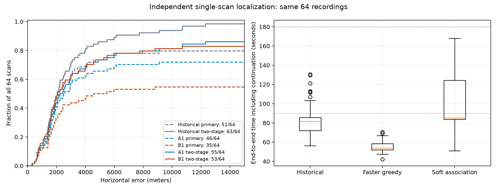
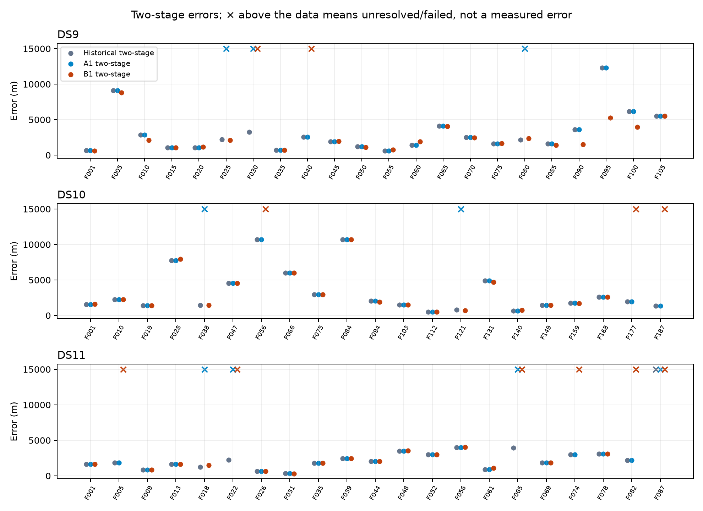
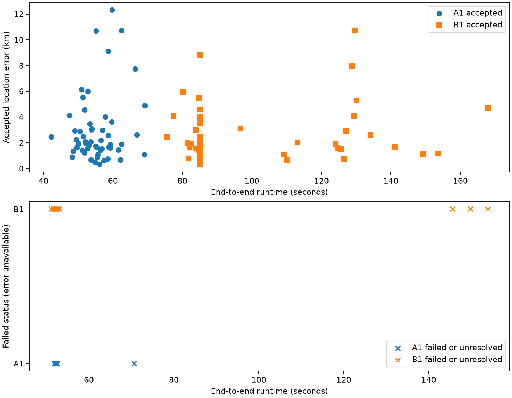
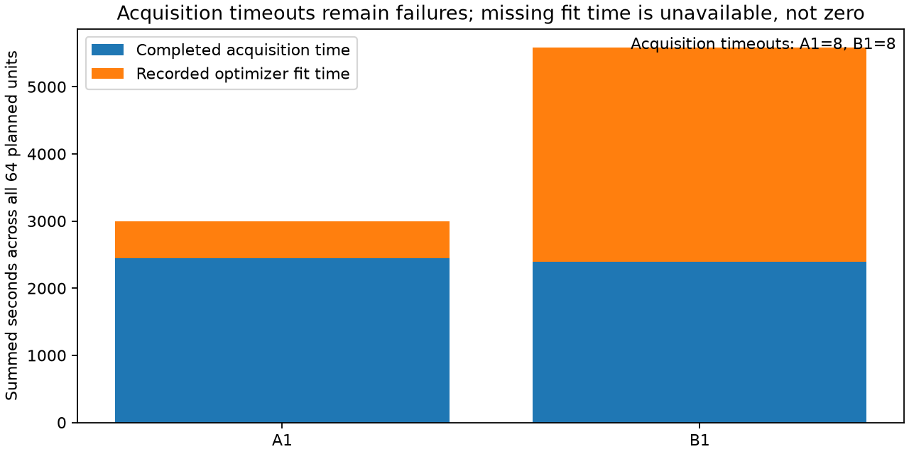

# Independent single-scan localization: completed comparison

The faster greedy implementation (A1) preserves the historical fitted answers and is the useful implementation result. Full soft association (B1) did not meet the predeclared practical accuracy gate. Initial location search and its time budget are now the clearest bottleneck. These are research implementations; this experiment does not establish a production replacement.

## Experiment

The frozen panel contains 64 scans: 22 DS9, 21 DS10, and 21 DS11. Every scan starts independently from the same uniform 250 km disk around Sacramento, using the existing Sacramento/Reno analysis prior. No receiver GPS is used to initialize or fit. Height is fixed at 100 ft (30.48 m) above sea level, represented as NAVD88 orthometric height with GEOID18 conversion to ellipsoid height. The same retained observations, causal orbit inputs, Student-t4 likelihood, 1,024-point initial search, eight refined basins, and three optimizer seeds apply to both methods.

Each primary attempt has a 90-second external limit. Only an unresolved winning mode permits one continuation, with a 180-second cumulative limit; no third-stage polishing or retries occurred. Before the official freeze, the common acquisition subbudget was changed from 40 to 50 seconds. Historical timing therefore is contextual, not a controlled speed comparison. Full details and immutable bindings are in [PROTOCOL.md](PROTOCOL.md) and [FREEZE.json](FREEZE.json).

SOL agents implemented and tested three approaches. A1 evaluates the selected branches of the original robust hard-association objective efficiently. B1 optimizes the fully normalized soft mixture, including the background branch and every positive satellite responsibility, without top-k truncation. C1 profiles clock/epoch and drift nuisance parameters; its pilot returned equivalent answers approximately three times slower, so it stopped at the pilot gate. The online Gaussian-mixture extension D1 was deferred under the admission rules. Mathematical definitions and pilot evidence are in [METHODS.md](METHODS.md).

## Errors in meters

Accepted means the winning local mode passed convergence checks, not that its position or satellite identities are proven correct. Error statistics below include accepted scans only. Runtime medians include all 64 attempted scans and can be affected by early failures.

| Method | Accepted / 64 | Median error (m) | 90th percentile (m) | Worst accepted (m) | Median runtime (s) |
|---|---:|---:|---:|---:|---:|
| Historical primary | 51 | 1,860 | 4,109 | 9,112 | 80.3 |
| A1 primary | 46 | 1,858 | 4,335 | 9,112 | 53.6 |
| B1 primary | 35 | 1,794 | 4,368 | 8,830 | 85.1 |
| Historical with continuation | 63 | 2,058 | 5,899 | 12,308 | 81.6 |
| A1 with continuation | 55 | 1,946 | 6,079 | 12,308 | 53.8 |
| B1 with continuation | 53 | 1,860 | 5,159 | 10,717 | 85.1 |

The raw medians compare different accepted subsets. On the **48 scans accepted by both new methods**, A1's median is **1,892 m** and B1's is **1,873 m**, approximately a **1% reduction**. The median per-scan B1-minus-A1 error difference is **−4.7 m**. B1 improves by more than one meter on 26 scans, worsens on 18, and differs by at most one meter on four. Seven scans are accepted only by A1, five only by B1, and four by neither.

B1 fails the predeclared requirement for at least a 20% paired median improvement with no loss of A1-accepted scans. It passes the separate tail-error and no-new-100-km-error conditions. Both methods deliver an accepted error of at most 5 km on **47/64** scans and at most 10 km on **52/64**. Historical continuation achieved 55/64 and 60/64 respectively. Thus this run does not demonstrate improved end-to-end completion or accuracy over the historical procedure.

All 55 jointly accepted A1/historical two-stage answers agree within one meter. The lower raw A1 median is a coverage effect, not an accuracy improvement. The correct historical continuation control is used in `summary.json`; the generic evaluator's `paired_error_delta_m` field uses the historical primary and must not be used for this comparison.

| Dataset | A1 accepted | A1 median / p90 (m) | B1 accepted | B1 median / p90 (m) |
|---|---:|---:|---:|---:|
| DS9 | 19/22 | 1,925 / 6,730 | 20/22 | 1,925 / 5,297 |
| DS10 | 19/21 | 2,062 / 8,327 | 18/21 | 1,804 / 6,566 |
| DS11 | 17/21 | 1,860 / 3,246 | 15/21 | 1,794 / 3,348 |



The error CDF uses all 64 scans as its denominator, so failures remain visible. Dashed curves are primary attempts; solid curves include the one permitted continuation.



Crosses above the data denote unavailable accepted errors, not 15 km measurements.

## Failures and computation

A1 had 46 primary acceptances, ten eligible continuations, and eight acquisition timeouts. Nine continuations converged, leaving **DS11-F087** unresolved. B1 had 35 primary acceptances, 21 continuations, and eight acquisition timeouts. Eighteen continuations converged, leaving **DS10-F056, DS11-F065, and DS10-F187** unresolved. The eight acquisition failures in each arm are not the same scan set. Every planned scan is retained in the denominator.

Among the 48 mutually accepted scans, median cumulative runtime is **54.3 s for A1 versus 85.1 s for B1**. Across completed acquisitions, median recorded fit-only time is **9.4 s versus 42.9 s**. Acquisition itself takes a median **43.7 s versus 43.6 s**; it accounts for a median 79% of A1's recorded acquisition-plus-fit time. A1's largest cumulative attempt is only 70.6 seconds, yet the separate 50-second acquisition limit caused eight failures. This supports testing better allocation of the existing total budget next, without retroactively changing this experiment.

Recorded native CPU totals are 3,514 seconds for A1 and 6,097 seconds for B1, over 74 and 85 attempts respectively. Peak recorded RSS is approximately 373 MiB for each arm. B1's zero scalar-Jacobian counter does not mean zero derivative work: B1 uses bulk derivatives outside that counter.





The breakdown is not complete wall-time accounting: failed acquisition durations, unavailable fit durations, and setup overhead are not all represented by these component bars.

The host was heavily shared. Read-only process attribution found **17 systemd adaptive-analysis worker services**; a two-second sample attributed approximately **18 logical cores to adaptive-hop analysis and three to scanner tracking**. Our benchmark permitted at most two single-threaded fit processes. Production ancestry leads to `leo-adaptive-analysis-worker@*.service`, release `/opt/leo-tracker/releases/47e2705e437722daa5e6d6bb1c252d54b7a21dbc`, and work under `/srv/bulk/leo`; it does not identify which chat originally configured them. Two worker roots were processing the same scan, and one had elapsed more than 33 minutes despite `--maximum-seconds 560`; these observations merit separate diagnosis, not an assumed cause. No services were stopped or modified. See [process attribution](benchmark-v1/process-attribution-snapshot.json) and [environment snapshot](benchmark-v1/environment-snapshot.json). Host contention confounds wall-clock comparisons, especially against historical runs; it is not proven to explain every timeout.

## What the soft weights tell us

Posthoc scoring of the 108 accepted arm/scan results used their sealed fitted states, with no refitting or GPS input. The median across scans of the mean strongest satellite weight is **0.971 for A1 and 0.975 for B1**. The corresponding mean effective branch count is **1.081 and 1.067**; median mean background weight is about **0.0041** for both. This suggests that at these local solutions the model already chooses nearly one satellite per track, limiting the benefit of soft averaging.

These are model-conditional fit weights, not calibrated identity probabilities, posterior location-mode weights, or evidence that the chosen satellite is correct. Summaries use unequal accepted scan sets and are explanatory only. The 158-second posthoc diagnostic is excluded from all benchmark timings. See [full association diagnostics](results/associations.json) and [aggregate definitions](results/association-summary.json).

## Verification and limitations

The complete official audit passes **159/159 attempts**: 128 primaries and 31 continuations. It checks frozen sources, authority bindings, complete panel coverage, proposal equivalence, and receipts. The detached/source audit passes 58 checks. The combined component and research test suite passes **100 tests**.

The historical hard-objective comparator covers 56 completed A1 acquisitions and 167 matching seed histories. All **121 seed pairs converged in both runs have equivalent endpoints**. DS11-F087 has one new-only seed because the historical budget did not start it. One conservative prefix-divergence flag remains on DS10-F028's unfinished, nonwinning third seed: the historical restart happened after 22 iterations, the new restart after 24. Independent inspection found an extra intermediate step and different iteration coverage, with about 0.405 m endpoint separation; the winning converged seed agrees to about 0.14 mm. The raw flag is preserved in [the v2 comparison](results/hard-oracle-comparison.json), not silently reclassified.

This is a correlated regression panel from the same recording location, not geographic generalization evidence. The roof reference is not a surveyed accuracy standard. The assumed height, orbit/systematic errors, covariance scales, and Student-t model can bias results. A local convergence flag does not establish the global optimum, correct satellite identity, or calibrated uncertainty. Location credible regions and observability calibration remain unvalidated.

The next bounded experiment should prioritize initial-search reuse within each scan, batched scoring, and dynamic allocation of the same total runtime budget; independence across scans must remain intact. Accuracy work should then target model bias and held-out residual/uncertainty calibration. More elaborate association is not supported as the first priority by this result. No additional fitting campaign was launched after this report.

## Reproducible artifacts

- [Final summary](results/summary.json), [timing and decision diagnostics](results/diagnostics.json), [per-scan CSV](results/two-stage.csv), and [primary CSV](results/primary.csv).
- [Complete official audit](benchmark-v1/audit-final-complete.json), [source audit](results/source-audit.json), and the detached evaluation, timing, diagnostic, and comparison addenda in this directory.
- Component implementations: `src/leo/analysis/localization_fast.py`, `localization_soft.py`, `localization_profiled.py`, and `localization_evaluation.py`; component-owned tests are under `tests/analysis/`.

From the repository root, the report can be regenerated without fitting:

```sh
export PYTHONPATH=src OPENBLAS_NUM_THREADS=1
.venv/bin/python reports/2026_10_01_localization_approaches/summarize_benchmark.py --primary reports/2026_10_01_localization_approaches/results/primary.json --two-stage reports/2026_10_01_localization_approaches/results/two-stage.json --official-audit reports/2026_10_01_localization_approaches/benchmark-v1/audit-final-complete.json --output reports/2026_10_01_localization_approaches/results
.venv/bin/python reports/2026_10_01_localization_approaches/benchmark_diagnostics.py reports/2026_10_01_localization_approaches/results/primary.json reports/2026_10_01_localization_approaches/results/two-stage.json --output reports/2026_10_01_localization_approaches/results/diagnostics.json --figure-prefix reports/2026_10_01_localization_approaches/results/diagnostics
```
