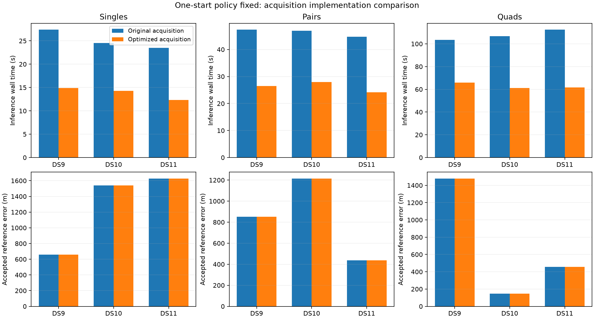

# Same one-start estimates, less computation across all three window sizes

All eighteen fresh inference outcomes pass their process and numerical audits, and all nine original/optimized comparisons pass every equivalence check. Optimized acquisition reduces observed inference wall time by 36.3–47.5% across the first single, pair and quad of DS9, DS10 and DS11. Recorded geographic errors are identical within every comparison. This is a computational improvement to the one-start research configuration, not a new statistical model or an accuracy gain.

| Window | Dataset | Original / optimized wall time | Original / optimized CPU time | Wall reduction | Error in both arms |
|---|---|---:|---:|---:|---:|
| Single | DS9 | 27.39 / 14.92 s | 27.37 / 14.91 s | 45.5% | 659 m |
| Single | DS10 | 24.54 / 14.26 s | 24.52 / 14.23 s | 41.9% | 1,538 m |
| Single | DS11 | 23.51 / 12.35 s | 23.48 / 12.33 s | 47.5% | 1,628 m |
| Pair | DS9 | 47.34 / 26.44 s | 47.30 / 26.41 s | 44.1% | 852 m |
| Pair | DS10 | 46.97 / 27.96 s | 46.94 / 27.93 s | 40.5% | 1,215 m |
| Pair | DS11 | 44.70 / 24.13 s | 44.67 / 24.10 s | 46.0% | 438 m |
| Quad | DS9 | 103.58 / 65.93 s | 103.52 / 65.86 s | 36.3% | 1,479 m |
| Quad | DS10 | 106.85 / 61.22 s | 106.75 / 61.15 s | 42.7% | 146 m |
| Quad | DS11 | 112.45 / 61.59 s | 112.38 / 61.53 s | 45.2% | 455 m |

Each cell is one timing observation on a previously exposed development window. Windows share scans, and timings have uncontrolled host/cache effects. This is not a randomized speed distribution, an independent nine-sample accuracy study or a measured full-panel runtime. CPU reductions closely follow wall reductions. Inference includes startup and work from prepared inputs, excluding observation/orbit extraction, prerequisites and separate numerical audits. Quad audits take 10.2–11.3 seconds each. Historical start-count savings must not be added to these percentages.

## Hypothesis and unchanged model

The hypothesis was that matrix-product acquisition would preserve the discrete search decisions and fitted estimates while reducing cost, including when evidence from multiple scans contributes to the search. The [single plan](ONE_START_BLAS_PLAN.md) and [staged pair/quad plan](ONE_START_BLAS_WINDOW_PLAN.md) fixed the cases, orders, tolerances and budgets before fitting.

For horizontal position x and scan-specific nuisance vector eta_s, let ell_stk(x, eta_s) be the log score for track t and satellite/background branch k. Acquisition ranks positions using

`A(x) = sum_(s,t) logsumexp_k ell_stk(x, 0)`.

The adaptive search proposes seeds; the one-start policy refines only its highest-ranked seed. Continuous fitting uses hard branch assignments and the original robust objective, schematically

`F(x, eta) = 0.5 * eta.T P eta - sum_(s,t) max_k ell_stk(x, eta_s)`.

The shared x couples the scans; clocks, receiver drifts and satellite epoch nuisance blocks remain independent across scans. This is a joint window fit with alternating hard associations, rather than a sequential location update after each track. Position support remains the uniform 250 km Sacramento disk, with height fixed at 100 ft MSL. The original eight-point track evidence, physical likelihood, nuisance priors and 64-iteration optimizer remain unchanged. This ablation changes only the acquisition score calculation to matrix products and preserves the process-start timer.

## Completed gates

The single stage checked 142 track appearances; pairs checked 285; quads checked 569. These are appearances across nested windows, not 996 distinct tracks. Per-track finite/visibility masks agree exactly at nine fixed prior positions plus saved acquisition seeds. Pair and quad prerequisites additionally check summed marginalized acquisition scores. The maximum quad per-track error is 1.52e-10 and aggregate error 4.78e-10, below the original 1e-6 tolerance. All complete acquisitions reproduce original seeds, requested/unique-point counts and spacing exactly; proposal scores agree within tolerance. No geographic scoring occurs in prerequisites.

All single gates passed before pair fits, and all pair gates passed before quad prerequisites and fits. Two stage-policy tests reject missing, duplicate, rejected and wrongly bound previous-stage results. The earlier worker-isolation and wrapper tests also remain passing evidence. No source component was edited after being frozen into a completed scientific receipt.

The six quad fits use original/optimized order on DS9, optimized/original on DS10 and original/optimized on DS11. Runs are sequential under the shared lock, with independent 360-second inference and audit caps. Every quad comparison passes all seventeen equivalence flags: one fitted seed per arm, exact proposal fields and assignments, state agreement within 1e-5, objective agreement within 1e-6, and agreement with the saved original first fit. The original objective, gradient and stationarity audit precedes geographic scoring. All processes are terminal; there were no retries or relaxed tolerances. Summaries verify source/input bindings and receipt/launch/audit seals.

## What this supports

One start plus optimized acquisition is a useful simpler, faster research configuration on these checked windows. This does not establish universal equivalence near numerical search boundaries or prove a stable speedup on every scan. The nine cases are all first-block windows whose original first fits pass; they do not exercise the three unresolved one-start singles. A sensible next computational gate is a separately frozen comparison on those unresolved singles, retaining failed outcomes and labeling the sample as failure selected, before a broader cold campaign.

The [full 112-window first-start replay](FIRST_START_RESULTS.md) remains the separate accuracy evidence: 61/64 singles, 32/32 pairs and 16/16 quads pass, with median errors 2,023 / 1,501 / 775 m. Those are audits of saved fits, not a fresh full-panel benchmark of this composed implementation. Error quantiles condition on acceptance, all results use one unsurveyed operator reference site, and local uncertainty is not calibrated. No production promotion follows.

Artifacts: [combined sealed summary](acquisition-composition-overview-v1.json), [overview generator](summarize_acquisition_composition.py), [quad summary](one-start-blas-window-quad-summary-v1.json), [quad figure](one-start-blas-window-quad-summary-v1.png), [single report](ONE_START_BLAS_RESULTS.md), [pair report](ONE_START_BLAS_PAIR_RESULTS.md), and complete sealed quad receipts under `one-start-blas-window-cold-v1/DS*-B01-Q/`.
